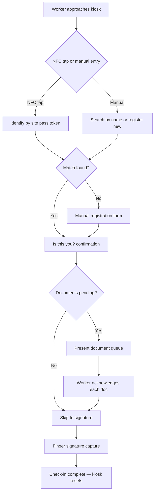
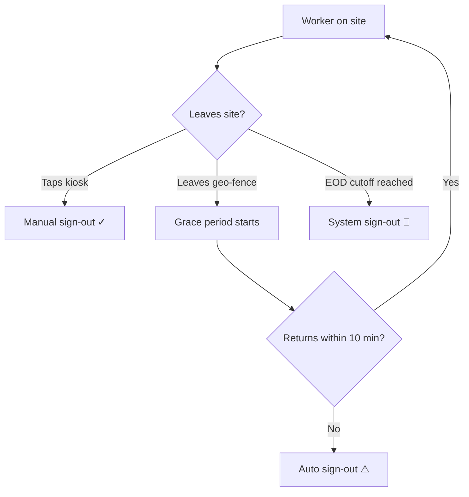

# NexCheck — Site Compliance Kiosk

## Purpose
NexCheck is a digital site compliance system that replaces paper sign-in sheets, JSA acknowledgments, and onboarding paperwork with a mobile kiosk-based workflow. Workers identify themselves via NFC tap or manual entry, acknowledge required safety documents, and provide a legally binding finger signature — all in under 20 seconds. The system builds a real-time digital roster and integrates with geo-fence time tracking for complete site accountability.

## Who Uses This
- **Field Workers / Subcontractors:** Check in at the kiosk each day, acknowledge documents, sign
- **Project Managers:** Configure required documents per project, view roster, delegate kiosk access
- **Foremen:** Activate kiosk mode on their device when delegated by PM
- **Admins / Safety Officers:** Review compliance reports, audit document acknowledgment history
- **Visitors / External Workers:** Register at kiosk on first visit, use site pass for subsequent visits

## Workflow

### Setting Up NexCheck for a Project

#### Step-by-Step Process
1. PM navigates to the project in the web app or mobile app
2. PM adds required site documents (JSA, safety policies, onboarding docs) via **NexCheck > Documents**
3. For each document, PM sets:
   - **Title** and **content** (HTML)
   - **Category**: JSA, ONBOARDING, SAFETY, POLICY, or CUSTOM
   - **Frequency**: ONCE (first visit only), DAILY (every day), or ON_CHANGE (when document is updated)
   - **Sort order** (controls display sequence on kiosk)
4. PM activates kiosk mode on a tablet/phone at the job site, or delegates kiosk access to a foreman

### Worker Check-In (Kiosk Flow)

#### Step-by-Step Process
1. Worker approaches the kiosk device
2. Worker taps their phone on the kiosk (NFC) or enters their name manually
3. Kiosk displays: "Is this you?" with name, company, and trade
4. Worker confirms identity
5. Kiosk presents the document queue — only documents the worker needs to acknowledge today
6. Worker reads each document and taps "I Acknowledge" for each one
7. After all documents are acknowledged, a signature pad appears
8. Worker signs with their finger
9. Kiosk records the signature, timestamps all acknowledgments, and resets for the next worker

#### First-Time Visitors (No Site Pass)
1. Kiosk shows "We don't have you on file"
2. Visitor enters: name, company, trade, phone number
3. System creates a site pass and registers the device
4. Visitor proceeds through the normal document queue and signature flow
5. On subsequent visits, the visitor taps to check in without re-entering information

### Sign-Out (Three Tiers)

1. **Manual sign-out** — Worker taps kiosk at end of day, confirms identity, sign-out recorded with timestamp. This is the expected, compliant path.
2. **Auto sign-out (geo-fence)** — Worker leaves the geo-fence and doesn't return within the grace period (default 10 min). System records sign-out at the actual departure time, flagged as `SYSTEM_AUTO_SIGNOUT`.
3. **EOD cutoff** — If neither manual nor auto sign-out occurs, the system closes all open sessions at a PM-configured cutoff time (default 6 PM), flagged as `SYSTEM_EOD_SIGNOUT`.

### Kiosk Mode Activation

#### PM / Admin (Direct)
1. Open Nexus mobile app → Settings → "Enable Kiosk Mode"
2. Select the project to bind the kiosk to
3. Optionally set a 4-digit PIN to exit kiosk mode
4. Device enters kiosk mode — locked to check-in screen

#### Foreman (Via Delegation)
1. PM opens project → Team → selects the foreman
2. PM taps "Delegate Kiosk Access"
3. PM sets duration (default 24 hours, max 7 days)
4. Foreman receives push notification with kiosk access confirmation
5. Foreman activates kiosk mode on their device for that project
6. Delegation auto-expires at the set time

### Roster & Reporting

1. PM navigates to project → NexCheck → Roster in the web app
2. Roster shows all check-ins for the day with:
   - Worker name, company, trade
   - Check-in time
   - Documents acknowledged (count and list)
   - Signature status
   - Sign-out status with color-coded indicators:
     - **Green ✓** — Manual sign-out (compliant)
     - **Yellow ⚠** — Auto sign-out (left without signing out)
     - **Red 🔴** — EOD cutoff (no departure detected)
3. PM can export a PDF report with all names, times, documents, and embedded signatures

## Key Features

- **NFC tap-in** — Sub-second identification for returning workers (Android HCE, QR fallback for iOS)
- **Document queue engine** — Frequency-based resolution (ONCE / DAILY / ON_CHANGE) ensures workers only see relevant documents
- **Single signature** — One finger signature per session covers all acknowledged documents
- **Kiosk delegation** — PM remotely grants time-boxed kiosk access to foremen (24h default, 7d max)
- **Three-tier sign-out** — Manual, auto (geo-fence), and EOD cutoff ensure every visit is closed
- **Zero hardware cost** — Any phone or tablet becomes a kiosk
- **Visitor support** — External workers register once, use site pass for all future visits
- **Offline queue** — Check-ins stored locally and synced when connectivity returns (Phase 5)

## API Endpoints

- `POST /nexcheck/site-pass` — Register new site pass
- `POST /nexcheck/site-pass/identify` — Identify by token
- `GET /nexcheck/site-pass` — List site passes
- `DELETE /nexcheck/site-pass/:id` — Revoke site pass
- `GET /nexcheck/projects/:id/documents` — List project site documents
- `POST /nexcheck/projects/:id/documents` — Add site document
- `PUT /nexcheck/projects/:id/documents/:docId` — Update site document
- `DELETE /nexcheck/projects/:id/documents/:docId` — Remove site document
- `POST /nexcheck/kiosk/activate` — Activate kiosk mode
- `POST /nexcheck/kiosk/:id/deactivate` — Deactivate kiosk mode
- `GET /nexcheck/kiosk/:projectId/document-queue` — Get pending docs for worker
- `POST /nexcheck/projects/:id/check-in` — Start check-in
- `POST /nexcheck/projects/:id/check-in/:id/complete` — Complete with signature + acks
- `POST /nexcheck/projects/:id/check-in/sign-out` — Manual sign-out
- `POST /nexcheck/projects/:id/check-in/:id/auto-sign-out` — System auto sign-out
- `POST /nexcheck/projects/:id/check-in/eod-sign-out` — EOD cutoff
- `POST /nexcheck/projects/:id/delegation` — Delegate kiosk access
- `GET /nexcheck/projects/:id/delegation` — List active delegations
- `DELETE /nexcheck/projects/:id/delegation/:id` — Revoke delegation
- `GET /nexcheck/projects/:id/roster` — Get daily roster

## Related Modules
- **Geofencing Time Tracking** — Provides presence data (arrival/departure times) merged into roster
- **PnP Documents** — Source documents can be linked to site documents via `sourceDocId`
- **Daily Logs** — JSA acknowledgments complement daily log safety entries
- **Notifications** — Kiosk delegation triggers push notifications to delegates

## Revision History
| Rev | Date | Changes |
|-----|------|---------|
| 1.0 | 2026-03-02 | Initial release — NexCheck system architecture, check-in flow, sign-out tiers, delegation |
