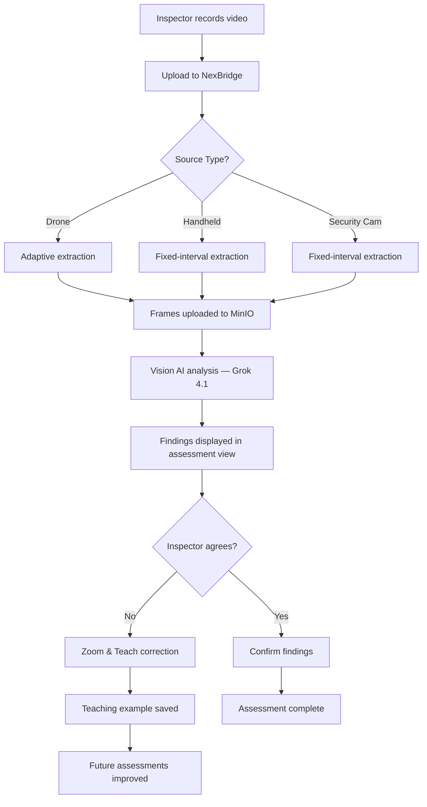

# NexEXTRACT™ Adaptive Frame Extraction

## Purpose
Describes how NexEXTRACT — NEXUS's proprietary motion-aware frame extraction technology — works, how to configure it, and how it integrates with the video assessment pipeline. NexEXTRACT replaces fixed-interval frame sampling with an adaptive algorithm that captures more frames during camera motion and fewer during hover/static shots.

## Who Uses This
- Estimators and project managers running video assessments via NexBridge
- Developers maintaining the video assessment pipeline
- Sales team demonstrating NexEXTRACT to clients

## Workflow

### End-to-End Assessment Flow



### Step-by-Step Process

1. Inspector records property video (drone flyover or handheld walkthrough)
2. Opens NexBridge Connect desktop app
3. Selects video file and chooses **Source Type** (Drone, Handheld, or Security Camera)
4. NexEXTRACT extracts frames using the appropriate mode:
   - **Drone** → adaptive mode (motion-aware)
   - **Handheld** → fixed mode (8-second intervals)
   - **Security Camera** → fixed mode (30-second intervals)
5. Extracted frames are uploaded to MinIO via presigned URLs (4 concurrent workers)
6. API sends frames to Vision AI (xAI Grok) for analysis
7. Structured findings returned: material identification, damage type, severity, causation
8. Inspector reviews findings in the assessment view
9. If a finding is incorrect, inspector uses **Zoom & Teach** to submit a correction
10. Correction is stored as an `AssessmentTeachingExample` for future assessments

## Extraction Modes

### Adaptive Mode (Drone)
Uses FFmpeg's `select` filter with scene change detection:

- **Scene threshold**: `0.15` — captures a frame when 15%+ of pixels change between consecutive frames (indicates camera motion, new surface, or approach)
- **Min interval**: `2s` — cooldown to prevent burst-capture during turbulence
- **Max interval**: `8s` — guaranteed baseline capture even during steady hover
- **Max frames**: `60` — hard cap to control AI token costs

**When it fires**: drone turns, approach to structure, transition between roof planes, movement over new damage areas.

**When it waits**: steady hover, slow straight-line flight over uniform surface.

### Fixed Mode (Handheld / Security Camera)
Extracts one frame every N seconds:

- **Handheld**: every 8 seconds, max 30 frames
- **Security Camera**: every 30 seconds, max 20 frames

### Configuration Reference

| Parameter | Adaptive (Drone) | Fixed (Handheld) | Fixed (Security) |
|-----------|-------------------|-------------------|-------------------|
| Mode | `adaptive` | `fixed` | `fixed` |
| `intervalSecs` | — | 8 | 30 |
| `min_interval` | 2s | — | — |
| `max_interval` | 8s | — | — |
| `scene_threshold` | 0.15 | — | — |
| `maxFrames` | 60 | 30 | 20 |

## Technical Implementation

### Source Files
- **Rust extraction engine**: `apps/nexbridge-connect/src-tauri/src/video.rs`
- **React UI component**: `apps/nexbridge-connect/src/components/VideoAssessment.tsx` (lines 119-131)
- **Vision AI service**: `apps/api/src/modules/video-assessment/gemini.service.ts`

### FFmpeg Filter (Adaptive Mode)
```
select='isnan(prev_selected_t)+gte(t-prev_selected_t,MIN_INTERVAL)*(gte(t-prev_selected_t,MAX_INTERVAL)+gt(scene,SCENE_THRESHOLD))',showinfo
```

Logic breakdown:
1. `isnan(prev_selected_t)` — always capture the first frame
2. `gte(t-prev_selected_t, MIN_INTERVAL)` — enforce cooldown
3. `gte(t-prev_selected_t, MAX_INTERVAL)` — guaranteed baseline
4. `gt(scene, SCENE_THRESHOLD)` — motion trigger

### Timestamp Accuracy
NexEXTRACT uses FFmpeg's `showinfo` filter to capture actual presentation timestamps (PTS) from the video stream. Timestamps are parsed from FFmpeg stderr output (`pts_time:` field). This allows findings to be mapped back to exact video timecodes for re-inspection.

## Tuning Guide

### When to Adjust Scene Threshold
- **Lower threshold (0.08-0.12)**: Captures more frames during subtle motion. Use for high-value properties where missing a detail is costly.
- **Default threshold (0.15)**: Balanced for typical residential drone inspection.
- **Higher threshold (0.20-0.30)**: Fewer frames, only major scene changes. Use for large commercial properties where token costs matter.

### When to Adjust Max Frames
- **Increase to 80-100**: Long videos (5+ minutes) of large properties
- **Keep at 60**: Standard 2-3 minute drone flyover
- **Decrease to 30-40**: Quick inspection, cost-sensitive

### How to Change Defaults
Edit `VideoAssessment.tsx` lines 119-131 in `apps/nexbridge-connect/src/components/`. Rebuild NexBridge after changes:

```bash
# From apps/nexbridge-connect:
bash scripts/build-nexbridge.sh
```

## Zoom & Teach Integration

When an inspector corrects a finding:
1. The correction (original AI output + human correction) is saved as an `AssessmentTeachingExample`
2. Teaching examples are scoped to the company
3. On future assessments, confirmed examples are injected as few-shot context in the Vision AI prompt
4. Over time, the AI becomes tuned to each company's typical materials and damage patterns

This creates a **proprietary accuracy flywheel** — the more assessments a company runs, the more accurate future assessments become.

## Related Modules
- [Vision AI Provider Migration SOP](vision-ai-provider-migration-sop.md)
- [GCP Full Isolation SOP](gcp-full-isolation-sop.md)
- CAM: [TECH-ACC-0002 — NexEXTRACT](../../cams/TECH-ACC-0002-nexextract-adaptive-frame-extraction.md)

## Revision History

| Rev | Date | Changes |
|-----|------|---------|
| 1.0 | 2026-03-05 | Initial release — adaptive extraction modes, FFmpeg filter logic, Zoom & Teach integration |
