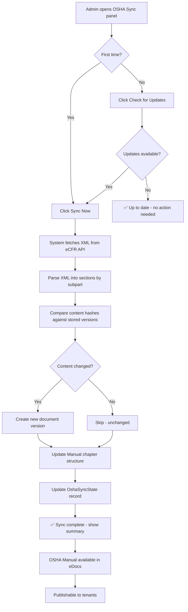

# OSHA 29 CFR 1926 Import & Auto-Sync

## Purpose
This module provides automatic import and synchronization of the complete OSHA Safety and Health Regulations for Construction (29 CFR Part 1926) from the Electronic Code of Federal Regulations (eCFR) into the NEXUS document management system. It ensures that NEXUS always has the most current version of OSHA construction standards available for reference, compliance, and distribution to tenants.

## Who Uses This
- **System Administrators (SUPER_ADMIN)**: Trigger syncs, monitor status, manage the OSHA manual
- **Project Managers**: Reference OSHA standards within NCC for project safety compliance
- **Safety Officers / Compliance**: Browse and search OSHA regulations within the platform
- **Executives**: View compliance posture and available safety documentation

## Workflow

### Initial Import (First-Time Setup)

#### Step-by-Step Process
1. Navigate to **System Documents** (`/system/documents`)
2. Locate the **🛡️ Safety & Compliance** section
3. Click **OSHA eCFR Sync** card (or use the 🛡️ OSHA Sync pill in the superuser nav bar)
4. On the OSHA Sync admin panel, click **🔄 Sync Now**
5. Wait for the sync to complete (~30–60 seconds depending on eCFR response time)
6. Verify the sync result summary shows expected section/subpart counts
7. Return to System Documents — the OSHA Construction Standards card should show a green **LIVE** badge with section count

### Checking for Updates

#### Step-by-Step Process
1. Navigate to the OSHA Sync admin panel (`/system/osha-sync`)
2. Click **🔍 Check for Updates**
3. The system queries the eCFR API and compares the `latest_amended_on` date against our stored date
4. If updates are available, a yellow banner appears showing the eCFR date vs. our last sync date
5. If up to date, a green confirmation appears

### Performing a Re-Sync

#### Step-by-Step Process
1. After confirming updates are available, click **🔄 Sync Now**
2. The system fetches the full XML from eCFR, parses all sections, and compares content hashes
3. Only changed sections create new document versions — unchanged sections are skipped (deduplication via SHA-256 content hashing)
4. The sync result summary shows counts for: new, updated, unchanged, and total sections
5. The Manual structure (chapters/subparts) is updated automatically

### Viewing the OSHA Manual

#### Step-by-Step Process
1. From System Documents, click the **OSHA Construction Standards** card (links directly to the manual)
2. Or from the OSHA Sync page, click **View Manual →** or **👁️ Preview Manual**
3. The manual is organized by OSHA Subparts (A through CC), each as a chapter
4. Each section (§1926.XXX) is a versioned SystemDocument within its subpart chapter
5. Standard manual features apply: Views, compact TOC, PDF export, tenant publishing

### Flowchart

## Key Features
- **Automatic eCFR Integration**: Fetches directly from the official U.S. Government eCFR API — no manual data entry
- **Public Domain Content**: All OSHA regulations are U.S. Government works (public domain) — no copyright restrictions
- **Content Deduplication**: SHA-256 content hashing prevents unnecessary version creation when content hasn't changed
- **Structured Import**: Each OSHA subpart becomes a Manual chapter; each section (§1926.XXX) becomes a versioned SystemDocument
- **Change Detection**: Quick check endpoint compares eCFR amendment dates without downloading the full XML
- **Full Version History**: Every content change creates a new document version with audit trail
- **Manual Features**: The generated manual supports Views, saved views, compact TOC, PDF export, and tenant publishing
- **Error Recovery**: Sync failures are recorded in the OshaSyncState; status page shows last error for troubleshooting

## Technical Architecture

### Data Source
- **API**: `https://www.ecfr.gov/api/versioner/v1/`
- **Endpoints Used**:
  - `GET /titles` — metadata with `latest_amended_on` for change detection
  - `GET /full/{date}/title-29.xml?part=1926` — full XML content
- **Authentication**: None required (public API)
- **Rate Limits**: None documented; eCFR is updated daily by the Office of the Federal Register

### Database Models
- **OshaSyncState**: Tracks sync status, last amended date, section count, content hash, and manual ID per CFR title/part
- **Manual** (code: `osha-29cfr1926`): The OSHA manual container with 🛡️ icon
- **ManualChapter**: One per OSHA subpart (A through CC)
- **SystemDocument** (code: `osha-1926-{number}`): One per OSHA section
- **SystemDocumentVersion**: Versioned content with HTML and content hash

### API Endpoints (SUPER_ADMIN only)
- `GET /system/osha/status` — current sync state
- `GET /system/osha/check-updates` — compare eCFR vs. stored amendment date
- `POST /system/osha/sync` — trigger full sync

### Frontend Pages
- `/system/osha-sync` — admin panel with status, check updates, and sync controls
- `/system/documents` — Safety & Compliance section with OSHA manual card

## Error Handling
- If eCFR API is unreachable, sync fails gracefully and records the error in OshaSyncState
- If XML parsing yields zero sections, sync aborts with an error (possible format change)
- The 2-minute transaction timeout prevents indefinite database locks
- The status page always shows the last error message for debugging

## Planned Enhancement: OSHA Links on PETL Line Items
The next phase will parse OSHA section references and link them directly to PETL line items (SowItem). When a line item involves work governed by a specific OSHA section, the PETL row will display a clickable 🛡️ OSHA reference badge.

### How It Will Work
- OSHA sections will be mapped to Xactimate category codes, activity types, and trade keywords (e.g., scaffolding → §1926.451, fall protection → §1926.501, electrical → §1926.405)
- SowItem rows matching a mapped category/activity will display a badge like: `🛡️ §1926.502`
- Clicking the badge opens the corresponding OSHA section from the synced manual
- This creates a direct, contextual bridge between estimating/scheduling and safety compliance at the line-item level

### Example
A PETL line for "Install temporary guardrails — 2nd floor perimeter" (category code for fall protection work) would show a 🛡️ §1926.502 badge linking directly to the Fall Protection Systems section in the OSHA manual.

### Data Model Impact
- New mapping table or JSON config linking Xactimate category/sel codes → OSHA section codes
- Optional `oshaReferences` JSON field on SowItem, or a cross-reference join table
- Frontend: badge component on PETL line items with popover showing section title and link

## Related Modules
- [System Documents Library](/system/documents/library) — where individual OSHA sections are stored
- [System Manuals](/system/documents/manuals) — where the OSHA manual appears
- [Document Publishing](/system/documents/publish) — for distributing OSHA content to tenants
- [Manual Views System] — for creating filtered/saved views of the OSHA manual
- [PETL / Estimating](/project-management) — where OSHA links will surface on line items (planned)

## Revision History
| Rev | Date | Changes |
|-----|------|---------|
| 1.0 | 2026-02-21 | Initial release — full eCFR import, sync admin panel, eDocs integration |
