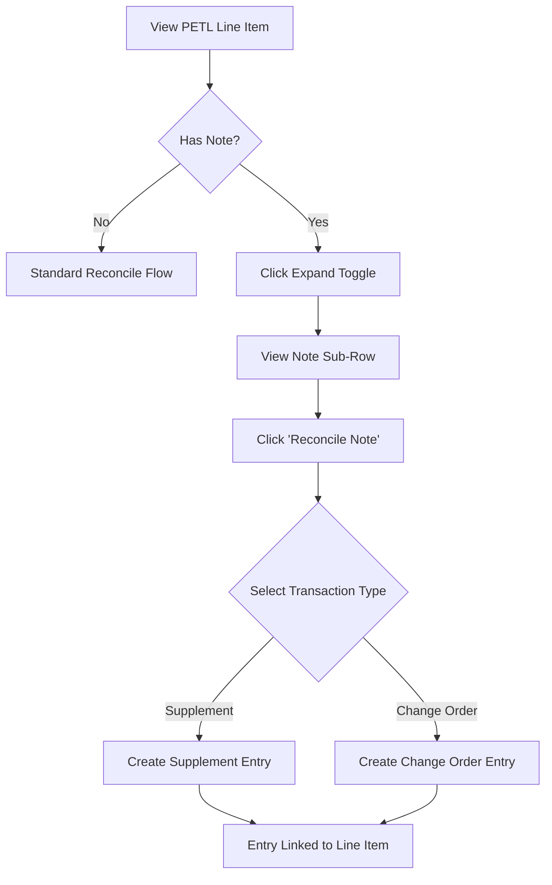

# PETL Note Reconciliation

## Purpose
Allow users to view and reconcile V0 (original estimate) notes as sub-line items within the PETL, enabling better tracking of notes that require reconciliation actions.

## Who Uses This
- Project Managers
- Estimators
- Administrators

## Workflow

### Step-by-Step Process
1. Navigate to a project's PETL tab
2. Find a line item with a NOTE badge (amber colored)
3. Click the expand toggle (▸) to reveal sub-rows
4. The V0 note appears as a sub-row with "↳ 📝 V0" indicator
5. Click "Reconcile Note" to open the reconciliation workflow
6. Complete the reconciliation (Supplement or Change Order) as needed

### Flowchart

## Key Features
- V0 notes display as expandable sub-rows with amber styling
- "Reconcile Note" button opens standard reconciliation workflow
- Notes remain visible alongside financial reconciliation entries
- Expand toggle appears for items with notes even without existing recon entries

## Related Modules
- PETL Management
- Reconciliation Workflow
- Supplements & Change Orders

## Revision History
| Rev | Date | Changes |
|-----|------|--------|
| 1.0 | 2026-02-19 | Initial release |
