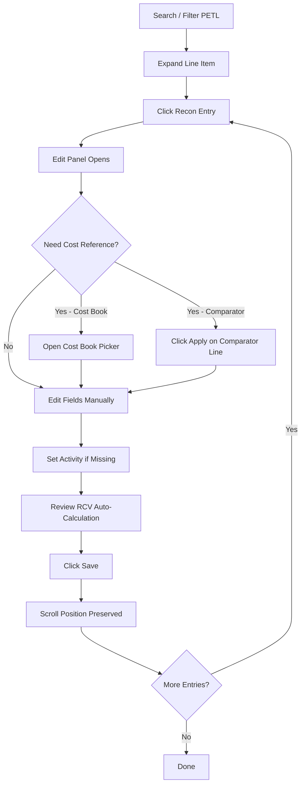

# PETL Reconciliation Entry Editing

## Purpose
Defines the workflow for editing existing reconciliation entries in the PETL (Project Estimate Task List). Covers finding line items, editing financial data, using cost book and comparator references, and saving changes efficiently during bulk reconciliation sessions.

## Who Uses This
- Project Managers (PM)
- Estimators
- Administrators / Super Admins

## Finding Line Items

### Standalone Search Bar
A search bar sits above the filter dropdowns (Room, Cat, Sel, Org Group). Use it to quickly locate line items:
- **Multi-term search**: Type space-separated words. ALL words must match somewhere across the line item's fields.
- **Searchable fields**: Description, room, line #, activity, cat, sel, unit, item notes, and reconciliation entry descriptions/notes.
- **Example**: Typing `bathroom remove` finds items where "bathroom" appears in the room AND "remove" appears in the activity or description.
- **Match count**: Shows "X matches" when search is active.
- **Clear**: Click the × button or delete text to clear the filter.

### Filter Dropdowns
Use the checkbox multi-select dropdowns (Room, Cat, Sel, Org Group) to filter by specific values. Each dropdown includes its own "Filter…" text input for quick option searching.

## Editing a Reconciliation Entry

### Opening the Editor
1. Expand a PETL line item (click ▸) to reveal its reconciliation sub-rows.
2. Click on a reconciliation entry row to open the edit panel.
3. The edit panel appears as a draggable modal over the PETL table.

### Transaction Types
Each entry has a transaction type (tag) set during creation:
- **Initial Claim** (green badge) — Carrier-visible initial claim entry.
- **Supplement** (blue badge) — Carrier-visible, attached to parent line.
- **Change Order** (purple badge) — Client-only, not visible to carrier. Can be standalone or attached.
- **Other** — Miscellaneous entries.
- **Warranty** — Warranty-related work.

The transaction type is read-only in the edit panel (set during the reconciliation workflow).

### Required Fields
- **Activity** (red border when empty) — Controls which cost components contribute to the line total. Options: R&R, Remove, Replace, D&R, Materials, Repair, Install Only.

### Financial Fields
- **Qty / Unit / Unit Cost** — Bidirectional calculation: editing unit cost recalculates item amount; editing item amount recalculates unit cost.
- **Item Amount** — Auto-derived from qty × unit cost, or manually overridable.
- **Tax / O&P** — Additional cost components.
- **RCV** — Auto-calculated as item amount + tax + O&P unless manually overridden.
- **% Complete** — Dropdown from 0% to 100%.

### Cost Components (Xactimate-style)
- **Worker's Wage, Labor Burden, Labor Overhead** — Labor cost breakdown.
- **Material Cost, Equipment Cost** — Non-labor components.
- Changing the Activity auto-recalculates the line total based on which components apply (e.g., "Remove" uses only labor; "R&R" uses labor + material + equipment).

### Using Cost Book
Click "Use Cost Book Fields" to open the cost book picker. Select a line item to populate all draft fields from the cost book entry.

### Using Comparator (From Comparator)
If comparator data is available for the parent line item, a "FROM COMPARATOR" section appears above the cost book button. Click "Apply" on any comparator line to populate all fields with one click.

### Saving
- Click **Save** (dark button, bottom-right). The button is disabled (grayed out) if no transaction type is set.
- After saving, the PETL table preserves your scroll position — you won't be sent back to the top.
- If no fields changed, clicking Save simply closes the editor.

### Deleting
- Click **Delete entry** (bottom-left, PM+ only). A confirmation prompt appears.
- Use Reject (status change) if you want to keep a record without charging.

## Bulk Editing Workflow

When reconciling many line items in sequence:
1. Use the standalone search to filter to the relevant items.
2. Expand and edit each entry.
3. Save → the table stays at your scroll position.
4. Click the next entry to edit.
5. Repeat.

The scroll preservation ensures you don't lose your place during bulk editing sessions.

## Flowchart

## Key Features
- Bidirectional qty/unitCost/itemAmount calculation
- Auto-RCV from item + tax + O&P (unless manually overridden)
- Activity-driven cost component formulas (matches Xactimate logic)
- Scroll position preserved across saves for efficient bulk editing
- Multi-term search across all fields including recon entry text
- Draggable edit panel — position it wherever is convenient

## Related Modules
- [PETL Note Reconciliation](petl-note-reconciliation-sop.md)
- [Purchase Reconciliation Audit Chain](purchase-reconciliation-audit-chain-sop.md)
- Batch Paste & Batch Undo
- Cost Book Management
- Comparator Import

## Revision History
| Rev | Date | Changes |
|-----|------|---------|
| 1.0 | 2026-03-10 | Initial release — covers editing workflow, search, scroll preservation |
