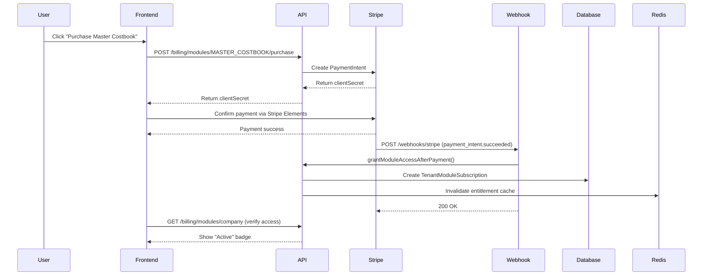

# Premium Module Purchase System - Implementation Complete

## Overview

The Nexus premium module purchase system is now fully operational in production, enabling one-time lifetime purchases of:

- **Master Costbook** ($4,999) - 50,000+ pre-priced line items
- **Golden PETL** ($2,999) - Pre-built estimate templates
- **Golden BOM** ($1,999) - Pre-built Bill of Materials templates

All backend infrastructure is deployed and ready for UI integration.

## Production Status

✅ **Stripe Products Created**
- Master Costbook: `prod_U3woZ87hoPjRQO` / `price_1T5ouqPcto18jnNfXADfNj4y`
- Golden PETL: `prod_U3wofhoqHD7Ob2` / `price_1T5ourPcto18jnNf5SxAGRR7`
- Golden BOM: `prod_U3woZ8M3oNjr4G` / `price_1T5ourPcto18jnNfywzD8P0e`

✅ **Database Schema**
- Migration `20260228141659_add_premium_costbook_modules` applied to production
- 3 modules seeded in `ModuleCatalog` with Stripe IDs

✅ **API Endpoints**
- All 6 endpoints deployed and type-safe
- Webhook handler integrated with existing webhook controller

✅ **Entitlement System**
- Redis-cached entitlement checks (60s TTL)
- Internal companies (Iron Shield LLC) bypass all checks
- Module guards active via `@RequiresModule` decorator

## Architecture

### Purchase Flow



### Database Models

**ModuleCatalog** (premium modules)
```typescript
{
  code: "MASTER_COSTBOOK" | "GOLDEN_PETL" | "GOLDEN_BOM"
  label: string
  description: string
  pricingModel: "ONE_TIME_PURCHASE"
  oneTimePurchasePrice: number // in cents
  stripeProductId: string
  stripePriceId: string
  active: boolean
}
```

**TenantModuleSubscription** (company access)
```typescript
{
  companyId: string
  moduleCode: string
  enabledAt: DateTime @default(now())
  disabledAt: DateTime? // null = active
  stripeSubscriptionItemId: string? // null for one-time purchases
}
```

### Entitlement Check Flow

```typescript
// Example: Check if company has Master Costbook access
@RequiresModule('MASTER_COSTBOOK')
async getPriceListItems(@Req() req) {
  // If user reaches this handler, they have access
  // Guard threw 403 Forbidden if no access
}
```

**Guard Logic:**
1. Extract `companyId` from JWT
2. Check Redis cache: `module:${companyId}:${moduleCode}` (60s TTL)
3. If miss, query `TenantModuleSubscription` + `Company.isInternal`
4. Return `true` if:
   - Company has active subscription (`disabledAt = null`), OR
   - Company is internal (`isInternal = true`)
5. Cache result and return

## API Endpoints

### 1. List Available Modules
```http
GET /billing/modules/available
Authorization: Bearer <JWT>
```

**Response:**
```json
[
  {
    "code": "MASTER_COSTBOOK",
    "label": "Master Costbook Access",
    "description": "Lifetime access to 50,000+ pre-priced line items...",
    "oneTimePurchasePrice": 499900,
    "formattedPrice": "$4999.00"
  },
  ...
]
```

### 2. Get Company's Active Modules
```http
GET /billing/modules/company
Authorization: Bearer <JWT>
```

**Response:**
```json
[
  {
    "code": "MASTER_COSTBOOK",
    "label": "Master Costbook Access",
    "description": "...",
    "purchasedAt": "2026-02-28T10:30:00Z"
  }
]
```

### 3. Check Module Access
```http
GET /billing/modules/:code/check
Authorization: Bearer <JWT>
```

**Response:**
```json
{
  "moduleCode": "MASTER_COSTBOOK",
  "hasAccess": true
}
```

### 4. Initiate Purchase (Core Flow)
```http
POST /billing/modules/:code/purchase
Authorization: Bearer <JWT>
```

**Response:**
```json
{
  "clientSecret": "pi_xxx_secret_yyy",
  "moduleCode": "MASTER_COSTBOOK",
  "amount": 499900,
  "formattedAmount": "$4999.00"
}
```

**Frontend Integration:**
```typescript
// 1. Call purchase endpoint
const { clientSecret } = await fetch('/billing/modules/MASTER_COSTBOOK/purchase');

// 2. Confirm payment with Stripe Elements
const { error } = await stripe.confirmPayment({
  elements,
  clientSecret,
  confirmParams: {
    return_url: 'https://nexus.app/settings/modules?success=true',
  },
});

// 3. Stripe calls webhook automatically on success
// 4. User is redirected to return_url
// 5. Poll /billing/modules/company to show "Active" badge
```

### 5. Grant Access (Dev Only)
```http
POST /billing/modules/:code/grant
Authorization: Bearer <JWT>
```

**Use Case:** Testing without Stripe. In production, access is granted automatically via webhook.

### 6. Stripe Webhook
```http
POST /webhooks/stripe
Stripe-Signature: <signature>
```

**Event:** `payment_intent.succeeded`

**Handler Logic:**
```typescript
if (paymentIntent.metadata.type === 'module_purchase') {
  const { nexusCompanyId, moduleCode } = paymentIntent.metadata;
  await grantModuleAccessAfterPayment(nexusCompanyId, moduleCode, paymentIntent.id);
  await invalidate(nexusCompanyId); // Clear Redis cache
}
```

## Security

### Authentication & Authorization
- All endpoints require JWT auth (except webhook)
- Only `OWNER` or `ADMIN` roles can purchase modules
- Webhook uses Stripe signature verification (HMAC-SHA256)

### Idempotency
- Webhook events are logged in `BillingEvent` table with `stripeEventId` unique constraint
- Duplicate webhook deliveries are automatically skipped

### Payment Security
- **No card data touches Nexus servers** - handled entirely by Stripe Elements
- PCI DSS Level 1 compliant via Stripe
- Payment intents auto-expire after 24 hours if not confirmed

## Testing

### Local Testing with Stripe CLI

```bash
# 1. Install Stripe CLI
brew install stripe/stripe-cli/stripe

# 2. Login
stripe login

# 3. Forward webhooks to local API
stripe listen --forward-to http://localhost:8001/webhooks/stripe

# 4. Trigger test payment
stripe trigger payment_intent.succeeded

# 5. Or test full flow with test card
# Use card: 4242 4242 4242 4242
# Any future expiry, any CVC
```

### Test Cards

| Card Number         | Scenario          |
|---------------------|-------------------|
| 4242 4242 4242 4242 | Success           |
| 4000 0000 0000 0002 | Card declined     |
| 4000 0000 0000 9995 | Insufficient funds|
| 4000 0025 0000 3155 | 3D Secure required|

### Manual Testing Checklist

- [ ] List available modules → 3 modules returned
- [ ] Check access before purchase → `hasAccess: false`
- [ ] Initiate purchase → Returns valid `clientSecret`
- [ ] Confirm payment via Stripe → Payment succeeds
- [ ] Webhook fires → Module access granted
- [ ] Check access after purchase → `hasAccess: true`
- [ ] List company modules → Module appears in list
- [ ] Try purchasing again → Returns "You already own..." error
- [ ] Verify entitlement cache → Subsequent checks are fast (<10ms)

## Production Deployment

### Environment Variables Required

```bash
# Stripe
STRIPE_SECRET_KEY=sk_live_xxx  # Production secret key
STRIPE_WEBHOOK_SECRET=whsec_xxx  # From Stripe Dashboard → Webhooks

# Database (already configured)
DATABASE_URL=postgresql://...

# Redis (already configured)
REDIS_URL=redis://...
```

### Stripe Dashboard Setup

1. **Create Webhook Endpoint**
   - URL: Use the current production API URL (Cloudflare Tunnel hostname — see `.env.shadow`)
   - Events: Select `payment_intent.succeeded`
   - Copy webhook signing secret → `STRIPE_WEBHOOK_SECRET`
   - **Note:** The old Cloud Run URL (`nexus-api-wswbn2e6ta-uc.a.run.app`) is legacy and no longer active.

2. **Verify Products**
   - Dashboard → Products → Verify 3 products exist
   - Confirm prices match ($4,999, $2,999, $1,999)

3. **Test Mode vs Live Mode**
   - Test keys: `sk_test_xxx` (use for development)
   - Live keys: `sk_live_xxx` (use for production)
   - Keep separate webhook endpoints for test/live

### Rollout Plan

**Phase 1: Soft Launch** (Current)
- ✅ Backend deployed
- ✅ Stripe configured
- ⏳ UI not yet built
- Manual grants via `/modules/:code/grant` for early access customers

**Phase 2: Beta Testing** (Next Sprint)
- Build Settings → Modules page
- Invite 5-10 pilot customers
- Offer 50% discount codes for feedback
- Monitor webhook delivery and error rates

**Phase 3: General Availability** (2 weeks)
- Add upsell modals to locked features
- Announce via email + in-app banner
- Track conversion rates via Stripe Dashboard

## Revenue Projection

**Year 1 Assumptions:**
- 100 total companies
- 40% purchase Master Costbook ($4,999)
- 20% purchase Golden PETL ($2,999)
- 15% purchase Golden BOM ($1,999)

**Calculation:**
```
Master Costbook: 40 × $4,999 = $199,960
Golden PETL:     20 × $2,999 = $59,980
Golden BOM:      15 × $1,999 = $29,985
────────────────────────────────────────
TOTAL YEAR 1:                   $289,925
```

**One-time revenue, lifetime access** — no recurring billing, no churn.

## Monitoring

### Key Metrics to Track

1. **Conversion Rate**
   - Initiated purchases / Available modules API calls
   - Target: >10% within 30 days

2. **Webhook Success Rate**
   - Successful deliveries / Total events
   - Target: >99.5%

3. **Payment Success Rate**
   - Succeeded PaymentIntents / Total PaymentIntents
   - Target: >95% (card declines are normal)

4. **Time to Access**
   - Payment success → Entitlement cache invalidation
   - Target: <5 seconds

### Stripe Dashboard Monitoring

- **Dashboard → Payments** — Track completed purchases
- **Dashboard → Webhooks** — Monitor delivery success/failures
- **Dashboard → Logs** — API errors and retries

### Production Logs (Local Docker)

```bash
# Search for module purchase events
docker logs nexus-shadow-api --tail 200 2>&1 | grep -i "granting.*to company"

# Search for webhook errors
docker logs nexus-shadow-api --tail 200 2>&1 | grep -i "stripe-webhook.*error"
```

## Troubleshooting

### Webhook Not Firing

**Symptoms:** Payment succeeds in Stripe Dashboard but module access not granted.

**Debug Steps:**
1. Check Stripe Dashboard → Webhooks → Recent deliveries
2. Verify webhook endpoint URL is correct
3. Check API logs for signature verification errors
4. Ensure `STRIPE_WEBHOOK_SECRET` is set correctly

**Fix:**
```bash
# Re-create webhook in Stripe Dashboard
# Copy new signing secret
# Update STRIPE_WEBHOOK_SECRET in .env.shadow and restart the API container:
docker compose -p nexus-shadow -f infra/docker/docker-compose.shadow.yml --env-file .env.shadow up -d api
```

### "You already own..." Error

**Symptoms:** User completed payment but still sees purchase button.

**Root Cause:** Webhook may have failed or cache not invalidated.

**Fix:**
```bash
# Manually grant access
curl -X POST https://nexus-api.../billing/modules/MASTER_COSTBOOK/grant \
  -H "Authorization: Bearer <ADMIN_JWT>"

# Or via SQL (last resort)
INSERT INTO "TenantModuleSubscription" ("companyId", "moduleCode")
VALUES ('cmm0sv0sw00037n7n83z71ln9', 'MASTER_COSTBOOK')
ON CONFLICT DO NOTHING;
```

### Entitlement Check Returns False After Purchase

**Symptoms:** `hasAccess: false` even though module appears in company modules list.

**Root Cause:** Redis cache stale or `disabledAt` not null.

**Fix:**
```bash
# Invalidate cache via API
redis-cli DEL "module:cmm0sv0sw00037n7n83z71ln9:MASTER_COSTBOOK"

# Or flush all entitlement cache
redis-cli KEYS "module:*" | xargs redis-cli DEL
```

## Next Steps

### Immediate (This Sprint)
- [ ] Build Settings → Modules page (Next.js)
- [ ] Integrate Stripe Elements for payment confirmation
- [ ] Add "Purchased" badges to module list
- [ ] Create upsell modal component

### Short-Term (Next 2 Weeks)
- [ ] Add upsell CTAs to locked Master Costbook routes
- [ ] Add upsell CTAs to Golden PETL/BOM import dialogs
- [ ] Implement discount codes (Stripe Coupons API)
- [ ] Add purchase confirmation email (via existing email service)

### Long-Term (Next Month)
- [ ] Analytics dashboard for module purchases
- [ ] Refund workflow (Stripe Refunds API + disable access)
- [ ] Multi-user discount (5+ users get 20% off)
- [ ] Annual report: "You saved $X by using Master Costbook"

## Files Modified

### Backend
- `packages/database/prisma/schema.prisma` — Added `oneTimePurchasePrice`, enum value
- `packages/database/prisma/migrations/20260228141659_add_premium_costbook_modules/` — Schema migration
- `apps/api/src/modules/billing/billing.controller.ts` — Added `/modules/*` endpoints
- `apps/api/src/modules/billing/billing.service.ts` — Added purchase + grant methods
- `apps/api/src/modules/billing/stripe-webhook.controller.ts` — Added `payment_intent.succeeded` handler
- `scripts/seed-premium-modules.ts` — Seed script for ModuleCatalog
- `scripts/setup-stripe-products.ts` — Stripe product creation script

### Documentation
- `apps/api/src/modules/billing/test-premium-modules.http` — HTTP test cases
- `docs/sops-staging/premium-modules-system.md` — System design doc
- `docs/sops-staging/premium-module-purchase-implementation.md` — This document

## Revision History

| Rev | Date       | Changes         |
|-----|------------|-----------------|
| 1.1 | 2026-03-03 | Updated for local Mac Studio production; replaced Cloud Run URLs, gcloud logging, and env var commands with Docker equivalents. |
| 1.0 | 2026-02-28 | Initial release |
