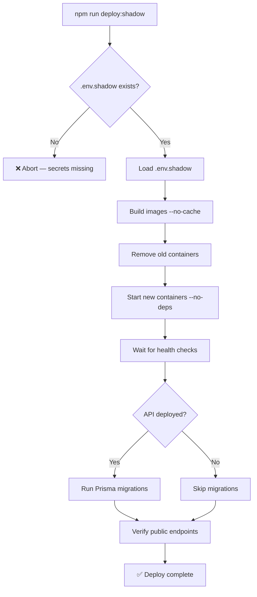

# Production Deployment (Shadow Stack)

## Purpose
Defines the standard process for deploying code changes to the Nexus production environment. Production runs entirely on the local Mac Studio behind a Cloudflare Tunnel — there is no cloud hosting.

## Who Uses This
- Developers deploying backend or frontend changes
- Warp agents performing automated deploys
- System administrators maintaining the shadow stack

## Architecture Overview

```
Internet → Cloudflare Tunnel → Mac Studio Docker
  staging-ncc.nfsgrp.com  → nexus-shadow-web    (:3001)
  staging-api.nfsgrp.com  → nexus-shadow-api     (:8000)
```

All services run as Docker containers managed by `infra/docker/docker-compose.shadow.yml`. The compose file has `name: nexus-shadow` baked in, ensuring all containers share the `nexus-shadow_default` network automatically.

### Services
- **nexus-shadow-api** — NestJS API (port 8000)
- **nexus-shadow-worker** — BullMQ import worker (port 8001, internal)
- **nexus-shadow-receipt-poller** — Receipt email poller
- **nexus-shadow-web** — Next.js frontend (port 3001)
- **nexus-shadow-postgres** — Postgres 18 (port 5435, DB: NEXUSPRODv3)
- **nexus-shadow-redis** — Redis 8 (port 6381)
- **nexus-shadow-minio** — S3-compatible storage (ports 9000/9001)
- **nexus-shadow-tunnel** — Cloudflare tunnel

## Workflow

### Deploy Commands

```bash
# Deploy API + Worker (most common — after backend code changes):
npm run deploy:shadow

# Deploy web only (after frontend changes):
npm run deploy:shadow:web

# Deploy everything (rare — full rebuild):
npm run deploy:shadow:all
```

All commands invoke `scripts/deploy-shadow.sh`, which automates the full lifecycle.

### What the Script Does



### Step-by-Step Process

1. **Commit and push** all code changes to `main`
2. **Run the deploy command** — choose based on what changed:
   - Backend (API, worker, database): `npm run deploy:shadow`
   - Frontend only: `npm run deploy:shadow:web`
   - Everything: `npm run deploy:shadow:all`
3. **Wait for completion** — the script will:
   - Build Docker images (~60–90s)
   - Restart containers (~5s)
   - Wait for health checks (~10–30s)
   - Run Prisma migrations (if API was deployed)
   - Verify public health endpoints
4. **Verify** — the script prints container status at the end

### Mobile Deploys

Mobile apps have the production API URL (`staging-api.nfsgrp.com`) baked in at build time. After deploying API changes, existing mobile installs automatically use the new API. A new mobile build is only needed when:
- The API URL changes
- Native mobile code changes
- New mobile features are added

See the Mobile Build & Deploy Contract in WARP.md for the build process.

## Key Features

### Automatic Network Isolation
Both compose files have a top-level `name:` property:
- `docker-compose.shadow.yml` → `name: nexus-shadow` → network: `nexus-shadow_default`
- `docker-compose.yml` → `name: nexus-dev` → network: `nexus-dev_default`

This eliminates the previous issue where containers could land on the wrong Docker network when the `-p` flag was forgotten.

### Automatic Secret Loading
The deploy script passes `--env-file .env.shadow` to every compose command, ensuring variables like `SHADOW_PG_PASSWORD` always interpolate correctly into `DATABASE_URL` and other connection strings.

### Automatic Migrations
When the API is deployed, `prisma migrate deploy` runs automatically against the shadow database. No manual migration step needed.

### Zero-Downtime Data Stores
The script uses `--no-deps` so data stores (Postgres, Redis, MinIO) are never restarted during a deploy. Only application containers (API, Worker, Web) are rebuilt.

## Troubleshooting

### Container starts but API returns 500
**Cause:** Missing environment variables (usually `SHADOW_PG_PASSWORD`)
**Fix:** Ensure `.env.shadow` exists at repo root and contains all required secrets. The deploy script loads it automatically.

### Tunnel returns 502 after deploy
**Cause:** New container landed on wrong Docker network
**Fix:** This should no longer happen with `name: nexus-shadow` in the compose file. If it does, check `docker inspect nexus-shadow-api --format '{{range $k, $v := .NetworkSettings.Networks}}{{$k}} {{end}}'` — it should show `nexus-shadow_default`.

### Health check times out
**Cause:** Container is starting slowly or crashed
**Fix:** Check logs: `docker logs nexus-shadow-api --tail 50`

### DNS not resolving after deploy
**Cause:** Local DNS cache holding stale entry
**Fix:** `sudo dscacheutil -flushcache && sudo killall -HUP mDNSResponder`

## Related Modules
- [Shadow Server DB Clone SOP](shadow-server-db-clone-sop.md) — Cloning prod data to dev
- [Dev Environment Startup SOP](dev-environment-startup-sop.md) — Local dev stack
- [CI/CD Production Deployment SOP](cicd-production-deployment-sop.md) — Legacy reference
- [Production Stack Monitoring SOP](production-stack-monitoring-sop.md) — Health monitor

## Files Reference
- `scripts/deploy-shadow.sh` — Deploy script
- `infra/docker/docker-compose.shadow.yml` — Shadow compose file
- `.env.shadow` — Production secrets (git-ignored)
- `packages/database/prisma.config.ts` — Prisma config for migrations

## Revision History
| Rev | Date | Changes |
|-----|------|---------|
| 1.0 | 2026-03-04 | Initial release — deploy-shadow.sh, name: property fix, npm scripts |
