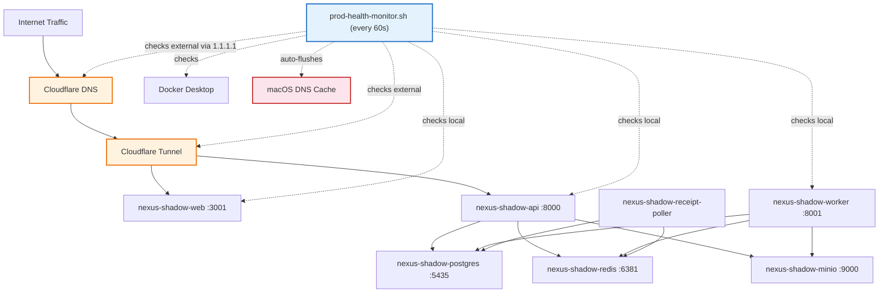
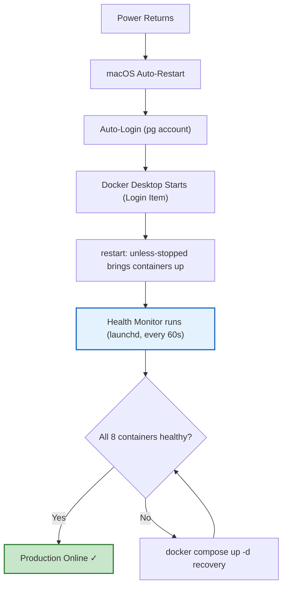

# Production Stack Monitoring & Auto-Recovery

## Purpose
Defines the monitoring, auto-recovery, and maintenance procedures for the NEXUS production stack running on the Mac Studio behind Cloudflare Tunnel. Ensures maximum uptime and rapid recovery from failures.

## Who Uses This
- System administrators
- DevOps / infrastructure operators
- On-call engineers
- Warp agents making production changes

## Architecture Overview



## Boot-to-Production Recovery Chain

When the Mac Studio restarts (power failure, macOS update, manual reboot), production auto-recovers:



### Prerequisites for Auto-Recovery
1. **Automatic Login** — System Settings → Users & Groups → Automatic Login → `pg`
2. **Prevent Sleep** — System Settings → Energy → "Prevent your Mac from automatically sleeping when the display is off" → ON
3. **Restart on Power Failure** — System Settings → Energy → "Start up automatically after a power failure" → ON
4. **Docker Desktop as Login Item** — System Settings → General → Login Items → Docker ✓
5. **FileVault OFF** — Required for automatic login to work

## Health Monitor

### Overview
`infra/scripts/prod-health-monitor.sh` runs every 60 seconds via launchd and performs 7 checks:

1. **Docker Desktop daemon** — Is `docker info` responding?
2. **Container status** — Are all 8 `nexus-shadow-*` containers running?
3. **Health endpoints (local)** — Do API (:8000), Worker (:8001), and Web (:3001) return HTTP 200 on localhost?
4. **DNS resolution** — Do `staging-api.nfsgrp.com` and `staging-ncc.nfsgrp.com` resolve via system DNS? If local DNS fails but public DNS (1.1.1.1) succeeds, auto-flushes macOS DNS cache.
5. **External endpoints (public)** — Do `https://staging-api.nfsgrp.com/health` and `https://staging-ncc.nfsgrp.com` return HTTP 200 through Cloudflare? Resolves via 1.1.1.1 with `--resolve` to bypass local DNS cache entirely.
6. **Restart policy drift** — Do all containers have `restart: unless-stopped`?
7. **Compose project consistency** — Are all containers in the `nexus-shadow` project?

### Auto-Recovery Actions
- **Docker Desktop down** → `open -a Docker` (with 10-minute cooldown to prevent restart loops)
- **Containers down** → `docker compose -p nexus-shadow -f ... up -d`
- **Health endpoints failing** → Notification only (containers may be starting up)
- **DNS cache stale** → Auto-flush via `sudo dscacheutil -flushcache` + `sudo killall -HUP mDNSResponder` (5-minute cooldown)
- **External endpoints down** → Critical notification distinguishing DNS/tunnel failure from container failure
- **Policy/project drift** → Notification only (manual compose redeploy needed)

### Notifications
- **macOS Notification Center** via `terminal-notifier`
- **System alert sound** (Sosumi) for critical issues (Docker crash, container failure)
- All events logged to `infra/logs/prod-health-monitor.log`

### Management Commands

```bash
# Check monitor is running
launchctl list | grep nexus

# View recent monitor log
tail -50 infra/logs/prod-health-monitor.log

# Manually trigger a health check
bash infra/scripts/prod-health-monitor.sh

# Restart the monitor
launchctl unload ~/Library/LaunchAgents/com.nexus.prod-health-monitor.plist
launchctl load ~/Library/LaunchAgents/com.nexus.prod-health-monitor.plist
```

## Required Containers (8 total)

| Container | Service | Port | Health Check |
|-----------|---------|------|-------------|
| nexus-shadow-api | NestJS API | 8000 | HTTP /health |
| nexus-shadow-worker | BullMQ import worker | 8001 | HTTP /health |
| nexus-shadow-web | Next.js frontend | 3001 | HTTP 200 |
| nexus-shadow-postgres | PostgreSQL 18 | 5435 | pg_isready |
| nexus-shadow-redis | Redis 8 | 6381 | redis-cli ping |
| nexus-shadow-minio | S3 storage | 9000 | curl /minio/health/live |
| nexus-shadow-tunnel | Cloudflare tunnel | — | — |
| nexus-shadow-receipt-poller | Email receipt poller | — | — |

## Critical Rules

### Always Use `-p nexus-shadow`
Every `docker compose` command against the production stack MUST include `-p nexus-shadow`. Omitting it causes Docker to derive a project name from the working directory, which splits containers across projects and breaks restart policies.

```bash
# CORRECT
docker compose -p nexus-shadow -f infra/docker/docker-compose.shadow.yml up -d --build api worker

# WRONG — will create a separate "docker" or "nexus-enterprise" project
docker compose -f infra/docker/docker-compose.shadow.yml up -d --build api worker
```

### Never Kill by Port
Never use `lsof -ti:<port> | xargs kill` or similar — this kills Docker proxy processes and can take down production containers.

### Never Stop Docker Desktop from Scripts
The Cloudflare tunnel and all production services depend on Docker being always-on. Scripts must never stop/restart Docker Desktop.

### Never Run `docker compose down` on Shadow Stack
Unless explicitly performing a full stack rebuild with immediate `up -d` afterward.

## Deploying Changes

```bash
# API + Worker (most common)
docker compose -p nexus-shadow -f infra/docker/docker-compose.shadow.yml up -d --build api worker

# Web only
docker compose -p nexus-shadow -f infra/docker/docker-compose.shadow.yml up -d --build web

# Full rebuild (rare)
docker compose -p nexus-shadow -f infra/docker/docker-compose.shadow.yml up -d --build
```

**After rebuilding web:** Users may need to hard-refresh (Cmd+Shift+R) to clear cached JS bundles.

## DNS Configuration

### Mac Studio DNS Servers
The Mac Studio MUST use Cloudflare DNS as primary resolvers. Since all production DNS records are managed in Cloudflare, this ensures instant resolution and prevents stale NXDOMAIN caching by ISP/router DNS.

**System Settings → Network → Ethernet → Details → DNS:**
1. `1.1.1.1` (Cloudflare primary)
2. `1.0.0.1` (Cloudflare secondary)
3. `192.168.1.1` (router fallback — auto-assigned by DHCP, cannot be removed)

**Why this matters:** Prior to this configuration (v1.0), the Mac Studio used only the router's DNS (`192.168.1.1`), which cached NXDOMAIN responses with long TTLs. This caused recurring outages where the production API was healthy on localhost but unreachable from the internet because the Mac Studio's own DNS couldn't resolve the Cloudflare-managed hostnames.

### Sudoers Entry for DNS Flush
The health monitor needs passwordless sudo to flush DNS. This is configured in:

```
/etc/sudoers.d/nexus-dns-flush
pg ALL=(ALL) NOPASSWD: /usr/bin/dscacheutil -flushcache, /usr/bin/killall -HUP mDNSResponder
```

**NEVER remove this file** — the monitor's DNS auto-recovery depends on it.

### Cloudflare DNS Records (nfsgrp.com zone)
Two tunnel CNAME records must exist in the Cloudflare dashboard:

- `staging-api` → `nexus-shadow` tunnel (Proxied)
- `staging-ncc` → `nexus-shadow` tunnel (Proxied)

If either record is missing, the health monitor's external check (Check 5) will fire a critical alert with `DNS FAIL`.

## Troubleshooting

### External endpoints down but localhost healthy
This means DNS or the Cloudflare tunnel is broken. Steps:
1. Check DNS: `dig +short staging-api.nfsgrp.com A` — if empty, flush DNS: `sudo dscacheutil -flushcache; sudo killall -HUP mDNSResponder`
2. If DNS still fails after flush, check Cloudflare dashboard for missing CNAME records
3. If DNS resolves but curl fails, check tunnel: `docker logs nexus-shadow-tunnel --tail 20`
4. Restart tunnel if needed: `docker compose -p nexus-shadow -f infra/docker/docker-compose.shadow.yml restart cloudflared`

### Login fails with "Network error"
The web container has a stale API URL baked in. Rebuild with no cache:
```bash
docker compose -p nexus-shadow -f infra/docker/docker-compose.shadow.yml build --no-cache web
docker compose -p nexus-shadow -f infra/docker/docker-compose.shadow.yml up -d web
```

### Containers in wrong project
Containers show different values for `com.docker.compose.project` label:
```bash
# Check
docker inspect --format '{{.Name}} Project={{index .Config.Labels "com.docker.compose.project"}}' $(docker ps -q --filter name=nexus-shadow)

# Fix: tear down both projects, bring up under correct name
docker compose -p <wrong-project> -f infra/docker/docker-compose.shadow.yml down
docker compose -p nexus-shadow -f infra/docker/docker-compose.shadow.yml down
docker compose -p nexus-shadow -f infra/docker/docker-compose.shadow.yml up -d
```

### Docker Desktop crashed overnight
Check system logs for the crash reason:
```bash
log show --predicate 'process == "com.docker.backend"' --style compact --start "$(date -v-1d +%Y-%m-%d) 00:00:00" 2>/dev/null | grep -iE "fault|error|exit|crash"
```
The health monitor should have auto-restarted Docker. Check `infra/logs/prod-health-monitor.log` for details.

### Orphaned containers with hash-prefix names
These appear as `84dd93142d2e_nexus-shadow-postgres` etc. Safe to remove:
```bash
docker rm <container-name>
```

## Files & Locations

- **Compose file:** `infra/docker/docker-compose.shadow.yml`
- **Monitor script:** `infra/scripts/prod-health-monitor.sh`
- **Monitor plist:** `~/Library/LaunchAgents/com.nexus.prod-health-monitor.plist`
- **Monitor log:** `infra/logs/prod-health-monitor.log`
- **Backup script:** `infra/scripts/backup-postgres.sh` (runs daily at 2 AM)
- **Backup plist:** `~/Library/LaunchAgents/com.nexus.backup-postgres.plist`
- **Production secrets:** `.env.shadow` (git-ignored)

## Related Modules
- [Local Production Deployment SOP](local-prod-deployment-sop.md)
- [WARP.md — Infrastructure Contract](../../WARP.md)

## Revision History

| Rev | Date | Changes |
|-----|------|---------|
| 2.0 | 2026-03-04 | Added DNS resolution check (Check 4), external endpoint monitoring via Cloudflare (Check 5), auto DNS cache flush with sudoers, Cloudflare DNS config for Mac Studio. Root cause: ISP DNS caching NXDOMAIN caused recurring prod outages invisible to localhost-only monitoring. |
| 1.0 | 2026-03-03 | Initial release. Covers health monitor, boot chain, Docker cleanup, compose project rules. |
