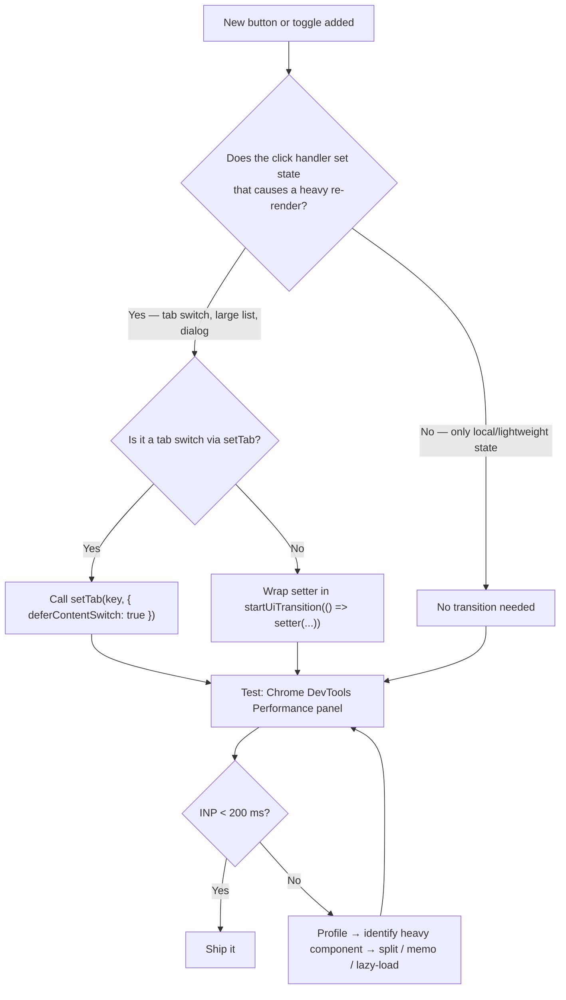

# App-Wide INP Performance

## Purpose
Documents the root causes, fixes, and ongoing patterns for Interaction to Next Paint (INP) regressions across the Nexus web application. The project detail page (`apps/web/app/projects/[id]/page.tsx`, ~36K lines) is the heaviest and most common source of INP violations, but the same patterns apply to all pages over ~2,000 lines.

## Who Uses This
- Frontend engineers adding features to the project detail page
- Code reviewers approving PRs that touch `apps/web/app/projects/[id]/page.tsx`
- DevOps/QA monitoring Web Vitals in production

## Background
The project detail page renders PETL tables (thousands of rows), Daily Logs, BOM & Procurement, Financial/invoicing, Schedule (Gantt), and more — all within a single component. Any state setter called during a click handler that triggers a large React re-render will block the main thread, causing INP violations (target: < 200 ms).

## Problem Pattern
React 18+ `useTransition` allows expensive state updates to be deferred so the browser can paint the immediate visual feedback (e.g. button highlight, tab underline) before committing the heavy render. When a button handler calls a state setter **without** wrapping it in a transition, the full re-render blocks the event handler and INP spikes.

## Fixes Applied (Feb 2026)

### 1. Invoice Print Dialog (2,174 ms → < 200 ms)
**Root cause:** Opening the print preview dialog synchronously mounted a full invoice table with all PETL lines.
**Fix:** Wrapped `setInvoicePrintDialogOpen(true/false)` in `startUiTransition()`. Made the inner print handler `async` with `await`.

### 2. PUDL Tab-Switch Buttons (424 ms → < 200 ms)
**Root cause:** Two "PUDL" buttons (in room rows and per-line-item rows of the PETL grouping table) called `setTab("DAILY_LOGS")` without `{ deferContentSwitch: true }`. This triggered a synchronous unmount of the heavy PETL tab and mount of Daily Logs.
**Fix:** Changed to `setTab("DAILY_LOGS", { deferContentSwitch: true })` at both call sites (~lines 30198, 30490).

### 3. BOM View Toggles (5 buttons)
**Root cause:** `setBomView("petl" | "components" | "raw" | "pricing" | "procure")` called directly without transition. Switching BOM sub-views re-renders large data tables.
**Fix:** Wrapped all five `setBomView()` calls in `startUiTransition()` (~lines 23321–23390).

### 4. Bills (Expenses) Collapse Toggle
**Root cause:** `setBillsCollapsed(v => !v)` called directly. Expanding bills renders the full bill list.
**Fix:** Wrapped in `startUiTransition()` (~line 17607).

## Workflow

### Adding a New Button / Toggle to the Project Detail Page

### Step-by-Step Process
1. **Identify the setter** — any `useState` setter that changes which large section is visible (tab switch, collapse/expand, dialog open, view toggle).
2. **Check existing transitions** — the page already provides:
   - `startUiTransition` — general-purpose UI transition (collapse toggles, view switches).
   - `startPetlTransition` — PETL-specific heavy work (filter changes, cost book picker).
   - `startEditTransition` — project header edit mode toggle.
   - `startTabTransition` (via `setTab` with `deferContentSwitch`) — tab content mount/unmount.
3. **Wrap the setter** in the appropriate transition.
4. **Verify** — open Chrome DevTools → Performance → record the click → confirm INP < 200 ms.

## Key Rules

- **Every `setTab()` call from a user click MUST use `{ deferContentSwitch: true }`.**
  - The only exception is `setTab()` calls inside `useEffect` (URL search params), which are not user interactions.
- **Every button that expands/collapses a section with > ~50 items should wrap the setter in `startUiTransition()`.**
- **Never add a synchronous `setState` in an `onClick` that causes a heavy component to mount/unmount.** If unsure, wrap it — the cost of an unnecessary transition is negligible.
- **PETL filter setters** (`setRoomParticleIdFilters`, `setCategoryCodeFilters`, `setSelectionCodeFilters`, `setPetlDisplayMode`) are already wrapped in `startPetlTransition`. New PETL-related setters should follow the same pattern.

## Existing Transition Inventory

| Transition Hook | Variable | Used For |
|---|---|---|
| `useTransition` | `startEditTransition` | Project header edit mode |
| `useTransition` | `startPetlTransition` | PETL filters, cost book picker, recon flags |
| `useTransition` | `startUiTransition` | General toggles, BOM view, bills collapse, fullscreen, schedule setters |
| `useTransition` | `startTabTransition` | Tab content switch (via `setTab` + `deferContentSwitch`) |

## Testing INP
1. Open the project page in Chrome.
2. Open DevTools → Performance → check "Web Vitals".
3. Click the button under test.
4. The INP annotation should show < 200 ms.
5. Alternatively, use the Chrome Web Vitals extension for a quick pass/fail.

## App-Wide Audit (Feb 2026)

After fixing the project detail page, all pages over ~1,800 lines were audited. Three additional pages received `useTransition` fixes:

### Financial Page (`apps/web/app/financial/page.tsx`, ~3,200 lines)
- Added `startUiTransition` hook.
- Wrapped `setActiveSection()` (card grid → section switch), "Back to Financial" button, and `setShowInventoryLogisticsInfo()` toggle.

### Admin Documents Page (`apps/web/app/admin/documents/page.tsx`, ~3,800 lines)
- Added `startUiTransition` hook.
- Wrapped `setSopsExpanded()` and `setSystemDocsExpanded()` collapse toggles.
- `setPublishMode` buttons inside `ImportModal` child component left as direct setState (modal is lightweight).

### Messaging Page (`apps/web/app/messaging/page.tsx`, ~2,700 lines)
- Added `startUiTransition` hook.
- Wrapped `setSelectedFolder()` folder switch.

### Pages Assessed as Low Risk
- **`company/users/page.tsx`** (7,260 lines) — already uses `startTransition` for sort columns; paginated at 50/page.
- **`company/users/[userId]/page.tsx`** (5,341 lines) — moderate-size sections with HR collapse toggles, no large table unmounts.
- **`candidates/[sessionId]/page.tsx`** (3,458 lines) — moderate-size, no heavy mount/unmount patterns.
- **`settings/company/page.tsx`** (1,894 lines) — under threshold.
- Pages under 1,500 lines — unlikely to cause 200ms+ INP.

## Related Modules
- [UI Performance SOP](../onboarding/ui-performance-sop.md) — general UI performance standards
- [eDoc Viewer SOP](edoc-viewer-sop.md) — another heavy rendering surface
- [INP Performance Testing Contract](../../WARP.md#inp-performance-testing-contract) — mandatory testing rules in WARP.md

## Revision History
| Rev | Date | Changes |
|-----|------|---------|
| 1.1 | 2026-02-24 | App-wide audit — added fixes for financial, admin/documents, messaging pages; low-risk assessments |
| 1.0 | 2026-02-24 | Initial release — documents INP fixes for invoice print, PUDL tab-switch, BOM view toggles, and bills collapse |
