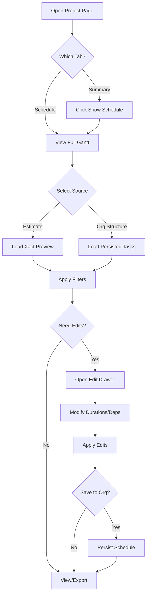

# Project Schedule (Gantt)

## Purpose
The Project Schedule module provides a visual Gantt chart representation of project tasks, allowing project managers and team leads to view, filter, and manage the timeline of work packages derived from Xact estimates or organizational schedules.

## Who Uses This
- **Project Managers** - View overall project timeline, identify bottlenecks
- **Superintendents** - Track trade-specific work packages
- **Estimators** - Verify schedule aligns with estimate assumptions
- **Executives** - High-level project status overview

## Workflow

### Accessing the Schedule

1. Navigate to a Project page
2. The schedule appears in two locations:
   - **Summary tab** - Collapsible preview (click "Show Schedule" to expand)
   - **Schedule tab** - Full dedicated view

### Step-by-Step Process

1. **Select Data Source**
   - Click "Estimate (Xact)" for live preview from imported estimate
   - Click "Org structure" for canonical persisted schedule

2. **Apply Filters** (optional)
   - Filter by **Org Group** (e.g., ELECTRI, PLUMBIN)
   - Filter by **Unit** (e.g., Unit 1, Unit 2)

3. **Adjust View Settings**
   - **Group by**: Room, Trade, or Unit
   - **Zoom**: Auto, Day, Week, or Month
   - **Date Range**: All, 30D, 60D, 90D, or Custom

4. **Edit Tasks** (if needed)
   - Click "Edit Schedule" to open the edit drawer
   - Modify task durations or dependencies
   - Click "Apply edits" to regenerate preview

5. **Save to Org Structure** (optional)
   - After finalizing edits, save canonical schedule
   - This persists the schedule for the project

### Flowchart

## Key Features

### Data Sources
- **Estimate (Xact)** - Dynamic preview generated from imported Xact estimate data, recalculated on-the-fly with any overrides
- **Org Structure** - Canonical schedule saved to the database, represents the "official" project timeline

### Grouping Modes
- **Room** - Groups tasks by room/area (e.g., "Kitchen", "Master Bath")
- **Trade** - Groups tasks by trade (e.g., "Electrical", "Plumbing")
- **Unit** - Groups tasks by unit label (e.g., "Unit 1", "Unit 2")

### Zoom Levels
- **Auto** - Automatically fits visible date range
- **Day** - One column per day
- **Week** - One column per week
- **Month** - One column per month

### Date Range Presets
- **All** - Shows entire project timeline
- **30D/60D/90D** - Shows next N days from today
- **Custom** - Manual from/to date selection

### Edit Capabilities
- Override task durations (in days or hours)
- Define task dependencies
- Apply overrides to preview without saving
- Save finalized schedule to org structure

## Technical Notes

### Performance
The schedule UI uses React's `useTransition` hook to prevent blocking during filter/toggle operations. The `ScheduleSection` component is memoized to avoid unnecessary re-renders when parent state changes.

### Component Location
- Main component: `apps/web/app/projects/[id]/schedule-section.tsx`
- Integrated into project page at `apps/web/app/projects/[id]/page.tsx`

## Related Modules
- [PETL (Project Estimate Task List)](/docs/sops-staging/petl-sop.md) - Source of estimate data
- [Project Summary](/docs/sops-staging/project-summary-sop.md) - Contains collapsible schedule preview
- [Xact Import](/docs/sops-staging/xact-import-sop.md) - How estimate data enters the system

## Revision History
| Rev | Date | Changes |
|-----|------|---------|
| 1.0 | 2026-02-15 | Initial release - Documents ScheduleSection extraction and Gantt functionality |
