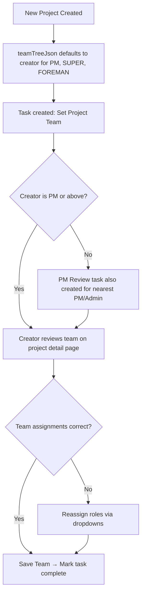

# Project Team Auto-Assignment

## Purpose
When a new project is created in NCC, the creator is automatically assigned to all three formal project team roles: **Project Manager**, **Superintendent**, and **Foreman**. This ensures every project has an accountable team from the moment it exists, and prompts the creator to review and delegate roles appropriately.

## Who Uses This
- **Project Managers** — primary beneficiaries; they create most projects and are prompted to set the real team
- **Admins / Owners** — may create projects on behalf of others
- **Foremen** — may create projects from mobile; triggers a separate PM review task

## Workflow

### What Happens Automatically on Project Creation
1. The project's **Team Tree** (`teamTreeJson`) is populated with the creator's user ID in all three slots:
   - PM → creator
   - Superintendent → creator
   - Foreman → creator
2. A **"Set Project Team"** task is auto-created and assigned to the creator:
   - Title: `Set Project Team: <Project Name>`
   - Priority: HIGH
   - Related entity: `PROJECT_TEAM_SETUP`
3. If the creator is below PM level (e.g. Foreman), a separate **PM Review** task is also created for the nearest PM/Admin.

### Step-by-Step: Acknowledging / Updating the Team
1. Navigate to the project detail page (Job Parameters tab).
2. Scroll to the **Project Team** card in the right sidebar.
3. All three roles will show the creator's name pre-selected.
4. Use the dropdowns to reassign any role to a different team member (must be a participant on the project).
5. Click **Save Team** to persist the changes.
6. Mark the "Set Project Team" task as complete in your task list.

### Flowchart

## Key Features
- **Zero-config start**: Every project has a responsible team immediately — no blank/unassigned state.
- **Single save**: All three roles are persisted in one `PUT /projects/:id/team-tree` call.
- **Task-driven accountability**: The auto-created task ensures the team setup isn't forgotten.
- **Backfill applied**: All existing projects (dev + prod) were backfilled on 2026-03-08 using the creator or project OWNER membership.

## Technical Details
- Team tree stored as `Project.teamTreeJson` (JSON column): `{ "PM": ["userId"], "SUPER": ["userId"], "FOREMAN": ["userId"] }`
- API endpoint: `PUT /projects/:id/team-tree` — accepts `{ teamTreeJson: { PM: [...], SUPER: [...], FOREMAN: [...] } }`
- Frontend keys match: `PM`, `SUPER`, `FOREMAN` (defined in `TEAM_TREE_SLOTS`)
- Task entity type: `PROJECT_TEAM_SETUP`

## Bug Fix Included
The `PUT /team-tree` controller had a property name mismatch (`body.teamTree` vs frontend sending `teamTreeJson`), which caused saves to silently no-op. Fixed 2026-03-08 to accept both property names.

## Related Modules
- [Project Creation](./project-creation-sop.md)
- [Task Management](./task-management-sop.md)
- [Project Participants](./project-participants-sop.md)

## Revision History
| Rev | Date | Changes |
|-----|------|---------|
| 1.0 | 2026-03-08 | Initial release — auto-assignment, backfill, team-tree save bug fix |
