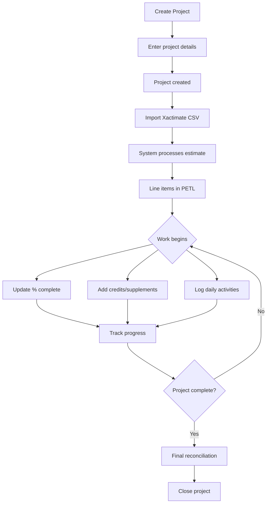

# Projects & Estimates

## Purpose
The Projects module is the central hub for managing construction and restoration projects. It handles project creation, Xactimate estimate imports, line item reconciliation, and project tracking throughout the job lifecycle.

## Who Uses This
- **Project Managers** — Create projects, import estimates, manage reconciliation
- **Estimators** — Review and reconcile line items, add credits/supplements
- **Field Staff** — Update percent complete, log daily activities
- **Administrators** — Oversee all projects, approve changes

## Workflow

### Creating a New Project
1. Navigate to **Projects** in the main menu
2. Click **+ New Project**
3. Enter project details (name, address, client)
4. Click **Create Project**

### Importing an Estimate
1. Open the project
2. Go to the **Import** tab
3. Upload Xactimate RAW CSV file
4. Wait for processing to complete
5. Review imported line items in **PETL** tab

### Flowchart

## Key Features
- **Project creation** — Quick project setup with client and address
- **CSV import** — Import Xactimate RAW and Components exports
- **PETL view** — Project Estimate Task List with all line items
- **Reconciliation** — Track credits, supplements, and changes
- **Progress tracking** — Update percent complete per line item
- **Version control** — Re-import estimates while preserving reconciliation
- **Project groups** — Organize related projects together

## Related Modules
- [CSV Import & Reconciliation](../bkm/csv-import-reconciliation-sop.md)
- [Timecards](./timecards-sop.md)
- [Daily Logs](./daily-logs-sop.md)

## Revision History
| Rev | Date | Changes |
|-----|------|--------|
| 1.0 | 2026-02-07 | Initial release |
