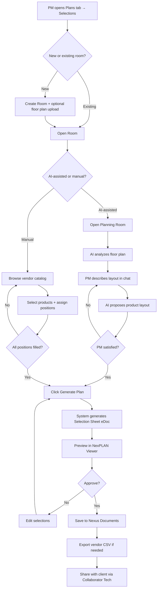

# Selections Module (NexPLAN)

## Purpose

The Selections module (NexPLAN) enables Project Managers to create professional material and finish selection packages for any room in a project. PMs can manually pick products from vendor catalogs or use AI-assisted planning to analyze floor plans and automatically fit products to the space. The module produces Selection Sheets — HTML eDocs with floor plans, product galleries, and vendor quote exports — that auto-import into Nexus Documents.

## Who Uses This

- **Project Managers** — primary users; create rooms, select products, generate selection sheets, share with clients
- **Estimators** — reference selection sheets for cost estimates and material budgets
- **Administrators** — manage vendor catalogs, review and approve selections
- **Clients** (via Collaborator Technology) — view selection sheets, approve or request changes

## Accessing Selections

1. Open any project from the Projects list
2. Click the **Plans** tab
3. Click the **Selections** sub-tab (next to "Plan Sheets")

## Workflow

### Creating a New Room

1. Click **+ New Room** in the Selections section
2. Enter the room name (e.g., "Kitchen", "Master Bath", "Powder Room")
3. Optionally upload a floor plan image (photo, scan, or drawing)
4. Click **Create**

The room appears in the room list with status "Active".

### Manual Product Selection (Quick Mode)

1. Open a room from the room list
2. Click **Add Selection**
3. Browse or search the vendor catalog:
   - Filter by vendor, product line, and category (base, wall, corner, vanity, accessory)
   - Products show dimensions, image, and pricing
4. Select a product and assign a position number (1, 2, 3…)
5. Set quantity (default 1)
6. Repeat for all positions
7. Click **Generate Sheet** to produce the Selection Sheet eDoc

### AI-Assisted Planning (Planning Room)

1. Open a room that has a floor plan uploaded
2. Click **Open Planning Room**
3. The AI assistant analyzes the floor plan and extracts dimensions
4. Describe your layout requirements in the chat:
   - Example: "L-shaped kitchen with peninsula off the third cabinet, fridge at the end of the driveway wall"
   - Example: "30-inch vanity centered on the back wall"
5. The AI proposes a layout with specific vendor products fitted to the space
6. Review the proposal — ask for changes if needed:
   - "Swap position 4 to a 24-inch base instead of 36-inch"
   - "Add a spice rack next to the range"
7. When satisfied, click **Generate Plan**
8. The system produces:
   - SVG floor plan with numbered positions
   - Product image gallery with vendor photos
   - Position key mapping numbers to products
   - Order summary with pricing
9. Review the Selection Sheet, then click **Save**

### Generating a Selection Sheet

Selection Sheets are HTML eDocs that contain:
- SVG floor plan with numbered cabinet/fixture positions
- Product image gallery with vendor photos and dimensions
- Position key (number → product name, SKU, dimensions)
- Order summary with quantities and pricing
- Vendor-specific quote CSV export button

To generate:
1. Ensure all selections are assigned for the room
2. Click **Generate Sheet**
3. Preview the sheet in the inline viewer
4. Click **Save to Documents** to auto-import into Nexus Documents under the project
5. Click **Export CSV** for vendor-formatted quote sheet

### Flowchart

### Managing Selection Status

Each selection has a status that tracks its lifecycle:

1. **Proposed** — initial state when a product is selected
2. **Approved** — PM or client has approved this selection
3. **Ordered** — purchase order has been placed with vendor
4. **Delivered** — product has been received on site
5. **Installed** — product has been installed

To update status:
- Open the room → click a selection → change the status dropdown
- Or use the **Selection Board** for bulk status updates

### Using the Selection Board

The Selection Board provides a project-level view of all selections across all rooms:

1. In the Selections sub-tab, click **Selection Board** (above the room list)
2. View all selections in a table grouped by room
3. Filter by status, category, or vendor
4. Track budget: the running total updates as products are selected
5. Export the full project selection package (all rooms combined)

## Key Features

- **Vendor Catalog**: Structured product database with real SKUs, dimensions, images, and pricing
- **AI Floor Plan Analysis**: Upload a photo or scan; AI extracts room geometry and dimensions
- **Natural Language Design**: Describe layouts in plain English; AI fits real products to the space
- **Selection Sheets**: Professional HTML eDocs with SVG floor plans and product galleries
- **Auto-Import**: Selection Sheets carry `ncc:` metadata for automatic import into Nexus Documents
- **Vendor Quote Export**: CSV exports formatted for each vendor's ordering system
- **Status Tracking**: Selection lifecycle from proposed → installed
- **Budget Monitoring**: Real-time budget vs. allowance tracking at the project level

## Vendor Catalogs

### Currently Available
- **BWC Dorian Gray Shaker** — full RTA cabinet line (base, wall, corner, vanity, accessories)

### Adding Products
Administrators can manage vendor catalogs:
1. Go to Admin → Vendor Catalogs
2. Add a new catalog (vendor name, product line)
3. Add products individually or import via CSV
4. Products require: name, SKU, category, dimensions (W×H×D), and at least one image

### Future Catalogs (Planned)
- Home Depot Pro
- Lowe's Pro
- CliqStudios
- Cabinets.com
- Custom/local vendors (user-defined)

## Related Modules

- **Plan Sheets** — co-located in the Plans tab; construction plan sheets provide floor plan context
- **BOM & Procure** — BOM pricing data can inform selection cost estimates
- **Nexus Documents** — Selection Sheets auto-import as eDocs
- **Financial** — ordered selections feed into project cost tracking

## Tips

- Upload the highest quality floor plan image you have — better images = better AI dimension extraction
- Name rooms descriptively (e.g., "Kitchen — Lake House" not just "Kitchen") for multi-project clarity
- Use the Selection Board to catch rooms that haven't been approved yet before ordering
- Generate sheets in draft mode first; share with clients only after internal review
- Export vendor CSVs before calling to place an order — they match the vendor's expected format

## Revision History

| Rev | Date | Changes |
|-----|------|---------|
| 1.0 | 2026-03-06 | Initial draft — SOP for Selections Module (NexPLAN) |
