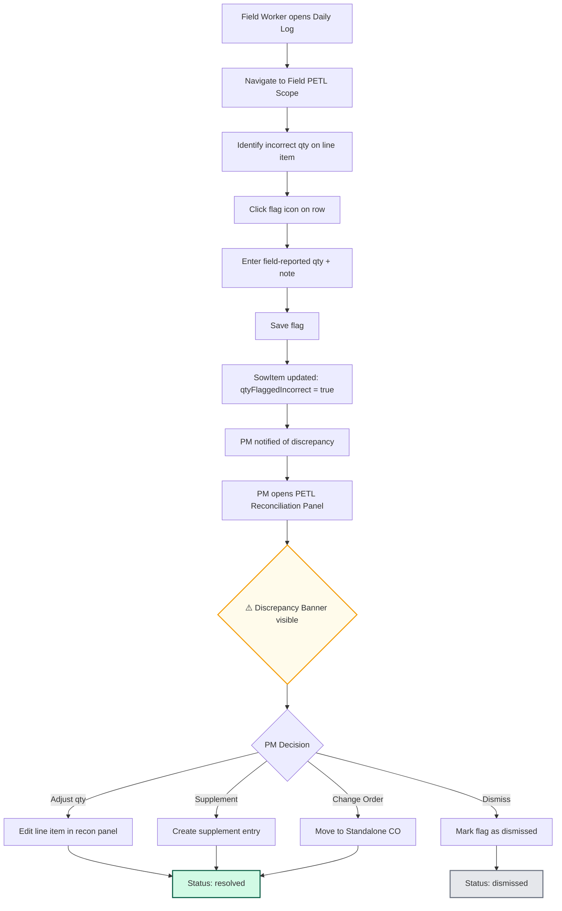

# Field PETL Qty Discrepancy → Reconciliation Panel

## Purpose
When a field worker identifies that a PETL line item quantity is incorrect (e.g., the estimate says 50 SF of drywall but the actual damage is 80 SF), they flag it in the Field PETL scope within Daily Logs. This flag and note must surface in the PM's PETL Reconciliation Panel so the PM can make informed supplement or change order decisions without switching views or losing context.

## Who Uses This
- **Field Workers / Foremen** — flag incorrect quantities and provide notes from the field
- **Project Managers** — review flagged items in the PETL reconciliation panel, decide on supplements or change orders
- **Admins / Executives** — visibility into field-reported discrepancies across projects

## Workflow

### Step-by-Step Process

1. **Field Worker opens Daily Log** for the project and navigates to the **Field PETL Scope** tab.
2. Field Worker locates the line item with the incorrect quantity.
3. Field Worker clicks the **flag icon** on the line item row to mark it as incorrect.
4. A form appears allowing the field worker to:
   - Enter the **field-reported quantity** (what they actually measured/observed).
   - Write a **note** explaining the discrepancy (e.g., "Drywall damage extends behind cabinets, actual area is 80 SF not 50 SF").
5. Field Worker **saves** the flag. The note persists beneath the flagged row in the Field PETL view (with expand/collapse toggle).
6. The system stores the flag on the `SowItem` record:
   - `qtyFlaggedIncorrect: true`
   - `qtyFieldReported: <number>`
   - `qtyFieldNotes: <string>`
   - `qtyReviewStatus: "pending"`
   - `qtyFieldReportedAt: <timestamp>`
   - `qtyFieldReportedByUserId: <userId>`
7. **PM receives notification** that a line item has been flagged as discrepant.
8. PM opens the project's **PETL tab** and clicks the flagged line item to open the **Reconciliation Panel**.
9. The reconciliation panel displays a prominent **⚠️ Field Qty Discrepancy** banner immediately below the Source Item Reference block, showing:
   - Field-reported quantity vs. the original estimate quantity
   - The field worker's note (italic)
   - Review status badge (pending / resolved / dismissed)
   - Timestamp of when it was reported
10. PM reviews the discrepancy and takes action:
    - **Adjust the line item** quantity/cost directly
    - **Create a supplement** entry for the additional scope
    - **Move to Standalone Change Order** if it's client-requested work outside the loss scope
    - **Dismiss** the flag if it was raised in error
11. The review status updates accordingly (resolved/dismissed).

### Flowchart

## Key Features
- **Persistent note display** in Field PETL view — notes remain visible beneath flagged rows with expand/collapse chevron toggles
- **"Show All Notes / Hide All Notes"** bulk toggle above the Field PETL table
- **Discrepancy banner in Reconciliation Panel** — ⚠️ amber alert with field qty, original estimate comparison, field note, status badge, and timestamp
- **Review status tracking** — pending → resolved/dismissed lifecycle
- **No backend changes required for display** — the API already returns all `qtyField*` fields on the `sowItem`; this was a frontend-only addition to the reconciliation panel

## Data Model

The discrepancy data lives on the `SowItem` model in `packages/database`:

- `qtyFlaggedIncorrect` (Boolean) — whether this item has been flagged
- `qtyFieldReported` (Float, nullable) — the quantity the field worker observed
- `qtyFieldNotes` (String, nullable) — free-text explanation from the field
- `qtyReviewStatus` (String, nullable) — "pending", "resolved", or "dismissed"
- `qtyFieldReportedAt` (DateTime, nullable) — when the flag was created
- `qtyFieldReportedByUserId` (String, nullable) — who flagged it

## Related Modules
- [Field PETL Scope (Daily Logs)]
- [PETL Reconciliation Panel]
- [Standalone Change Orders]
- [Supplement Management]
- [Daily Log System]

## Revision History
| Rev | Date | Changes |
|-----|------|---------|
| 1.0 | 2026-02-22 | Initial release — field discrepancy banner added to reconciliation panel |
