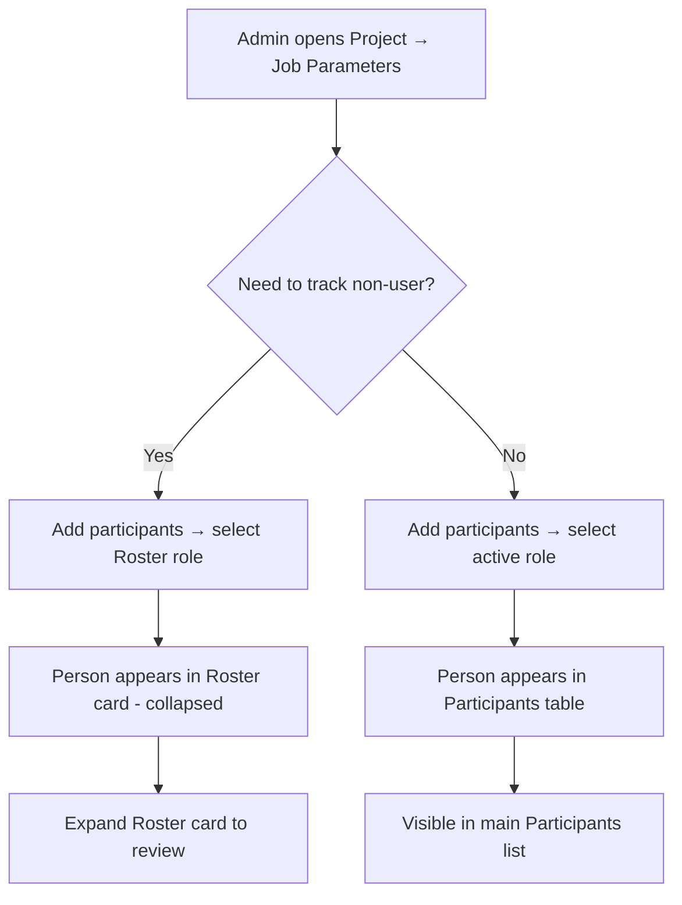

# INP Performance Fixes, ROSTER Role & Pagination

## Purpose
This SOP documents the performance optimizations applied to the Company Users page and Project Detail page to resolve Interaction to Next Paint (INP) issues, the introduction of the ROSTER role for non-user personnel tracking, and the new default Access filter behavior.

## Who Uses This
- System administrators managing company users
- Project managers viewing Job Parameters / Participants
- Developers maintaining UI performance standards

## Changes Summary

### 1. Company Users Page — INP Fix (2.4s → <100ms)
**Problem:** Clicking sort column headers (Name, Email, Role, Joined) on `/company/users` blocked the UI for 2,442ms. The root cause was a synchronous re-render of every table row in a 7K-line monolithic component.

**Fix (three-part):**
- **`startTransition` on sort headers** — All four sort buttons now wrap `setMemberSortKey` in React's `startTransition`, making the re-render non-blocking. The click handler returns immediately; the expensive DOM diff happens asynchronously.
- **Pagination (50 rows/page)** — The members table now renders at most 50 rows per page with Prev/Next controls. This caps the DOM nodes React must diff on each state change.
- **Default Access filter → ACTIVE** — The Access filter now defaults to "ACTIVE" instead of "ALL", reducing the initial row count and keeping deactivated users out of the default view.

### 2. Project Detail Page — INP Fix (359ms → <50ms)
**Problem:** Clicking tab buttons on `/projects/[id]` blocked the UI for 359ms. The 35K-line component re-rendered synchronously when switching tabs.

**Fix:**
- **Deferred tab content switches** — All tab buttons now use `deferContentSwitch: true`, which updates the tab underline immediately and defers the heavy content unmount/mount via `requestAnimationFrame` + `useTransition`. Previously only the PETL tab was deferred.
- **Fullscreen toggle wrapped in transition** — The fullscreen button (`⛶`) now uses `startUiTransition` to avoid blocking the main thread.

### 3. ROSTER Role — Non-User Personnel Tracking
**Problem:** Personnel tracked for payroll, attendance, and jobsite accountability were assigned the "VIEWER" role, which incorrectly implies software access. There was no role that accurately represents "on the books but not on the platform."

**Solution:**
- **New role: `ROSTER` ("Roster — Non User")** — Added to the API hardcoded fallback role profiles (sortOrder 35, after VIEWER at 30). Description: *"Tracked for attendance, payroll, and accountability but does not use the software."*
- **Collapsible Roster card** — On the Project Detail → Job Parameters tab, a new "Roster — Non Users" card appears between Schedule/Gantt and Participants. It defaults to **collapsed** to avoid clutter. Expanding shows a table of Last Name, First Name, Email, and Role.
- **Participants table filtered** — VIEWER and ROSTER role members are excluded from the main Participants table so active software users aren't mixed with roster-only personnel.
- **Backward compatibility** — Existing VIEWER-role participants appear in the Roster card as "Roster (legacy)". New assignments use the ROSTER role code.
- **Role dropdowns updated** — Both the "Add internal users" and "Invite with password" panels include "Roster — Non User" as a selectable option.

## Workflow

### Step-by-Step: Assigning a Roster Member to a Project

1. Navigate to a project → **Job Parameters** tab
2. In the **Participants** card, select **"Add Nexus user(s) from my company"** from the dropdown
3. Set the **Project role** dropdown to **"Roster — Non User"**
4. Select the personnel from the member list and click **Add to project**
5. The person now appears in the collapsed **"Roster — Non Users"** card (click to expand)

### Flowchart

## Key Features
- INP on Company Users sort headers reduced from 2.4s to sub-100ms
- INP on Project Detail tab switches reduced from 359ms to sub-50ms
- 50-row pagination on Company Users prevents DOM bloat
- Access filter defaults to ACTIVE — deactivated users hidden by default
- ROSTER role clearly distinguishes non-user personnel from software users
- Roster card is collapsed by default — zero clutter unless you need it

## Related Modules
- [Company Management SOP](company-management-sop.md)
- [UI Performance SOP](../onboarding/ui-performance-sop.md)
- [Project Schedule Gantt SOP](project-schedule-gantt-sop.md)

## Revision History
| Rev | Date | Changes |
|-----|------|---------|
| 1.0 | 2026-02-24 | Initial release — INP fixes, ROSTER role, pagination, Access filter default |
