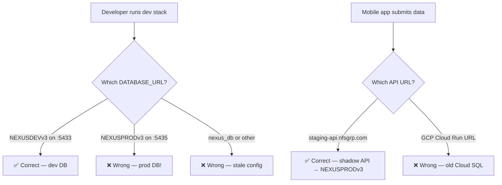
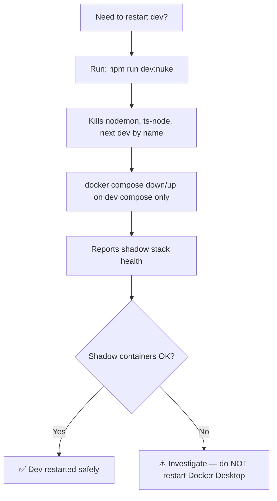

# Infrastructure Audit & Mobile API Migration

## Purpose
Documents the March 2026 infrastructure audit that resolved a dev login failure, hardened the dev/prod boundary, and migrated the mobile API endpoint from legacy GCP Cloud Run to the local shadow stack behind Cloudflare Tunnel.

## Who Uses This
- System administrators managing the dev and production stacks
- Developers working on mobile or API code
- DevOps reviewing deployment and infrastructure scripts

## Incident Timeline

### 1. Dev Login Failure — Wrong Database
**Symptom:** Login at `localhost:3000` returned "Internal server error" despite the API being healthy.

**Root cause:** `scripts/dev-start.sh` hardcoded `LOCAL_DB_NAME=nexus_db` and force-exported `DATABASE_URL`, overriding all `.env` files. The actual user data lives in `NEXUSDEVv3`.

**Fix:**
- Changed `dev-start.sh` to default to `NEXUSDEVv3` and only set `DATABASE_URL` as a fallback (not an override).
- Fixed stale `.env` files across the repo (`packages/database/.env`, `apps/web/.env.local`, `prisma.config.ts`).

### 2. Shadow Stack Crash from Unsafe Nuke Script
**Symptom:** Running `npm run dev:nuke` killed Docker Desktop, taking down all `nexus-shadow-*` production containers and the Cloudflare Tunnel.

**Root cause:** The old `dev-nuke-restart.sh` killed processes by port (`lsof -ti:PORT | xargs kill`), which terminated Docker proxy processes and crashed Docker Desktop.

**Fix:** Rewrote `dev-nuke-restart.sh` with these safety rules:
- Kill only named dev processes (nodemon, ts-node, next dev) — never by port
- Use `docker compose down/up` scoped to the dev compose file only
- Never touch `nexus-shadow-*` containers or Docker Desktop
- Report shadow stack health after running

### 3. DNS Resolution After Shadow Recovery
**Symptom:** After restarting `nexus-shadow-web`, `staging-ncc.nfsgrp.com` returned `DNS_PROBE_FINISHED_NXDOMAIN` despite Cloudflare DNS records being correct.

**Root cause:** The local router had cached a stale NXDOMAIN from when the tunnel was down.

**Fix:** Added temporary `/etc/hosts` entry for `staging-ncc.nfsgrp.com`. This can be removed once the router DNS cache expires (typically 1–24 hours).

### 4. Mobile API Pointing to Legacy GCP
**Symptom:** Daily logs created on the mobile device did not appear in the production web app.

**Root cause:** `apps/mobile/src/api/config.ts` was hardcoded to the old GCP Cloud Run URL (`https://nexus-api-979156454944.us-central1.run.app`). Since the production database moved to the local shadow stack, mobile data was being written to the old Cloud SQL database — completely separate from the current production.

**Fix:** Updated the mobile API base URL to `https://staging-api.nfsgrp.com` (the shadow API behind Cloudflare Tunnel). Requires a mobile app rebuild and redeploy to take effect.

## Workflow

### Verifying Dev/Prod Separation

### Safe Dev Restart Procedure

## Key Rules (Permanent)

### DATABASE_URL
- Dev `.env` files MUST point to `NEXUSDEVv3` on `localhost:5433`
- `apps/web/.env.local` must NOT set `DATABASE_URL`
- Shadow/prod uses its own `DATABASE_URL` via `.env.shadow` — never mix

### Script Safety
- **NEVER** kill processes by port (`lsof -ti:PORT | xargs kill`)
- **NEVER** stop or restart Docker Desktop from a script
- **NEVER** run `docker compose down` on `docker-compose.shadow.yml` unless explicitly rebuilding shadow

### Port Allocation (Fixed)
- `:3000` — Dev Web (next dev)
- `:3001` — Shadow Web (nexus-shadow-web)
- `:8000` — Shadow API (nexus-shadow-api)
- `:8001` — Dev API (nodemon)
- `:5433` — Dev Postgres (NEXUSDEVv3)
- `:5435` — Shadow Postgres (NEXUSPRODv3)
- `:6380` — Dev Redis
- `:6381` — Shadow Redis

### Mobile API Endpoint
- Production: `https://staging-api.nfsgrp.com` (shadow stack via Cloudflare Tunnel)
- Config file: `apps/mobile/src/api/config.ts`
- After any URL change, the mobile app must be rebuilt and redeployed

## Files Modified
- `scripts/dev-nuke-restart.sh` — shadow-safe rewrite
- `scripts/dev-start.sh` — DATABASE_URL fallback logic
- `packages/database/.env` — fixed to NEXUSDEVv3
- `packages/database/prisma.config.ts` — fixed fallback
- `apps/web/.env.local` — removed DATABASE_URL
- `apps/mobile/src/api/config.ts` — GCP → staging-api.nfsgrp.com
- `WARP.md` — added Dev Infrastructure Contract

## Related Modules
- [Production Stack Monitoring SOP](production-stack-monitoring-sop.md)
- [Mobile Build & Deploy Contract](../WARP.md#mobile-build--deploy-contract)

## Revision History
| Rev | Date | Changes |
|-----|------|---------|
| 1.0 | 2026-03-04 | Initial release — infrastructure audit and mobile API migration |
