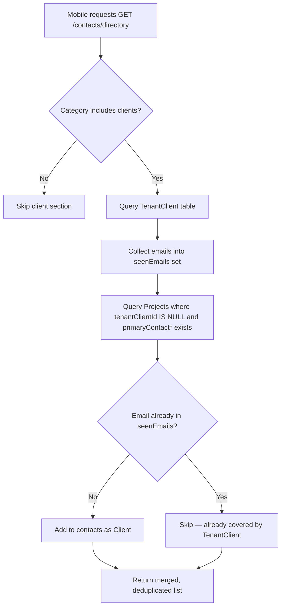

# Contacts Directory — Legacy Client Fallback

## Purpose
Ensures that client contact information is visible in the mobile app's contacts directory even when a formal `TenantClient` record has not been created. Projects with legacy `primaryContact*` fields (name, email, phone) but no linked `TenantClient` are now surfaced as client contacts automatically.

## Problem Statement
Projects created before the `TenantClient` system (or where clients were never formally registered) store contact info in three fields directly on the `Project` model: `primaryContactName`, `primaryContactEmail`, `primaryContactPhone`. The contacts directory API (`GET /contacts/directory`) only queried the `TenantClient` table, so these legacy contacts were invisible in the mobile app's client list.

**Production impact at time of fix:** 7 projects across 3 unique client emails were affected.

## Who Uses This
- Field crews and PMs using the mobile app Contacts screen
- Anyone browsing the "Clients" category in the contacts directory
- API consumers hitting `GET /contacts/directory?category=clients`

## What Changed

### File Modified
`apps/api/src/modules/user/contacts-directory.service.ts`

### Change Summary
Added **section 2b** after the existing TenantClient query (section 2). The new block:

1. Queries `Project` for rows where `tenantClientId IS NULL` AND at least one `primaryContact*` field is non-null.
2. Scopes to the caller's `companyId` (and optionally a specific `projectId`).
3. Deduplicates by email against contacts already collected (TenantClient records, internal members, etc.).
4. Parses `primaryContactName` into `firstName` / `lastName` as best-effort.
5. Pushes results as `category: "clients"`, `source: "ncc"` — identical shape to TenantClient-sourced contacts.

### Self-Healing Behavior
Once a project gets a proper `TenantClient` linked (`tenantClientId` set), the legacy fallback automatically stops returning that project's contact — no cleanup needed.

## Workflow

### How It Works Now

### Step-by-Step: Verifying the Fix
1. Open the mobile app → Contacts → filter by "Clients".
2. Confirm that clients like Mary Lewis (who only exist as `primaryContact*` on projects) now appear.
3. Tap the contact to verify name, email, and phone are populated.

### Step-by-Step: Properly Registering a Legacy Client
To promote a legacy contact to a full `TenantClient` (recommended for long-term clients):
1. In the web app, go to Settings → Clients → Add Client.
2. Enter the client's name, email, and phone.
3. Link the client to the relevant project(s).
4. The legacy fallback will automatically stop returning a duplicate once `tenantClientId` is set on the project.

## Key Details
- **No schema change required** — reads existing `primaryContact*` fields.
- **No migration required** — purely an API logic change.
- **Deployment:** Takes effect after `npm run deploy:shadow` (API + Worker).
- **Dev:** Picked up automatically by nodemon file watcher.

## Related Modules
- [Tenant Client Management](/apps/api/src/modules/project/tenant-client.service.ts)
- [Contacts Directory](/apps/api/src/modules/user/contacts-directory.service.ts)
- [Mobile Contacts Screen](/apps/mobile/src/screens/DirectoryScreen.tsx)
- [Mobile Projects Screen — Client Search](/apps/mobile/src/screens/ProjectsScreen.tsx)

## Revision History
| Rev | Date | Changes |
|-----|------|---------|
| 1.0 | 2026-03-05 | Initial release — legacy primaryContact fallback added to contacts directory |
