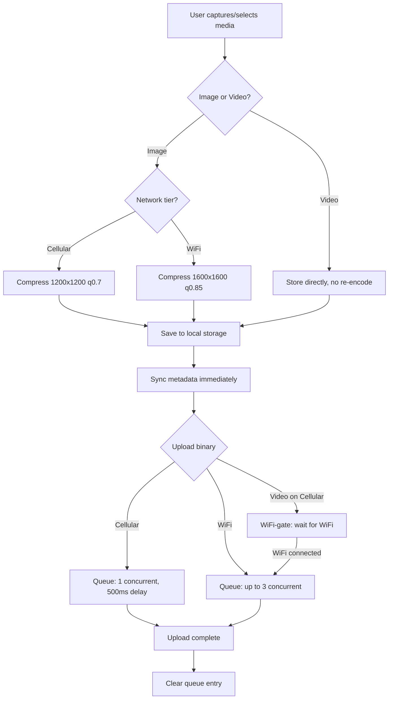

# Smart Media Upload

## Purpose
Provides network-aware image compression and video capture across the Nexus mobile app. Automatically adjusts media quality based on cellular vs. WiFi connectivity, queues uploads with bandwidth throttling, and ensures metadata syncs instantly regardless of connection type.

## Who Uses This
- Field crews capturing daily log photos and videos on-site
- Project managers reviewing daily log media
- Admins managing storage and upload policies

## Workflow

### Step-by-Step Process
1. User opens any Daily Log screen (Create, Edit, or List view) and taps the camera or library picker.
2. The app detects the current network tier (WiFi or Cellular).
3. **For images:** The app automatically compresses to the appropriate quality level:
   - Cellular: 1200×1200 max, 0.7 JPEG quality (~100-200KB per image)
   - WiFi: 1600×1600 max, 0.85 JPEG quality (~300-500KB per image)
4. **For videos:** The camera captures at reduced quality on cellular, full quality on WiFi. Videos are stored without re-encoding.
5. Media is saved to local app storage with correct mime type and extension.
6. Metadata (log entry, timestamps, descriptions) syncs immediately on any connection.
7. Binary files (images/videos) enter the upload queue:
   - Cellular: 1 concurrent upload with 500ms throttle delay
   - WiFi: Up to 3 concurrent uploads
   - Videos are WiFi-gated (queued until WiFi is available)
8. Upload progress is tracked in the local `media_uploads` SQLite table.
9. On successful upload, the local queue entry is cleared.

### Flowchart

## Key Features
- **Network-aware compression**: Automatic quality adjustment based on WiFi vs. cellular
- **Video support**: All daily log screens (Create, Edit, List) accept video capture and library selection
- **Bandwidth throttling**: Prevents network saturation on cellular connections
- **WiFi-gating for videos**: Large video files only upload when WiFi is available
- **Resumable uploads**: Progress tracked per-file in local SQLite
- **Instant metadata sync**: Log entries sync immediately; binary files queue separately
- **Orphan cleanup**: Utility to remove attachment files older than 7 days not referenced by pending uploads

## Screens Affected
- `DailyLogCreateScreen` — Full video + network-aware compression
- `DailyLogEditScreen` — Video capture and selection with correct mime types
- `DailyLogsScreen` — Video capture and selection with correct mime types
- `PhotoCapture` component — Video support, auto network badge, queue status display

## Storage Limits (Recommended)
- Images: Target 100-500KB per file depending on network
- Videos: No client-side re-encoding; consider server-side limits (e.g., 100MB max per video)
- Orphaned attachments auto-cleaned after 7 days

## Related Modules
- Daily Logs
- Offline Sync
- File Storage / Attachments
- Receipt OCR (images only — videos skip receipt scan)

## Revision History
| Rev | Date | Changes |
|-----|------|---------|
| 1.0 | 2026-02-21 | Initial release — network-aware compression, video support, upload queue |
