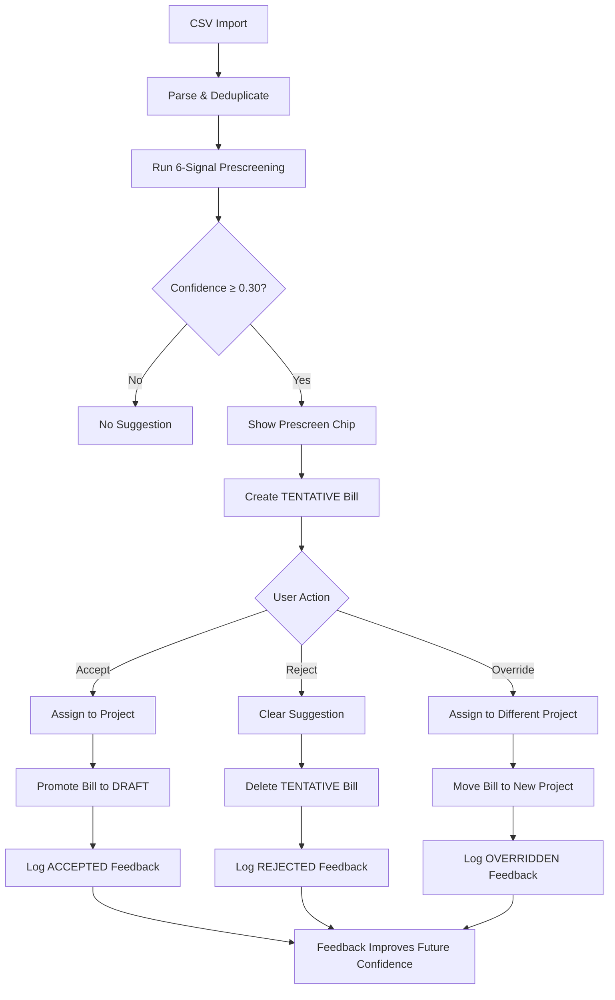
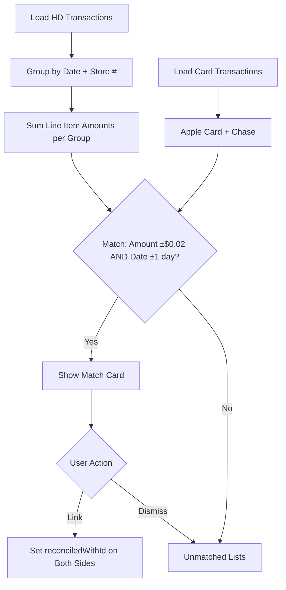

# Smart Transaction Prescreening & Store-to-Card Reconciliation

## Purpose
Automate project allocation of imported financial transactions (HD Pro Xtra, Apple Card, Chase) using a multi-signal confidence algorithm that learns from user feedback, and reconcile store-level line items against credit card charges to catch discrepancies.

## Who Uses This
- **Accounting / Finance** — reviews prescreened suggestions, accepts/rejects/overrides, links store-to-card matches
- **Project Managers** — reviews tentative bills created from prescreened transactions on project detail pages
- **Admins** — monitors overall reconciliation health, manages bulk operations

## Workflow

### Part A: Smart Prescreening

#### How It Works
When a CSV is imported (HD, Apple Card, or Chase), every transaction is automatically evaluated by a 6-signal algorithm that suggests which project it belongs to. Each suggestion includes a confidence score (0–1.0) and a human-readable explanation.

#### The 6 Signals
1. **Job Name Match (HD only)** — Compares normalized HD job names against project names using exact, substring, and fuzzy (Levenshtein ≤2) matching. Highest base confidence (0.95 exact, 0.85 fuzzy, 0.80 substring).
2. **Store Affinity (HD only)** — Analyzes which projects historically receive purchases from a given store. If ≥30% of a store's history maps to one project, it becomes a signal.
3. **Purchaser + Store Combo (HD only)** — Combines who purchased and where. If a specific purchaser at a specific store has ≥40% history with one project, it contributes.
4. **Merchant + Description Pattern (all sources)** — If the same merchant + description prefix has been assigned to a project ≥3 times before, it suggests that project.
5. **Keyword Match (all sources)** — Scans transaction text for project names as substrings (≥4 chars to avoid false positives).
6. **Override Learning** — When users previously overrode a prescreen to a different project for similar transactions (matching ≥2 of 3: job name, store, purchaser), the corrected project is suggested.

#### Multi-Signal Boost
When 2+ signals agree on the same project, confidence is boosted by +0.10 (capped at 0.98).

#### Learning Feedback Loop
The algorithm improves over time based on user actions:
- **Acceptance boost**: +0.05 per prior acceptance of the same job→project mapping (capped at +0.20)
- **Rejection penalty**: −0.15 per prior rejection (capped at −0.50)
- **Store-level rejection penalty**: −0.08 per store→project rejection (capped at −0.25)
- **Override learning**: Corrected mappings are remembered and suggested as Signal 6

#### Step-by-Step Process
1. User imports a CSV on the Banking page (Financial → Banking → Import CSV)
2. System parses and deduplicates rows, then runs prescreening on the batch
3. Each transaction with confidence ≥ 0.30 gets a prescreen suggestion chip
4. A TENTATIVE bill is auto-created in the suggested project
5. User reviews suggestions:
   - **Accept** — assigns to suggested project, promotes bill to DRAFT, logs positive feedback
   - **Reject** — clears suggestion, deletes tentative bill, logs rejection with reason
   - **Override** — assigns to a different project, moves bill, logs corrected mapping
6. Bulk operations available:
   - **Bulk Accept** — accept multiple selected transactions at once
   - **Bulk Accept by Confidence** — accept all transactions above a threshold (e.g., ≥0.70)

### Flowchart

### Part B: Store-to-Card Reconciliation

#### How It Works
HD Pro Xtra CSVs contain individual line items per purchase. Credit card statements (Apple Card, Chase) contain a single charge per store visit. This feature matches the two: grouping HD items by (date, store number), summing their amounts, and finding credit card charges within ±1 day and ±$0.02 of the total.

#### Step-by-Step Process
1. Navigate to Financial → Reconciliation
2. Expand the "Store ↔ Card Matching" section
3. System shows matched pairs: HD store groups on the left, card charges on the right
4. Each match shows: item count, line item details (up to 5), total, amount difference, date offset
5. User actions:
   - **Link** — permanently links the store transactions to the card charge (bidirectional)
   - **Dismiss** — moves both sides to their respective "unmatched" tabs for manual handling
6. Tabs show: Matches, Unmatched HD groups, Unmatched card transactions

#### Matching Criteria
- **Amount tolerance**: ±$0.02 (handles rounding differences)
- **Date tolerance**: ±1 calendar day (handles clearing vs transaction date offsets)
- **One-to-one**: Each card charge matches at most one store group

### Flowchart

## Key Features
- 6-signal confidence algorithm with multi-signal boosting
- Self-improving learning loop from accept/reject/override feedback
- Override learning (Signal 6) — remembers user corrections
- Bulk accept by confidence threshold
- Automatic tentative bill creation and lifecycle management
- Store-to-card matching with ±$0.02 / ±1 day tolerance
- Bidirectional reconciliation linking
- Tabbed UI for matches, unmatched HD groups, unmatched card transactions

## API Endpoints
- `PATCH /banking/transactions/:id/prescreen-accept` — accept a prescreen suggestion
- `PATCH /banking/transactions/:id/prescreen-reject` — reject with reason
- `PATCH /banking/transactions/:id/prescreen-override` — override to different project
- `PATCH /banking/transactions/bulk-prescreen-accept` — bulk accept by IDs
- `PATCH /banking/transactions/bulk-prescreen-accept-by-confidence` — bulk accept by threshold
- `GET /banking/reconciliation/store-card-matches` — get matched pairs + unmatched
- `PATCH /banking/reconciliation/link` — link store transactions to card charge
- `PATCH /banking/reconciliation/unlink` — unlink a reconciliation

## Related Modules
- Banking / CSV Import (transaction ingestion)
- Project Bills (tentative → draft lifecycle)
- Financial Reconciliation (project breakdown, unassigned queue)
- Receipt OCR (complementary: receipts capture what was bought, prescreening captures where it goes)

## Revision History
| Rev | Date | Changes |
|-----|------|---------|
| 1.0 | 2026-03-04 | Initial release — 6-signal prescreening, learning feedback loop, store-to-card reconciliation |
