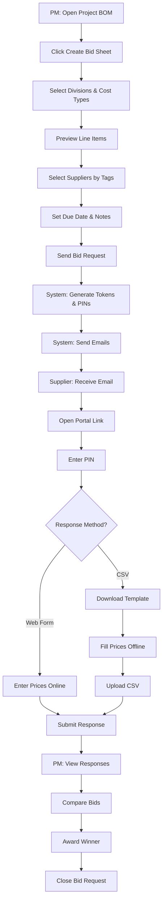

# Supplier Bid Portal

## Purpose
Enable Project Managers and Admins to request competitive pricing from suppliers and subcontractors by sharing Bill of Materials (BOM) line items via a secure portal. Suppliers can respond with pricing without requiring an NCC account.

## Who Uses This
- **Project Managers (PM)** - Create and send bid requests from project BOM
- **Company Admins** - Manage supplier directory and tags
- **Suppliers/Subcontractors** - Receive bid requests and submit pricing via portal

## Workflow

### Step-by-Step Process

#### For PMs/Admins (Creating Bid Requests)
1. Navigate to Project → BOM tab
2. Click "Create Bid Sheet" button
3. Configure bid request:
   - Select divisions/categories to include (grouped by CSI)
   - Filter by cost type (Materials, Labor, Equipment, or All)
   - Preview line items that will be shared
4. Select suppliers:
   - Filter by tags (region: FL, GA; trade: Roofer, Drywall)
   - Multi-select from supplier list
   - Optionally add new supplier inline
5. Set due date and add notes
6. Review and click "Send Bid Request"
7. System generates unique token + PIN per supplier
8. Email sent to each supplier with portal link and PIN

#### For Suppliers (Responding to Bid Requests)
1. Receive email with bid request notification
2. Click portal link or go to provided URL
3. Enter 6-digit PIN to access
4. View line items with quantities
5. Choose response method:
   - **Option A**: Enter prices directly in web form
   - **Option B**: Download CSV template, fill in offline, upload
6. Add notes and lead times (optional)
7. Click "Submit Response"
8. Receive confirmation email

#### For PMs (Managing Responses)
1. Navigate to Project → Bids tab
2. View bid request status per supplier
3. Compare responses side-by-side
4. Export comparison as CSV/PDF
5. Award winning bid (optional)
6. Close bid request when complete

### Flowchart

## Key Features

### Supplier Management
- Maintain supplier directory with contacts
- Tag suppliers by region (FL, GA, TX) and trade (Roofer, Electrician, Plumber)
- Import suppliers from CSV
- Track supplier response history

### Bid Request Configuration
- Group BOM items by CSI division
- Filter by cost type (Materials only, Labor only, etc.)
- Set bid due dates
- Add project-specific notes

### Secure Public Portal
- No NCC login required for suppliers
- 6-digit PIN authentication
- Token expires after 30 days (configurable)
- Rate-limited PIN attempts (5 per hour)

### CSV Workflow
- Download pre-formatted template with line items
- Fill in "Your Price", "Notes", "Lead Time" columns
- Upload completed CSV
- System validates and imports responses

### Response Comparison
- Side-by-side pricing comparison
- Highlight lowest bid per line item
- Calculate total bid amounts
- Export comparison reports

## Related Modules
- [Bill of Materials (BOM)](./bom-sop.md)
- [Project Management](./project-management-sop.md)
- [Cost Dashboard](./cost-dashboard-sop.md)

## Access Control
| Role | Create Bid | View Bids | Manage Suppliers |
|------|-----------|-----------|------------------|
| Super Admin | ✓ | ✓ | ✓ |
| Company Admin | ✓ | ✓ | ✓ |
| Project Manager | ✓ | ✓ | View Only |
| Project Member | ✗ | View Only | ✗ |

## Security Notes
- Access tokens are 32-character random hex strings
- PINs are 6-digit numeric, stored hashed (bcrypt)
- Portal exposes only line item data (no sensitive project info)
- All portal access is logged for audit

## Revision History
| Rev | Date | Changes |
|-----|------|---------|
| 1.0 | 2026-02-17 | Initial release |
