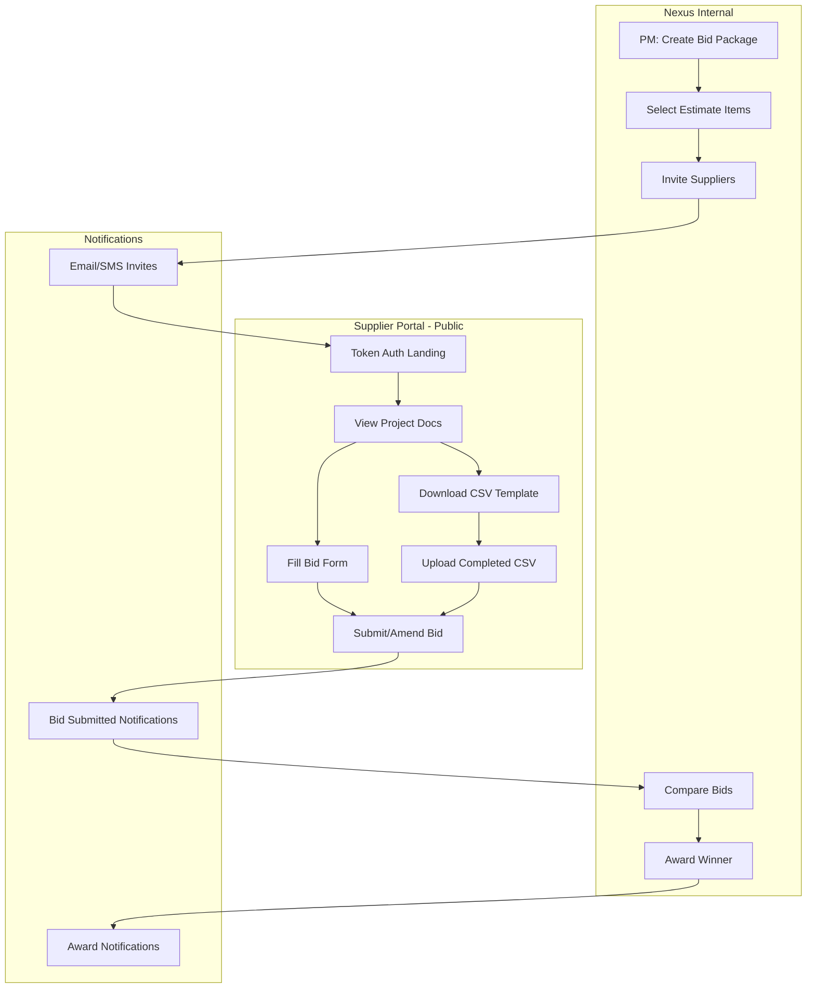

# Supplier Bidding System - Implementation Plan

## 🎯 Overview

Build a B2B procurement system that allows PMs to:
1. Create bid packages from estimates
2. Invite suppliers via email/SMS (token-based, no login required)
3. Let suppliers submit/amend bids via web portal or CSV upload
4. Compare bids side-by-side and award to winner(s)

**Key Innovation**: Token-based supplier portal (no account creation, instant access).

---

## 📐 Architecture

### System Components



### Data Flow

```
Estimate Items → Bid Package Line Items → Supplier Bid Line Items → Winning Bid → PO
```

---

## 🗂️ Data Model

See `supplier-bidding-schema.prisma` for full schema.

**Key Tables**:
1. `BidPackage` — Container for bid request (title, due date, attachments)
2. `BidPackageLineItem` — Items to be priced (from estimate)
3. `SupplierInvitation` — Invite sent to supplier (email/SMS + access token)
4. `SupplierBid` — Supplier's submission (can be amended)
5. `SupplierBidLineItem` — Pricing per line item

**Status Flow**:
```
BidPackage:  DRAFT → OPEN → CLOSED → AWARDED
Invitation:  PENDING → OPENED → SUBMITTED
Bid:         DRAFT → SUBMITTED → AMENDED → AWARDED
```

---

## 🔌 API Endpoints

### PM Side (Internal, Auth Required)

#### 1. Create Bid Package
```
POST /projects/:projectId/bid-packages
Body: {
  title: "Phase 1 Cabinets Bid",
  description: "RFQ for all kitchen cabinets, White Shaker finish",
  dueDate: "2026-03-15T17:00:00Z",
  estimateId: "...",
  lineItems: [
    {
      estimateLineItemId: "...",
      description: "White Shaker Base Cabinet 24x34.5x24",
      unit: "EA",
      qty: 12,
      category: "CAB",
      notes: "Must be in stock by 3/20"
    }
  ]
}
Response: { id: "...", status: "DRAFT", ... }
```

#### 2. Invite Suppliers
```
POST /bid-packages/:packageId/invite
Body: {
  suppliers: [
    {
      supplierName: "ABC Supply Co.",
      contactName: "John Smith",
      contactEmail: "john@abcsupply.com",
      contactPhone: "+1-555-123-4567"
    }
  ]
}
Response: {
  invitations: [
    { id: "...", accessToken: "...", status: "PENDING", portalUrl: "https://nexus.app/supplier-portal/abc123..." }
  ]
}
```

#### 3. List Bid Packages
```
GET /projects/:projectId/bid-packages
Response: {
  bidPackages: [
    {
      id: "...",
      title: "Phase 1 Cabinets Bid",
      status: "OPEN",
      dueDate: "...",
      invitationsCount: 3,
      bidsReceived: 2,
      lineItemsCount: 24
    }
  ]
}
```

#### 4. Get Bid Package Details
```
GET /bid-packages/:packageId
Response: {
  id: "...",
  title: "...",
  description: "...",
  status: "OPEN",
  dueDate: "...",
  attachmentUrls: ["https://..."],
  lineItems: [...],
  invitations: [
    {
      id: "...",
      supplierName: "ABC Supply Co.",
      status: "SUBMITTED",
      submittedAt: "..."
    }
  ],
  bids: [...]
}
```

#### 5. Compare Bids
```
GET /bid-packages/:packageId/compare
Response: {
  lineItems: [
    {
      lineNo: 1,
      description: "White Shaker Base Cabinet...",
      qty: 12,
      unit: "EA",
      bids: [
        { supplier: "ABC Supply", unitPrice: 187.66, total: 2251.92, leadTime: 14 },
        { supplier: "XYZ Co.", unitPrice: 221.65, total: 2659.80, leadTime: 21 },
        { supplier: "Best Cabinets", unitPrice: 195.00, total: 2340.00, leadTime: 7 }
      ],
      lowestBid: { supplier: "ABC Supply", unitPrice: 187.66 }
    }
  ],
  totals: [
    { supplier: "ABC Supply", total: 45230.12 },
    { supplier: "XYZ Co.", total: 48750.00 },
    { supplier: "Best Cabinets", total: 46890.00 }
  ]
}
```

#### 6. Award Bid
```
POST /bid-packages/:packageId/award
Body: {
  bidId: "...",
  notes: "Best price and shortest lead time"
}
Response: { ok: true, awardedAt: "..." }
```

#### 7. Close Bidding
```
POST /bid-packages/:packageId/close
Response: { ok: true, closedAt: "..." }
```

---

### Supplier Portal (Public, Token Auth)

#### 8. Get Bid Package (Supplier View)
```
GET /supplier-portal/:accessToken
Response: {
  bidPackage: {
    title: "Phase 1 Cabinets Bid",
    description: "...",
    dueDate: "...",
    status: "OPEN",
    project: {
      name: "Schumann Renovation",
      address: "..."
    },
    attachments: [
      { name: "Floor Plans.pdf", url: "..." },
      { name: "SOW.pdf", url: "..." }
    ],
    lineItems: [
      {
        id: "...",
        lineNo: 1,
        description: "White Shaker Base Cabinet 24x34.5x24",
        unit: "EA",
        qty: 12,
        notes: "Must be in stock by 3/20"
      }
    ]
  },
  invitation: {
    supplierName: "ABC Supply Co.",
    contactName: "John Smith",
    status: "OPENED"
  },
  existingBid: {
    id: "...",
    status: "DRAFT",
    revisionNo: 1,
    lineItems: [...]
  } // null if no bid started yet
}
```

#### 9. Save/Submit Bid
```
POST /supplier-portal/:accessToken/bid
Body: {
  status: "SUBMITTED", // or "DRAFT" for save-only
  notes: "Lead time 4-6 weeks",
  lineItems: [
    {
      bidPackageLineItemId: "...",
      unitPrice: 187.66,
      notes: "In stock, ready to ship",
      leadTimeDays: 14
    }
  ],
  subtotal: 45230.12,
  tax: 3617.41,
  shipping: 500.00,
  total: 49347.53
}
Response: {
  bid: {
    id: "...",
    status: "SUBMITTED",
    revisionNo: 1,
    submittedAt: "..."
  }
}
```

#### 10. Amend Bid
```
PATCH /supplier-portal/:accessToken/bid/:bidId
Body: {
  status: "AMENDED",
  lineItems: [
    { bidPackageLineItemId: "...", unitPrice: 185.00 } // updated price
  ],
  total: 48900.00
}
Response: {
  bid: {
    id: "...",
    status: "AMENDED",
    revisionNo: 2,
    amendedAt: "..."
  }
}
```

#### 11. Download CSV Template
```
GET /supplier-portal/:accessToken/csv-template
Response: CSV file
Headers: Line No, Description, Unit, Qty, Your Unit Price, Total Price, Lead Time (Days), Notes
Row 1:   1, "White Shaker Base Cabinet 24x34.5x24", EA, 12, , , ,
```

#### 12. Upload Completed CSV
```
POST /supplier-portal/:accessToken/upload-csv
Body: multipart/form-data (CSV file)
Response: {
  parsed: {
    lineItems: [
      { lineNo: 1, unitPrice: 187.66, totalPrice: 2251.92, leadTimeDays: 14, notes: "In stock" }
    ],
    total: 45230.12
  },
  bid: {
    id: "...",
    status: "SUBMITTED",
    submittedAt: "..."
  }
}
```

#### 13. Decline to Bid
```
POST /supplier-portal/:accessToken/decline
Body: { reason: "Cannot meet timeline requirements" }
Response: { ok: true, declinedAt: "..." }
```

---

## 🎨 UI Flows

### PM Side (Internal Nexus App)

#### Flow 1: Create Bid Package
1. PM navigates to Project → Estimates → Select estimate items (checkboxes)
2. Click "Request Bids" button → Modal opens
3. Enter bid package details:
   - Title
   - Description
   - Due date
   - Attach plans/SOW (drag-drop)
4. Review selected line items (can edit qty, add notes per line)
5. Click "Save Draft" or "Invite Suppliers"

#### Flow 2: Invite Suppliers
1. From bid package detail page, click "Invite Suppliers"
2. Modal: Add suppliers (3 input methods):
   - **Manual entry**: Name, Email, Phone
   - **Select from Contacts**: Dropdown with existing contacts
   - **Import CSV**: Bulk upload supplier list
3. Preview invite message (email/SMS)
4. Click "Send Invites" → Access tokens generated, emails/SMS sent

#### Flow 3: Compare Bids
1. PM opens bid package → "Compare Bids" tab
2. Table view:
   - **Rows**: Line items
   - **Columns**: Suppliers (ABC Supply, XYZ Co., Best Cabinets)
   - **Cells**: Unit price, total, lead time
3. Highlight lowest price per line (green)
4. Bottom row: Total per supplier
5. Actions: Award to supplier, Request clarification, Download comparison

#### Flow 4: Award Bid
1. Click "Award to Supplier" button (next to supplier column)
2. Confirm modal: "Award to ABC Supply - Total: $45,230.12"
3. Optional: Add award notes
4. Click "Confirm Award"
5. System:
   - Updates bid status → AWARDED
   - Sends award email to winner
   - Sends rejection emails to others (optional)
   - Creates PO draft (optional)

---

### Supplier Portal (Public, No Login)

#### Landing Page (Token Auth)
```
URL: https://nexus.app/supplier-portal/abc123xyz...

┌─────────────────────────────────────────┐
│  🏗️ Nexus Supplier Portal               │
├─────────────────────────────────────────┤
│  Schumann Renovation - Phase 1 Cabinets │
│  Due: March 15, 2026 at 5:00 PM         │
│                                          │
│  Invited by: Iron Shield, LLC           │
│  Contact: John Doe (john@ironshield.com)│
│                                          │
│  📎 Attachments:                         │
│    • Floor Plans.pdf                     │
│    • SOW.pdf                             │
│    • Cabinet Specs.xlsx                  │
│                                          │
│  📋 Bid Details:                         │
│    • 24 line items                       │
│    • Total quantity: 156 units           │
│    • Estimated project value: $50K+      │
│                                          │
│  [View Line Items & Submit Bid]          │
│  [Download CSV Template]                 │
│  [Decline to Bid]                        │
└─────────────────────────────────────────┘
```

#### Bid Form (Web Input)
```
┌─────────────────────────────────────────┐
│  Line Items (1-24)                      │
├──────┬──────────────┬──────┬────┬───────┤
│ Line │ Description  │ Unit │ Qty│ Price │
├──────┼──────────────┼──────┼────┼───────┤
│  1   │ White Shaker │ EA   │ 12 │ [$  ] │
│      │ Base Cabinet │      │    │       │
│      │ 24x34.5x24   │      │    │       │
│      │ [Notes: Must │      │    │       │
│      │  be in stock]│      │    │       │
├──────┼──────────────┼──────┼────┼───────┤
│  2   │ Wall Cabinet │ EA   │ 8  │ [$  ] │
│      │ 30x30x12     │      │    │       │
│                                          │
│  Lead Time: [__] days                    │
│  Notes: [_____________________________] │
│                                          │
│  Subtotal:    $45,230.12                 │
│  Tax (8%):    $3,618.41                  │
│  Shipping:    $500.00                    │
│  Total:       $49,348.53                 │
│                                          │
│  [Save Draft]  [Submit Bid]              │
└─────────────────────────────────────────┘
```

#### CSV Upload Flow
1. Download CSV template (pre-filled with line items)
2. Fill in "Your Unit Price" and "Lead Time" columns in Excel
3. Upload completed CSV
4. System validates and displays preview
5. Click "Submit Bid"

#### Amend Bid Flow
1. Supplier returns to portal URL (same token)
2. System shows: "You submitted a bid on [date]. You can amend until [due date]."
3. Edit prices in form or upload new CSV
4. Click "Amend Bid" → Revision number increments

---

## 🔔 Notifications

### Email Templates

#### 1. Supplier Invitation
```
Subject: Bid Invitation - Schumann Renovation Phase 1 Cabinets

Hi John,

You're invited to submit a bid for:

Project: Schumann Renovation
Bid Package: Phase 1 Cabinets
Due Date: March 15, 2026 at 5:00 PM

Click here to view details and submit your bid:
[View Bid Package]

This link is unique to you and does not require login.

Questions? Contact Iron Shield, LLC at john@ironshield.com

---
Nexus Supplier Portal
```

#### 2. Bid Submitted Confirmation (to Supplier)
```
Subject: Bid Submitted - Schumann Renovation

Hi John,

Your bid for Schumann Renovation - Phase 1 Cabinets has been submitted.

Bid Summary:
• 24 line items
• Total: $49,348.53
• Lead Time: 14 days
• Submitted: Feb 26, 2026 at 3:45 PM

You can amend your bid until March 15, 2026 at 5:00 PM.
[View/Amend Bid]

---
Nexus Supplier Portal
```

#### 3. Bid Received Notification (to PM)
```
Subject: New Bid Received - Phase 1 Cabinets

A new bid has been received for Phase 1 Cabinets:

Supplier: ABC Supply Co.
Contact: John Smith (john@abcsupply.com)
Total: $49,348.53
Lead Time: 14 days
Submitted: Feb 26, 2026 at 3:45 PM

[View Bid Details]
[Compare All Bids]

---
2 of 3 invited suppliers have submitted bids.
```

#### 4. Award Notification (to Winner)
```
Subject: Congratulations - Bid Awarded

Hi John,

Your bid for Schumann Renovation - Phase 1 Cabinets has been awarded!

Bid Amount: $49,348.53
Award Date: Feb 26, 2026

Next Steps:
1. Iron Shield, LLC will contact you to finalize PO
2. Please confirm lead time (14 days)
3. Delivery to: [project address]

Contact: John Doe, Iron Shield, LLC
Phone: +1-555-123-4567
Email: john@ironshield.com

---
Nexus Supplier Portal
```

#### 5. Rejection Notification (to Non-Winners)
```
Subject: Bid Status - Phase 1 Cabinets

Hi John,

Thank you for submitting a bid for Schumann Renovation - Phase 1 Cabinets.

We've chosen to move forward with another supplier for this project.

We appreciate your time and will keep you in mind for future opportunities.

---
Iron Shield, LLC
```

### SMS Templates (Shorter)

#### Invitation SMS
```
You're invited to bid on Schumann Renovation Phase 1 Cabinets. Due: 3/15 at 5pm. View & submit: https://nexus.app/s/abc123 - Iron Shield, LLC
```

#### Bid Submitted SMS
```
Bid submitted for Schumann Renovation - $49,348.53. Amend anytime: https://nexus.app/s/abc123 - Nexus
```

---

## 📋 Implementation Phases

### Phase 1: Core Infrastructure (Week 1-2)
- [ ] Add schema to Prisma (BidPackage, SupplierInvitation, SupplierBid, etc.)
- [ ] Run migration
- [ ] Create API module: `apps/api/src/modules/supplier-bidding/`
- [ ] Implement PM-side endpoints (create, invite, list, compare, award)
- [ ] Unit tests for bid package service

### Phase 2: Supplier Portal Backend (Week 2-3)
- [ ] Public controller with token auth middleware
- [ ] Supplier portal endpoints (get, submit, amend, decline)
- [ ] CSV parser for bulk bid upload
- [ ] CSV template generator
- [ ] Validation: check due date, prevent submission after close

### Phase 3: PM UI (Internal) (Week 3-4)
- [ ] Bid package creation flow (from estimate items)
- [ ] Supplier invitation modal (manual + import CSV)
- [ ] Bid package list page (status dashboard)
- [ ] Bid comparison table (side-by-side pricing)
- [ ] Award bid flow (winner selection, notifications)

### Phase 4: Supplier Portal UI (Public) (Week 4-5)
- [ ] Token-based landing page (no login)
- [ ] Bid form (web input for line items)
- [ ] CSV download/upload flow
- [ ] Save draft / submit bid
- [ ] Amend bid (after initial submission)
- [ ] Decline to bid flow

### Phase 5: Notifications & Integrations (Week 5-6)
- [ ] Email templates (invitation, submission, award, rejection)
- [ ] SMS notifications (via Twilio)
- [ ] Slack/Teams integration (PM notifications)
- [ ] Export winning bid to PO draft
- [ ] Calendar reminders (approaching due date)

### Phase 6: Advanced Features (Week 6+)
- [ ] Bid templates (reuse common line items)
- [ ] Supplier performance tracking (on-time, quality)
- [ ] Multi-currency support
- [ ] Multi-language supplier portal
- [ ] Mobile-optimized supplier portal
- [ ] Auto-award based on rules (lowest price, fastest delivery)

---

## 🧪 Testing Strategy

### Unit Tests
- Bid package CRUD
- Token generation/validation
- CSV parsing (handle errors, edge cases)
- Pricing calculations (subtotal, tax, total)

### Integration Tests
- Full bid flow: create → invite → submit → compare → award
- Token expiry (after due date)
- Amendment versioning (revision numbers)

### E2E Tests
- PM creates bid package → invites 3 suppliers → all submit → PM compares → awards winner
- Supplier receives email → clicks link → fills form → submits → receives confirmation
- Supplier amends bid → PM sees updated pricing in comparison

### Security Tests
- Token cannot be guessed (unique, random)
- Supplier can only access their own bid (not others)
- Cannot submit after due date
- Cannot amend after bidding closed

---

## 🔒 Security Considerations

1. **Token Security**
   - Use `cuid()` or crypto-random tokens (not sequential IDs)
   - Tokens expire after due date (no late submissions)
   - Rate limit token lookups (prevent brute force)

2. **Data Privacy**
   - Suppliers cannot see other suppliers' bids
   - Suppliers only see line items relevant to their bid
   - PM can optionally hide project name/address (anonymous bidding)

3. **Audit Trail**
   - Log all bid submissions, amendments, awards
   - Track who opened invitation links (IP, timestamp)
   - Record PM actions (create, close, award)

4. **Input Validation**
   - Sanitize supplier-provided notes (prevent XSS)
   - Validate CSV uploads (no malicious code)
   - Check pricing logic (no negative prices, totals match)

---

## 📊 Metrics & KPIs

### Bid Package Metrics
- **Invite-to-submission rate** (% of invited suppliers who submit)
- **Avg time to submit** (days from invite to submission)
- **Avg amendment rate** (% of bids amended before deadline)
- **Avg cost savings** (difference between lowest and highest bid)

### Supplier Metrics
- **On-time submission rate** (% submitted before due date)
- **Win rate** (% of bids awarded)
- **Avg response time** (hours from invite to first open)

### PM Efficiency Metrics
- **Time to create bid package** (minutes)
- **Time to compare bids** (minutes)
- **Bid packages per project** (how often used)

---

## 🎯 Success Criteria

**Phase 1 (MVP) Success**:
- ✅ PM can create bid package from estimate
- ✅ PM can invite 3+ suppliers via email
- ✅ Suppliers can access portal via token link
- ✅ Suppliers can submit bids via web form
- ✅ PM can compare bids side-by-side
- ✅ PM can award to winner

**Phase 2 (Full Feature) Success**:
- ✅ CSV upload/download for bulk data
- ✅ Suppliers can amend bids (revision tracking)
- ✅ Email/SMS notifications at every step
- ✅ Mobile-responsive supplier portal
- ✅ Export winning bid to PO

---

## 🔗 Related Systems

### Integrations
1. **Estimates** → Source for line items
2. **Contacts** → Supplier directory
3. **Projects** → Context for bid packages
4. **POs** → Convert winning bid to purchase order
5. **Email/SMS** → Notifications (Twilio, SendGrid)
6. **Storage (GCS)** → Store attachments (plans, SOW)

### Future Integrations
- **Accounting** → Cost tracking, budget variance
- **Scheduling** → Link bid lead times to Gantt chart
- **Contracts** → Auto-generate contracts from awarded bids

---

## 📝 Open Questions

1. **Can multiple suppliers win?** (e.g., split cabinets across 2 vendors)
   - **Answer**: Yes, support partial awards (select winner per line item)

2. **Should we show PM's budget to suppliers?** (target price)
   - **Answer**: Optional, PM can choose to share or hide

3. **What happens if no bids received?**
   - **Answer**: PM can extend due date or cancel package

4. **Can suppliers ask questions before bidding?**
   - **Answer**: Phase 2 feature — Q&A thread per bid package

5. **How to handle rush bids?** (due in <24 hours)
   - **Answer**: SMS-only invites, streamlined mobile form

---

## 🚀 Next Steps

1. **Review & approve this plan** with team
2. **Add schema to Prisma** (Phase 1, Step 1)
3. **Run migration** to create tables
4. **Create API module** (`supplier-bidding/`)
5. **Build PM-side endpoints** (CRUD, invite, compare, award)
6. **Test token auth flow** (public portal access)

---

**Status**: 📝 Draft — Ready for review  
**Estimated Timeline**: 6 weeks (MVP in 3 weeks, full feature in 6)  
**Team Size**: 2 backend, 1 frontend, 1 PM/tester

---

**Revision History**

| Rev | Date       | Changes                    |
|-----|------------|----------------------------|
| 1.0 | 2026-02-26 | Initial implementation plan |
