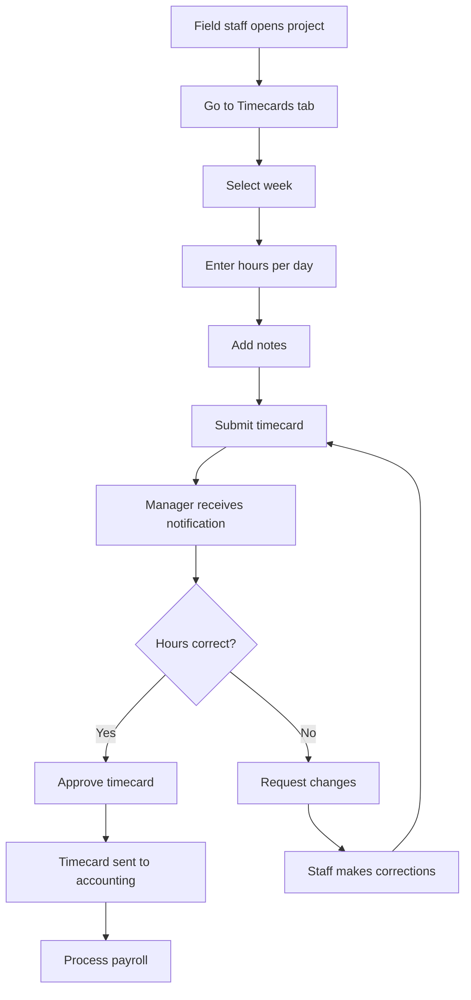

# Timecards

## Purpose
The Timecard module allows field staff to log hours worked on projects. Managers can review, approve, and track labor costs against project budgets.

## Who Uses This
- **Field Staff** — Enter daily hours per project
- **Project Managers** — Review and approve timecards
- **Accounting** — Process approved timecards for payroll
- **Administrators** — Manage timecard settings and approvals

## Workflow

### Entering Time (Field Staff)
1. Navigate to **Projects → [Your Project] → Timecards**
2. Select the week to enter time
3. Enter hours for each day worked
4. Add notes if needed
5. Submit timecard for approval

### Approving Time (Manager)
1. Navigate to **Projects → [Project] → Timecards**
2. Review submitted timecards
3. Verify hours and notes
4. Click **Approve** or **Request Changes**

### Flowchart

## Key Features
- **Weekly entry** — Enter hours for the full week at once
- **Copy from previous** — Quickly copy last week's timecard
- **Project assignment** — Hours tied directly to projects
- **Approval workflow** — Manager review before payroll
- **Notes** — Document work performed each day
- **Labor cost tracking** — Costs roll up to project financials

## Related Modules
- [Projects & Estimates](./projects-estimates-sop.md)
- [Daily Logs](./daily-logs-sop.md)
- [Financial Reports](./financial-reports-sop.md)

## Revision History
| Rev | Date | Changes |
|-----|------|--------|
| 1.0 | 2026-02-07 | Initial release |
