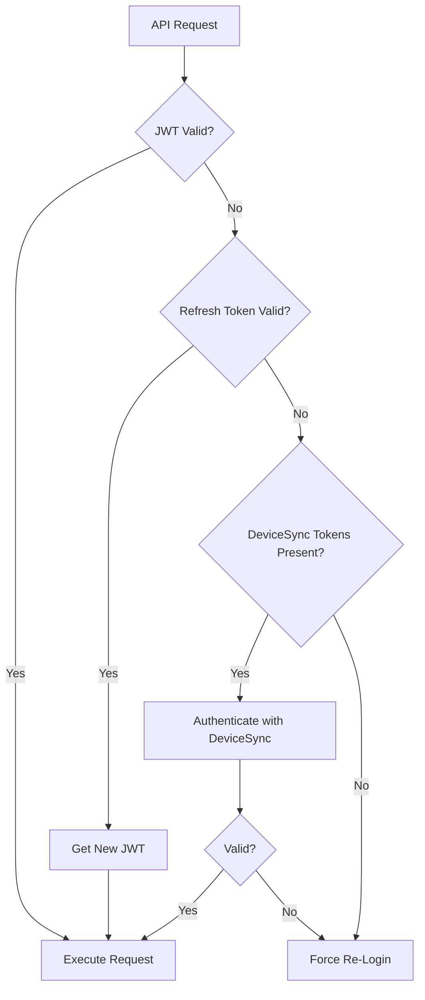

# Token Authentication

## Purpose
This SOP defines the authentication mechanism for mobile device sync operations using permanent Person + Company tokens. This enables reliable offline-first sync without requiring users to re-authenticate when JWT tokens expire.

## Who Uses This
- Mobile app users (field crews, project managers)
- API developers implementing sync endpoints
- System administrators managing device access

## Workflow

### Authentication Flow

#### Step-by-Step Process
1. User logs into mobile app with email/password
2. API validates credentials and returns:
   - JWT access token (15-minute TTL)
   - Refresh token (30-day TTL, stored in Redis)
   - Sync credentials (permanent Person token + Company token)
3. Mobile app stores all tokens in secure storage
4. For API requests, app uses JWT by default
5. If JWT expires, app attempts refresh token
6. If refresh fails, app falls back to DeviceSync authentication
7. If DeviceSync fails, user must re-login manually

#### Flowchart



### Token Structure

#### Person Token (syncToken)
- Stored on: `User.syncToken` field in database
- Format: UUID v4 (e.g., `a1b2c3d4-e5f6-7890-abcd-ef1234567890`)
- Generated: On first mobile login if not exists
- Scope: Identifies the user globally across all companies
- Lifespan: Permanent until explicitly revoked

#### Company Token (workerInviteToken)
- Stored on: `Company.workerInviteToken` field in database
- Format: UUID v4
- Generated: When company is created
- Scope: Identifies the tenant/organization
- Lifespan: Permanent, can be regenerated by admin

#### Combined Signature
```
Authorization: DeviceSync <personToken>:<companyToken>
```

Example:
```
Authorization: DeviceSync a1b2c3d4-e5f6-7890-abcd-ef1234567890:x9y8z7w6-v5u4-3210-fedc-ba0987654321
```

### API Implementation

#### Request Header
```http
GET /api/v1/projects HTTP/1.1
Host: nexus-api.example.com
Authorization: DeviceSync a1b2c3d4-...:x9y8z7w6-...
```

#### Validation Steps (API Side)
1. Parse Authorization header, extract tokens
2. Look up User by `syncToken`
3. Look up Company by `workerInviteToken`
4. Verify User has active `CompanyMembership` for that Company
5. Load user's role and profile permissions
6. Return authenticated context or 401 Unauthorized

### Mobile App Implementation

#### Token Storage
```typescript
// Storage keys
SYNC_USER_TOKEN = "nexus.sync.userToken"
SYNC_COMPANY_TOKEN = "nexus.sync.companyToken"

// On login response
await SecureStore.setItemAsync(SYNC_USER_TOKEN, response.syncCredentials.userToken);
await SecureStore.setItemAsync(SYNC_COMPANY_TOKEN, response.syncCredentials.companyToken);
```

#### Auth Fallback Chain
```typescript
async function authenticatedFetch(url, options) {
  // Try 1: JWT
  let response = await fetchWithJwt(url, options);
  if (response.status !== 401) return response;

  // Try 2: Refresh JWT
  const refreshed = await refreshJwtToken();
  if (refreshed) {
    response = await fetchWithJwt(url, options);
    if (response.status !== 401) return response;
  }

  // Try 3: DeviceSync
  response = await fetchWithDeviceSync(url, options);
  if (response.status !== 401) return response;

  // All failed - force re-login
  throw new AuthenticationError("Please log in again");
}
```

## Key Features
- **Never Expires**: Combined token signature has no TTL
- **Offline-Resilient**: Works even after extended offline periods
- **Per-Tenant Scoped**: Company token ensures data isolation
- **Revocable**: Admin can regenerate tokens to invalidate devices

## Security Considerations

### Token Protection
- Store tokens in secure/encrypted storage (Keychain/Keystore)
- Never log tokens or include in error reports
- Transmit only over HTTPS

### Revocation
- User can revoke by regenerating their `syncToken` (logs out all devices)
- Admin can revoke company-wide by regenerating `workerInviteToken`
- Both actions require re-authentication on all affected devices

### Rate Limiting
- DeviceSync auth attempts should be rate-limited
- After 5 failed attempts, block for 15 minutes
- Log all DeviceSync failures for security audit

### Audit Trail
All DeviceSync authentications should log:
- Timestamp
- User ID
- Company ID
- Device identifier (if available)
- IP address
- Success/failure status

## Related Modules
- [Mobile App Sync](../architecture/mobile-sync.md)
- [API Authentication](../api-contracts/authentication.md)
- [User Management](./user-management-sop.md)

## Revision History
| Rev | Date | Changes |
|-----|------|--------|
| 1.0 | 2026-02-12 | Initial release |
