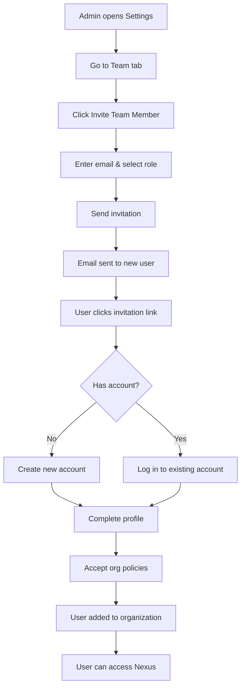

# User Onboarding

## Purpose
The User Onboarding module handles new user registration, organization invitations, and the initial setup process for new team members joining Nexus.

## Who Uses This
- **Administrators** — Send invitations, manage user access
- **Owners** — Full control over organization membership
- **New Users** — Complete onboarding to join the organization

## Workflow

### Inviting a New User (Admin)
1. Navigate to **Settings → Team**
2. Click **Invite Team Member**
3. Enter email address
4. Select role (Member, Admin, Owner)
5. Click **Send Invitation**
6. User receives email with invitation link

### Accepting an Invitation (New User)
1. Click invitation link in email
2. Create account (name, password)
3. Complete profile information
4. Accept organization policies
5. Begin using Nexus

### Flowchart

## Key Features
- **Email invitations** — Secure invitation links via email
- **Role assignment** — Set permissions at invitation time
- **Account creation** — Simple signup flow for new users
- **Profile completion** — Capture necessary user information
- **Policy acceptance** — Ensure compliance acknowledgment
- **Multi-org support** — Users can belong to multiple organizations

## User Roles
| Role | Description |
|------|-------------|
| **Owner** | Full administrative control, billing access |
| **Admin** | Manage users, settings, and documents |
| **Member** | Standard access to projects and documents |

## Related Modules
- [Company Management](./company-management-sop.md)
- [User Roles & Permissions](./user-roles-sop.md)

## Revision History
| Rev | Date | Changes |
|-----|------|--------|
| 1.0 | 2026-02-07 | Initial release |
