# User Onboarding

## Purpose
The User Onboarding module handles new user registration, organization invitations, referral-based signups, and self-registration for new team members and contractors joining Nexus.

## Who Uses This
- **Administrators** — Send invitations, manage user access
- **Owners** — Full control over organization membership
- **New Users** — Complete onboarding to join the organization
- **Public Users** — Self-register without invitation or referral

## Workflow

### Self-Registration (Public)
1. Visit the login page at `/login`
2. Click **Self Register** link
3. Enter email and create password
4. Complete onboarding checklist (profile, photo, documents, skills)
5. Submit for review
6. Admin approves/rejects application
7. On approval, user gains access to Nexus

### Inviting a New User (Admin)
1. Navigate to **Settings → Team**
2. Click **Invite Team Member**
3. Enter email address
4. Select role (Member, Admin, Owner)
5. Click **Send Invitation**
6. User receives email with invitation link

### Accepting an Invitation (New User)
1. Click invitation link in email
2. Create account (name, password)
3. Complete profile information
4. Accept organization policies
5. Begin using Nexus

### Flowchart

```mermaid
flowchart TD
    subgraph Self-Registration
        S1[Visit /login] --> S2[Click Self Register]
        S2 --> S3[Enter email & password]
        S3 --> S4[Complete onboarding checklist]
        S4 --> S5[Submit for review]
        S5 --> S6{Admin decision}
        S6 -->|Approved| S7[Access granted]
        S6 -->|Rejected| S8[Application denied]
    end

    subgraph Admin Invitation
        A[Admin opens Settings] --> B[Go to Team tab]
        B --> C[Click Invite Team Member]
        C --> D[Enter email & select role]
        D --> E[Send invitation]
        E --> F[Email sent to new user]
        F --> G[User clicks invitation link]
        G --> H{Has account?}
        H -->|No| I[Create new account]
        H -->|Yes| J[Log in to existing account]
        I --> K[Complete profile]
        J --> K
        K --> L[Accept org policies]
        L --> M[User added to organization]
    end
```

## Key Features
- **Self-registration** — Public signup via login page without invitation
- **Email invitations** — Secure invitation links via email
- **Referral links** — Existing users can refer new contractors
- **Company tokens** — Organization-specific onboarding links
- **Role assignment** — Set permissions at invitation time
- **Onboarding checklist** — Profile, photo, gov ID, skills assessment
- **Admin review queue** — Approve/reject self-registered applicants
- **Multi-org support** — Users can belong to multiple organizations

## User Roles
| Role | Description |
|------|-------------|
| **Owner** | Full administrative control, billing access |
| **Admin** | Manage users, settings, and documents |
| **Member** | Standard access to projects and documents |

## Related Modules
- [Company Management](./company-management-sop.md)
- [User Roles & Permissions](./user-roles-sop.md)

## Revision History
| Rev | Date | Changes |
|-----|------|--------|
| 1.1 | 2026-02-10 | Added self-registration workflow and login page link |
| 1.0 | 2026-02-07 | Initial release |
