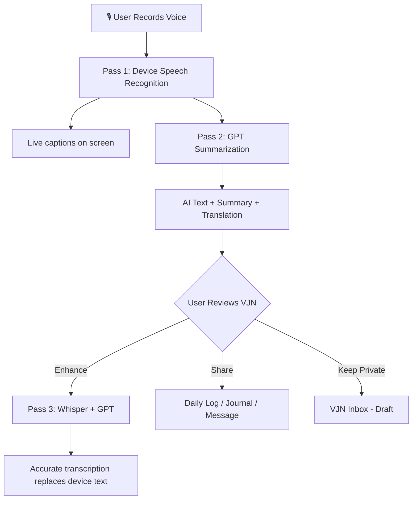
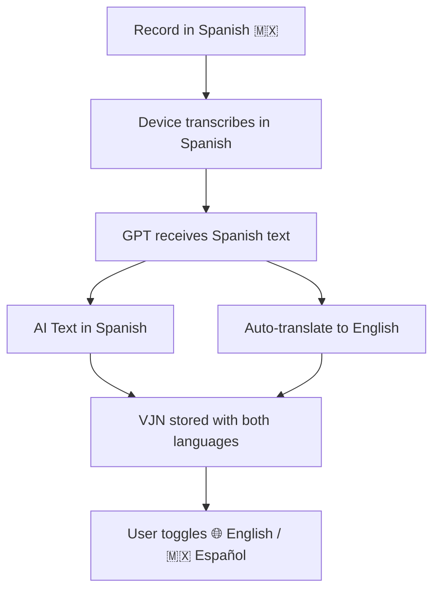

# Voice Journal Notes (VJN)

## Purpose
Voice Journal Notes (VJN) allow field and office users to capture voice recordings from any module in NEXUS, get instant AI-powered transcription and summarization, and optionally share the output to Daily Logs (PUDL), Journals, or Messages. VJNs support multi-language recording with automatic English translation for Spanish and other supported languages.

## Who Uses This
- Field crews (daily log voice entries, site observations)
- Project managers (voice notes tied to projects)
- Estimators (voice memos during site walks)
- All authenticated users (personal voice journaling)

## Workflow

### Step-by-Step Process

1. **Open VJN Recorder** — Tap the 🎙️ mic icon from any supported module (Daily Logs, Journals, Messages, Home screen).
2. **Select Language** — Choose recording language (English, Español, Français, Português, 中文). Default is English.
3. **Record** — Tap "Record" to begin. Live speech-to-text captions appear in real-time on screen.
4. **Stop Recording** — Tap "Done" when finished. The device transcript and audio file are captured.
5. **AI Processing (Tier 1)** — Immediately, the device transcript is sent to GPT for summarization. The AI cleans up grammar, structures the content, and generates a summary.
6. **Review VJN** — The VJN Review Sheet opens showing:
   - Audio player with playback controls
   - AI-generated summary (green card)
   - Full transcription text (editable)
   - Translation toggle (if non-English)
7. **Choose Action**:
   - **Share to PUDL** — Creates a Daily Log entry with AI text as work-performed
   - **Share to Journal** — Creates a journal entry linked to the VJN
   - **Share to Message** — Sends the VJN summary as a message
   - **Keep Private** — VJN stays in your personal VJN inbox as a draft
8. **Enhance (Optional)** — Tap "🔄 Enhance" to trigger Tier 2 processing (Whisper + GPT), which provides a more accurate server-side transcription.

### 3-Pass Voice Processing Architecture

### Multi-Language Translation Flow

## Key Features

- **Real-time voice-to-text** — On-device speech recognition provides instant captions while recording
- **AI summarization** — GPT cleans, structures, and summarizes voice content automatically
- **3-pass accuracy** — Device → GPT → Whisper+GPT pipeline progressively improves quality
- **Multi-language support** — Record in 5 languages with automatic English translation
- **Translation toggle** — Switch between original language and English in the review sheet
- **Edit before sharing** — Users can edit AI output before sharing to any module
- **Keep Private option** — VJNs can remain as personal drafts without sharing
- **Audio preservation** — Original audio recording is always kept for reference and replay
- **Daily Log language toggle** — Daily logs support a language toggle showing translated content
- **Frequent Contacts Smart List** — Quick-access top 5-10 most called contacts when initiating calls

## VJN Statuses

- **DRAFT** — Recorded but not shared. Visible only to the creator.
- **SHARED** — Shared to at least one target (PUDL, Journal, Message).
- **ARCHIVED** — Soft-deleted by the user.

## API Endpoints

- `POST /vjn` — Create new VJN (upload audio + device transcript)
- `GET /vjn` — List my VJNs (supports `?projectId=` and `?status=` filters)
- `GET /vjn/:id` — Get single VJN with shares
- `PATCH /vjn/:id` — Edit AI text or summary
- `POST /vjn/:id/process` — Trigger Tier 2 (Whisper+GPT) processing
- `POST /vjn/:id/share` — Share to daily_log, journal, or message
- `DELETE /vjn/:id` — Archive VJN

## Related Modules
- [Daily Logs (PUDL)] — Voice entries create PUDL log entries
- [Journals] — VJN can be shared as journal entries
- [Messaging] — VJN summaries can be sent as messages
- [Video Calling] — Frequent Contacts smart list for quick calls
- [Transcription Service] — Shared AI pipeline used by VJN and Daily Logs

## Security & Privacy
- VJNs are scoped to the creator's company and user ID
- Only the author can view, edit, share, or archive their VJNs
- Audio files are stored in GCS with company-level access controls
- Speech recognition runs on-device (no audio sent to cloud for Tier 1)
- Tier 2 processing sends audio to OpenAI Whisper API (encrypted in transit)

## Revision History
| Rev | Date | Changes |
|-----|------|---------|
| 1.0 | 2026-02-26 | Initial release — VJN system, multi-language support, translation toggle, frequent contacts |
