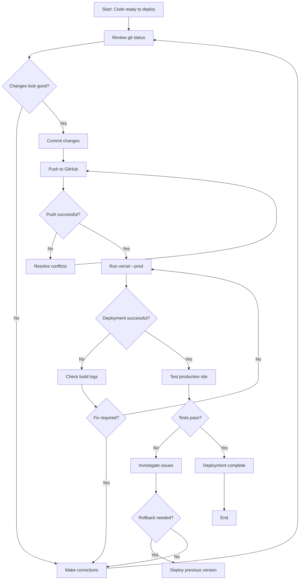

# Web Application Deployment

## Purpose
This SOP documents the process for deploying the Nexus Connect Next.js web application to Vercel production environment. This includes code changes, configuration updates, and public page deployments.

## Who Uses This
- Web developers deploying code changes
- DevOps/Release managers
- Product managers coordinating releases

## Workflow

### Step-by-Step Process

#### 1. Prepare Code for Deployment

**Verify local changes:**
```bash
cd /Users/pg/nexus-enterprise
git status
```

**Review changes:**
```bash
git diff
```

**Test locally (optional but recommended):**
```bash
cd apps/web
npm run dev
# Test at http://localhost:3000
```

#### 2. Commit Changes

**Stage specific files:**
```bash
git add [files...]
```

**Or stage all changes:**
```bash
git add -A
```

**Commit with descriptive message:**
```bash
git commit -m "Brief description of changes

- Detailed change 1
- Detailed change 2
- Detailed change 3

Co-Authored-By: Warp <agent@warp.dev>"
```

**Example commit:**
```bash
git commit -m "Add public app support page for app store submission

- Created /support page with contact info and help resources
- Made support page publicly accessible (no login required)
- URL: https://ncc.nfsgrp.com/support

Co-Authored-By: Warp <agent@warp.dev>"
```

#### 3. Push to GitHub

```bash
git push origin main
```

**Verify push:**
- Check GitHub repository for new commits
- Ensure all changes are reflected in remote

#### 4. Deploy to Vercel

**Prerequisites:**
- Vercel CLI installed: `npm install -g vercel`
- Authenticated with Vercel: `vercel login` (if needed)
- Project linked: `.vercel/project.json` exists

**Production deployment:**
```bash
cd /Users/pg/nexus-enterprise
vercel --prod --yes --archive=tgz
```

**Flags explained:**
- `--prod`: Deploy to production (not preview)
- `--yes`: Skip confirmation prompts
- `--archive=tgz`: Use archive mode for large projects (>15,000 files)

**Expected output:**
```
Vercel CLI 50.1.3
🔍  Inspect: https://vercel.com/[team]/[project]/[deployment-id]
✅  Production: https://[project]-[hash].vercel.app
🔗  Aliased: https://[project].vercel.app
```

**Deployment time:** 5-10 minutes depending on changes

#### 5. Verify Deployment

**Check deployment status:**
```bash
vercel ls
```

**Test production site:**
1. Open production URL in incognito/private browser
2. Test key pages and functionality
3. Verify recent changes are live
4. Check browser console for errors
5. Test on mobile devices if applicable

**Verify custom domain (if configured):**
```
https://ncc.nfsgrp.com
```

### Flowchart



## Key Features

- **Zero-downtime deployment**: Vercel handles seamless traffic switching
- **Automatic builds**: Vercel builds Next.js app from source
- **CDN distribution**: Global edge network for fast page loads
- **Automatic HTTPS**: SSL certificates managed automatically
- **Preview deployments**: Every push creates a preview URL (non-prod)

## Environment Variables

Production environment variables are configured in Vercel dashboard:

**Access Vercel settings:**
```
https://vercel.com/paulgagnon1969s-projects/nexus-enterprise-web/settings/environment-variables
```

**Common variables:**
- `NEXT_PUBLIC_API_BASE_URL`: Backend API URL
- `DATABASE_URL`: Database connection (if using)
- Custom variables as needed per application

**Note:** Changes to environment variables require redeployment to take effect.

## Custom Domain Configuration

**Check configured domains:**
```bash
vercel domains ls
```

**Add custom domain:**
```bash
vercel domains add ncc.nfsgrp.com
```

**Configure DNS (in domain registrar):**

For root domain (`ncc.nfsgrp.com`):
- Type: `A`
- Name: `@` or `ncc`
- Value: `76.76.21.21` (Vercel IP)

Or use CNAME:
- Type: `CNAME`
- Name: `ncc`
- Value: `cname.vercel-dns.com`

**Verify DNS propagation:**
```bash
dig ncc.nfsgrp.com
# or
nslookup ncc.nfsgrp.com
```

**DNS propagation time:** 5 minutes to 48 hours (typically 15-30 minutes)

## Rollback Procedure

If deployment introduces critical issues:

**View deployment history:**
```bash
vercel ls
```

**Redeploy previous version:**
1. Go to Vercel dashboard: https://vercel.com/paulgagnon1969s-projects/nexus-enterprise-web
2. Click "Deployments" tab
3. Find last known good deployment
4. Click "..." menu → "Promote to Production"

**Or rollback code and redeploy:**
```bash
git log --oneline -n 10  # Find good commit
git revert [bad-commit-hash]
git push origin main
vercel --prod --yes --archive=tgz
```

## Troubleshooting

**"Invalid request: files should NOT have more than 15000 items"**
- Solution: Add `--archive=tgz` flag
```bash
vercel --prod --yes --archive=tgz
```

**Build fails in Vercel:**
1. Check build logs in Vercel dashboard
2. Common issues:
   - TypeScript errors (run `npm run check-types` locally)
   - Missing dependencies (check `package.json`)
   - Environment variables not set
3. Fix issues locally, commit, and redeploy

**Custom domain not working:**
1. Verify DNS records in domain registrar
2. Wait for DNS propagation (up to 48 hours)
3. Check domain status in Vercel dashboard
4. Use Vercel default URL temporarily: `https://nexus-enterprise-web.vercel.app`

**Changes not appearing:**
- Clear browser cache (Cmd+Shift+R on Mac)
- Check in incognito mode
- Verify correct deployment in Vercel dashboard
- Wait a few minutes for CDN to update

## Related Modules

- [App Support Page Creation]
- [API Deployment]
- [Production Environment Configuration]

## Revision History

| Rev | Date | Changes |
|-----|------|---------|
| 1.0 | 2026-02-16 | Initial release |
