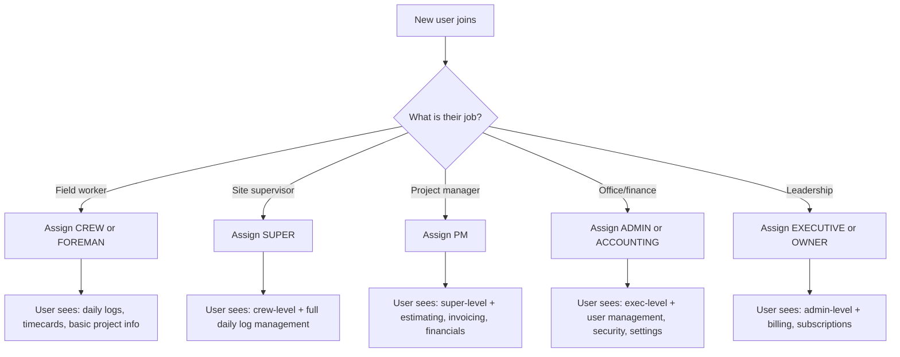

# ADMIN-002 — User Roles & Permissions

🟡 Intermediate · 👑 OWNER · 🔧 ADMIN

> **Chapter 1: Security, Roles & Company Setup** · [← Company Settings](./ADMIN-001-company-settings.md) · [Next: Field-Level Security →](./ADMIN-003-field-security.md)

---

## Purpose

NCC uses a hierarchical role system that controls what each user can see, edit, and manage. Understanding the role hierarchy is critical — it determines everything from which financial fields are visible to who can approve invoices.

## Who Uses This

- **Owners** — assign roles to all team members, including admins
- **Admins** — manage roles for non-admin users

## The Role Hierarchy

NCC uses an internal role hierarchy where each level inherits all permissions of the levels below it:

```
CREW → FOREMAN → SUPER → PM → EXECUTIVE → ADMIN → OWNER → SUPER_ADMIN
```

**CLIENT** is a separate, independent role — it is NOT part of the internal hierarchy. Client access is controlled independently via Field Security Policies (see [ADMIN-003](./ADMIN-003-field-security.md)).

| Role | Label | Typical User | Key Access |
|------|-------|-------------|------------|
| CREW | Crew+ | Field laborer | Daily logs, timecards, basic project view |
| FOREMAN | Foreman+ | Lead worker | Crew-level + task assignment, material requests |
| SUPER | Super+ | Superintendent | Foreman-level + full daily log management |
| PM | PM+ | Project Manager | Super-level + estimating, invoicing, project financials |
| EXECUTIVE | Exec+ | VP / Director | PM-level + company-wide financial reports, dashboards |
| ADMIN | Admin+ | Office administrator | Exec-level + user management, security policies, settings |
| OWNER | Owner+ | Company owner | Admin-level + billing, subscription management, company deletion |
| SUPER_ADMIN | Superuser | NCC system admin | Full platform access (NCC staff only) |

## Step-by-Step: Viewing and Managing Roles

1. Navigate to **Settings → Roles** (`/settings/roles`).
2. The left panel lists all **Role Profiles** — both NCC Standard roles and any custom roles.
3. Click a role to view its permissions on the right panel.
4. Permissions are organized by **section** (Projects, Financial, People, Reports).
5. Each permission resource shows View, Add, Edit, Delete capabilities.

## Step-by-Step: Assigning a Role to a User

1. Navigate to **Company → Users** (`/company/users`).
2. Find the user and click their name to open their profile.
3. Under **Role**, select the appropriate role from the dropdown.
4. Click **Save**. The user's access changes take effect immediately.

## Flowchart



## Tips & Best Practices

- **Principle of least privilege** — start users at the lowest role that covers their needs. You can always promote.
- **ADMIN vs OWNER** — Admins can manage users and settings but cannot change billing or delete the company. Only Owners can.
- **Protected roles** (ADMIN, OWNER, SUPER_ADMIN) require confirmation before modification — this prevents accidental lockout.
- Role changes take effect immediately. If a PM is demoted to CREW, they instantly lose access to financial data.

## Troubleshooting

| Issue | Solution |
|-------|----------|
| User can't see financial data | Check their role — only PM+ can see project financials by default |
| Can't change a user's role | Only ADMIN+ can change roles. OWNER role can only be changed by another OWNER |
| User sees "Access Denied" on a page | Their role is below the minimum required. Check the Field Security settings ([ADMIN-003](./ADMIN-003-field-security.md)) |

---

## Revision History

| Rev | Date | Changes |
|-----|------|---------|
| 1.0 | 2026-03-11 | Initial release — extracted from Module Master Class |
