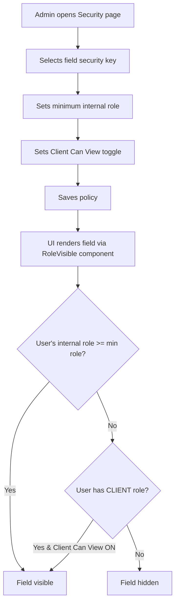

# ADMIN-003 — Field-Level Security Policies

🔴 Advanced · 👑 OWNER · 🔧 ADMIN

> **Chapter 1: Security, Roles & Company Setup** · [← User Roles](./ADMIN-002-user-roles-permissions.md) · [Next: Inviting Users →](./ADMIN-004-inviting-users.md)

---

## Purpose

Beyond role-based page access, NCC provides **field-level security** — granular control over individual data fields. You can hide specific fields (like pay rates, profit margins, or SSNs) from certain roles while keeping the rest of the page visible. This is what separates NCC from competitors that only offer page-level access control.

## Who Uses This

- **Owners/Admins** — configure which fields are visible to which roles
- **PMs/Execs** — validate that their teams see the right data
- **Support** — troubleshoot "why can't I see this field?" questions

## How Field Security Works

Every securable field in NCC has a **Security Key** (e.g., `petl.itemAmount`, `project.margin`, `worker.payRate`). For each key, you set:

1. **Minimum Internal Role** — the lowest role in the hierarchy that can see this field (e.g., "PM+" means PM, Executive, Admin, Owner, and Super_Admin can see it)
2. **Client Can View** — an independent toggle. Setting this to ON does NOT grant internal access — it only controls whether the CLIENT role can see the field.

## Application Map — Securable Fields

NCC organizes securable fields by module:

**Projects**
- Project Overview: address, status, actor info, budget, cost to date, profit margin
- PETL: line item total, RCV amount, percent complete, unit price, labor cost, material cost
- Timecards: pay rate, total pay, overtime hours
- Change Orders: amount, markup percentage

**Financial**
- Overview: revenue, expenses, profit, cash flow
- Invoices: amount, paid, balance due

**People**
- Worker Profiles: base pay rate, bill rate, SSN (last 4), bank account, home address
- HR Records: salary, performance rating, disciplinary notes

**Reports**
- Financial Reports: P&L data, payroll data, cost analysis
- Operational Reports: productivity metrics, resource utilization

## Step-by-Step Procedure

1. Navigate to **Admin → Security** (`/admin/security`).
2. The page displays the **Application Map** — a tree of modules, pages, and fields.
3. For each field, you see a row with:
   - The field name and description
   - A **role dropdown** for minimum internal access (Crew+ through Superuser)
   - A **Client Can View** toggle (independent from the internal hierarchy)
4. To restrict a field: click the role dropdown and select a higher minimum role.
   - Example: Set `worker.payRate` to "Admin+" so only Admins and Owners can see pay rates.
5. To enable client visibility: toggle **Client Can View** to ON.
   - Example: Enable client view on `project.status` so clients in the portal can see project status.
6. Click **Save** at the bottom.

## Flowchart

## Tips & Best Practices

- **Start restrictive, then open up.** It's safer to hide a field and get a request to show it than to accidentally expose sensitive data.
- **Common pattern:** Hide `worker.payRate`, `worker.ssn`, `worker.bankAccount`, and `hr.salary` from everyone below ADMIN. These are the most sensitive fields.
- **Client visibility is your friend.** Use it to show clients exactly what they need (project status, budget) without showing internal data (margin, cost breakdown).
- **Use the Security Inspector overlay** (available in admin mode) to visually audit which fields are visible for each role — it highlights each field with its security key.

## Troubleshooting

| Issue | Solution |
|-------|----------|
| A field is hidden but shouldn't be | Check that the user's role meets the minimum — and that the field isn't being hidden by a *different* security key covering the same area |
| Client can see financial data they shouldn't | Check the Client Can View toggle for each financial field — remember it's independent from internal roles |
| Changes to security policies not taking effect | Policies update in real-time — have the user refresh their browser. If still stale, clear localStorage |

## Powered By — CAM Reference

> **Why this matters:** Most construction PM tools offer only page-level access (you can see the page or you can't). NCC's field-level security means a Foreman can view the PETL tab to see line item descriptions and quantities — but the dollar amounts are hidden because `petl.itemAmount` is set to PM+. No other platform in this space offers this granularity.
>
> This workflow is powered by the platform's **Field Security Policy** engine, which stores policies in the database and evaluates them dynamically via the `RoleVisible` component. The independent CLIENT toggle is part of the **Collaborator Technology** architecture documented in **CLT-COLLAB-0001** (Client Tenant Tier) and **CLT-COLLAB-0002** (Dual-User Portal Routing).

---

## Revision History

| Rev | Date | Changes |
|-----|------|---------|
| 1.0 | 2026-03-11 | Initial release — extracted from Module Master Class |
