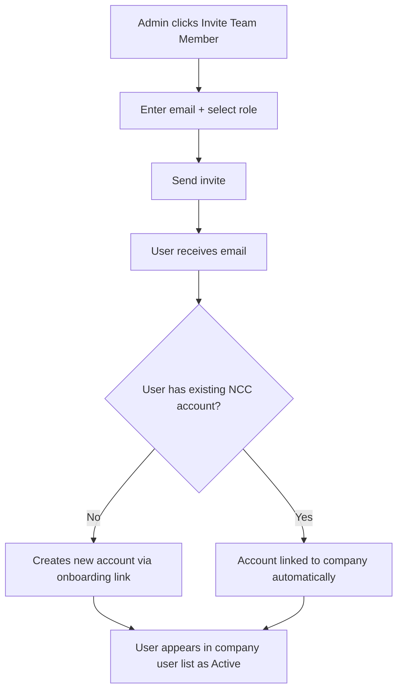

# ADMIN-004 — Inviting & Managing Users

🟢 Basic · 👑 OWNER · 🔧 ADMIN

> **Chapter 1: Security, Roles & Company Setup** · [← Field Security](./ADMIN-003-field-security.md) · [Next: Client Access →](./ADMIN-005-client-access.md)

---

## Purpose

Add team members to your NCC organization, assign them roles, and manage their access. NCC supports email-based invitations with automatic onboarding.

## Who Uses This

- **Owners** — invite the initial team during setup
- **Admins** — ongoing user management as the team grows

## Step-by-Step: Inviting a New User

1. Navigate to **Company → Users** (`/company/users`).
2. Click **Invite Team Member** (top right).
3. Enter the user's email address.
4. Select their **role** (see [ADMIN-002](./ADMIN-002-user-roles-permissions.md) for role descriptions).
5. Optionally assign them to specific projects.
6. Click **Send Invite**.
7. The user receives an email with a link to create their account and set a password.

## Step-by-Step: Managing Existing Users

1. Navigate to **Company → Users** (`/company/users`).
2. The user list shows: name, email, role, status (Active/Invited/Disabled), and last active date.
3. Click a user to open their profile page (`/company/users/[userId]`).
4. From the profile you can:
   - **Change role** — select a new role from the dropdown
   - **Disable account** — deactivates the user without deleting their data
   - **View HR records** — salary, performance, disciplinary notes (ADMIN+ only)
   - **View activity** — last login, projects assigned, recent actions

## Flowchart

## Tips & Best Practices

- **Batch onboarding:** You can invite multiple users in sequence — each gets their own invite email.
- **Disabled vs. deleted:** Always *disable* instead of *delete*. Disabled users retain their history (daily logs, approvals, timecards) but can't log in. Deleting a user could orphan their records.
- **Re-invite:** If someone didn't receive the invite, you can resend from their profile page.

---

## Revision History

| Rev | Date | Changes |
|-----|------|---------|
| 1.0 | 2026-03-11 | Initial release — extracted from Module Master Class |
