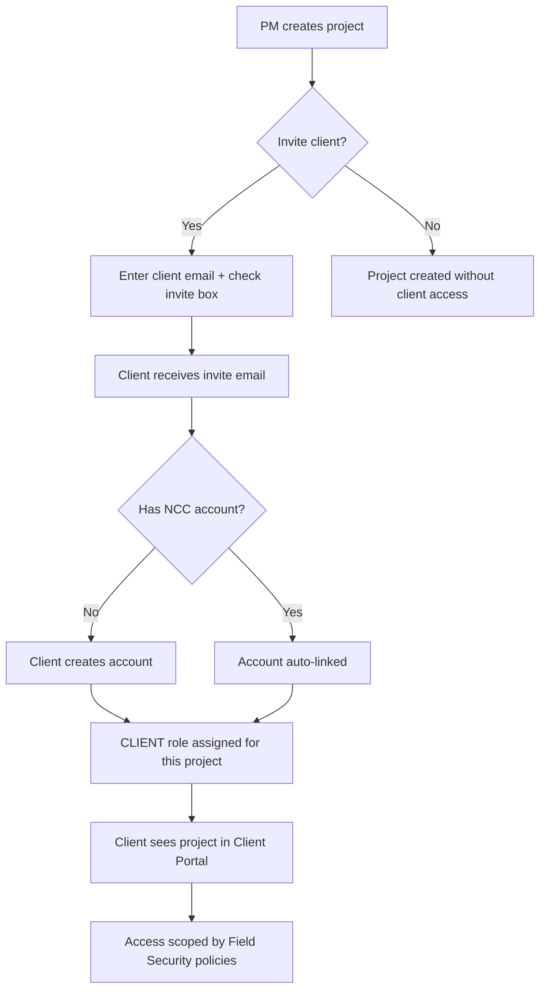

# ADMIN-005 — Client Access & Collaborator Technology

🟡 Intermediate · 👑 OWNER · 🔧 ADMIN · 📋 PM

> **Chapter 1: Security, Roles & Company Setup** · [← Inviting Users](./ADMIN-004-inviting-users.md) · [Next: Module Subscriptions →](./ADMIN-006-module-subscriptions.md)

---

## Purpose

NCC's Collaborator Technology lets you invite clients directly into the platform — giving them a real login, a portal showing their projects, and scoped access controlled by Field Security. Clients don't just view a read-only report; they get a live dashboard on their actual project data.

## Who Uses This

- **PMs** — invite clients during project creation (one checkbox)
- **Admins** — configure what clients can see via Field Security
- **Clients** — access their portal, view project status, approve documents

## Step-by-Step: Inviting a Client During Project Creation

1. Navigate to **Projects → New Project** (`/projects`).
2. Fill in project details (name, address, type, etc.).
3. In the **Client** section, enter the client's email address.
4. Check the **"Invite client to portal"** checkbox.
5. Click **Create Project**.
6. The client receives an email invitation. When they accept:
   - They create an NCC account (or link to an existing one)
   - They're assigned the CLIENT role for this project
   - They see the **Client Portal** (`/client-portal`) with all projects where they're a collaborator

## Step-by-Step: Managing Client Access After Creation

1. Navigate to **Settings → Clients** (`/settings/clients`) to see all client users.
2. Or open a specific project and view the **Collaborators** section.
3. Client visibility is controlled by **Field Security** ([ADMIN-003](./ADMIN-003-field-security.md)) — use the "Client Can View" toggles to show/hide specific fields.
4. Clients can view:
   - Project overview (name, status, address — if Client Can View is ON)
   - Documents shared with them
   - Financial summaries (if enabled via Field Security)
   - Approval workflows (change orders, invoices)

## The Client Portal Experience

When a client logs in, they see the Client Portal (`/client-portal`):
- **Projects** — every project where they're a collaborator, across all companies on NCC
- **Finance** — financial summaries for their projects (scoped by Field Security)
- **Collaborations** — cross-company view of all active collaborations
- **Documents** — documents shared with them

## Flowchart

## Tips & Best Practices

- **Every client invite is a product demo.** The client experiences NCC on their actual project data. If they're impressed, they can upgrade to a full subscriber — this is the acquisition flywheel.
- **Dual-user routing:** If a client also works for a contractor company on NCC, they have ONE login that spans both roles. The system routes them to the correct view based on context.
- **Start with minimal visibility.** Enable Client Can View on project status and documents first. Add financial visibility only after discussing with the client.

## Powered By — CAM Reference

> **CLT-COLLAB-0001 — Client Tenant Tier: Acquisition Flywheel** (30/40 ⭐ Strong)
> *Why this matters:* Every client portal invitation is a zero-friction product demo on real data. No other construction PM tool converts project clients into platform subscribers through live collaboration. The client doesn't see a static PDF — they see a living project dashboard that updates in real time.
>
> **CLT-COLLAB-0002 — Dual-User Portal Routing** (29/40 ✅ Qualified)
> *Why this matters:* A single person can be both a client (on one project) and an internal PM (on another). NCC handles this with one login and automatic context switching. Traditional PM tools force rigid silos — you're either internal or external, never both.

---

## Revision History

| Rev | Date | Changes |
|-----|------|---------|
| 1.0 | 2026-03-11 | Initial release — extracted from Module Master Class |
