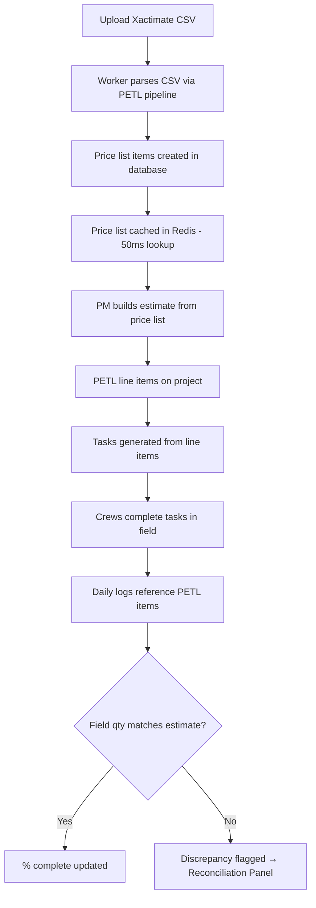

# EST-001 — Understanding PETL (Price, Estimate, Task, Log)

🟡 Intermediate · 📋 PM · 💰 ACCOUNTING

> **Chapter 2: Estimating & Xactimate Import** · [← Module Subscriptions](./ADMIN-006-module-subscriptions.md) · [Next: Xactimate Import →](./EST-002-xactimate-import.md)

---

## Purpose

PETL is the core data model that powers NCC's estimating engine. Every line item on a project flows through the PETL pipeline — from initial price list import through estimate creation, task tracking, and daily log integration. Understanding PETL is essential for anyone who works with estimates, invoices, or project financials.

## Who Uses This

- **PMs** — create and manage estimates, review PETL line items
- **Accounting** — understand how estimate data flows into invoicing
- **Admins** — configure price lists and import workflows

## What PETL Means

| Letter | Stage | What Happens |
|--------|-------|-------------|
| **P** — Price | Price List Import | Upload your cost book (Xactimate, custom CSV). Prices are cached in Redis for instant lookup. |
| **E** — Estimate | Line Item Creation | Build the project estimate from price list items. Each line has quantity, unit price, labor/material split. |
| **T** — Task | Task Generation | Estimate line items can generate tasks assigned to crews. Completion tracking feeds back to % complete. |
| **L** — Log | Daily Log Integration | Field observations reference PETL items. Quantity discrepancies flagged by crews flow back to the Reconciliation Panel. |

## How PETL Line Items Are Structured

Each PETL line item contains:
- **Category & Selection** — from the Xactimate cost book (e.g., Category: "Drywall", Selection: "Remove & replace")
- **Description** — the full line item description
- **Quantity & Unit** — how much (e.g., 150 SF, 12 EA, 200 LF)
- **Unit Price** — price per unit from the cost book
- **Total Amount** — quantity × unit price
- **RCV Amount** — Replacement Cost Value (for insurance estimates)
- **Labor / Material Split** — broken out for crew scheduling and material ordering
- **Percent Complete** — tracks progress from task completion and daily logs

## Step-by-Step: Viewing PETL on a Project

1. Open a project → navigate to the **PETL** tab.
2. You'll see the full estimate broken into categories and line items.
3. Use the **Cost Book Picker** to switch between imported price lists.
4. Click any line item to expand its details — unit breakdown, labor/material split, and linked tasks.
5. The **Reconciliation Panel** (top of PETL tab) shows any field quantity discrepancies flagged by crews.

## Flowchart

## Powered By — CAM Reference

> **EST-SPD-0001 — Redis Price List Caching** (29/40 ✅ Qualified)
> *Why this matters:* PETL price lists can contain 54,000+ items. Without caching, every lookup takes 500–800ms. NCC caches the entire list in Redis and serves it in ~50ms — a 16× speedup. The cache auto-invalidates on every new import, so data is always fresh. If Redis goes down, a synchronous DB fallback ensures zero downtime. No competing platform delivers sub-100ms price list access at this scale.

---

## Revision History

| Rev | Date | Changes |
|-----|------|---------|
| 1.0 | 2026-03-11 | Initial release — extracted from Module Master Class |
