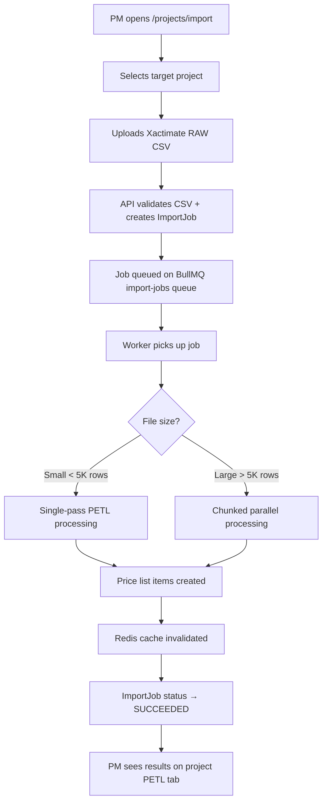

# EST-002 — Importing from Xactimate

🔴 Advanced · 📋 PM · 🔧 ADMIN

> **Chapter 2: Estimating & Xactimate Import** · [← Understanding PETL](./EST-001-understanding-petl.md) · [Next: Price List Management →](./EST-003-price-list-management.md)

---

## Purpose

The Xactimate import is the primary way to bring external estimates into NCC. It accepts CSV exports from Xactimate (the industry-standard estimating tool used by insurance restoration contractors) and converts them into NCC PETL line items. The import runs asynchronously via a background worker — large files (50,000+ rows) complete without freezing the browser.

## Who Uses This

- **PMs** — upload Xactimate CSVs for their projects
- **Admins** — manage the Golden Price List (master cost book)

## Before You Start

- Export your estimate from Xactimate as a CSV file.
- Xactimate exports two types of CSV:
  - **RAW** — the full line-item estimate (Category, Selection, Description, Quantity, Unit, Price)
  - **Components** — the component breakdown of each line item (detailed material/labor split)
- You need at least PM role to import.

## Step-by-Step: Importing an Xactimate Estimate

1. Navigate to **Projects → Import** (`/projects/import`).
2. Select the **target project** from the dropdown (or pass `?projectId=...` in the URL to pre-select).
3. **Upload RAW CSV:**
   - Click **Choose File** in the "Xactimate RAW Import" section.
   - Select your Xactimate RAW CSV file.
   - Click **Upload & Import**.
   - A job is created and queued. The progress panel shows real-time status:
     - `QUEUED` → `RUNNING` (with progress messages) → `SUCCEEDED` or `FAILED`
   - The "Script Window" shows timestamped log entries as the worker processes rows.
4. **Upload Components CSV** (optional but recommended):
   - Click **Choose File** in the "Xactimate Components Import" section.
   - Select the Components CSV.
   - Click **Upload & Import**.
   - Same async job flow as RAW.
5. **Upload Comparator Estimates** (optional):
   - If you have alternative estimates for comparison, upload them in the "Comparator Estimates" section.
   - Multiple files can be uploaded simultaneously.

## What Happens During Import

The import worker follows the PETL pipeline:

1. **Parse** — CSV rows are read and validated. Unicode dimension markers from Xactimate (`'`, `′`, `"`, `″`) are normalized.
2. **Enrich** — Each row is matched to the appropriate price list item using Category + Selection + Component Code lookups.
3. **Transform** — Rows are aggregated, deduplicated (by content hash), and normalized into NCC's data model.
4. **Load** — Data is written to Postgres in batches using `createMany` for performance.

For large files, the worker uses **chunked parallel processing** — the CSV is split into partitions that run simultaneously across worker threads.

## Flowchart

## Deduplication

NCC generates a **content hash** for each imported row based on (Category + Selection + Description + Unit). If you re-import the same CSV, duplicate rows are automatically detected and skipped — your existing line items are preserved, not duplicated.

## Tips & Best Practices

- **Always import RAW first, then Components.** The Components import references RAW line items.
- **Watch the Script Window.** It shows real-time worker output — if something fails, the error details appear here.
- **Large imports (50K+ rows) are normal.** The chunked pipeline handles them. Expect 30–90 seconds depending on file size.
- **Re-importing is safe.** The deduplication hash prevents duplicates. Changed rows will update, new rows will be added.
- **Price list imports refresh the Redis cache.** After import, the next price list lookup will be a cold load (~600ms), then all subsequent lookups are cached (~50ms).

## Troubleshooting

| Issue | Solution |
|-------|----------|
| Import stuck at QUEUED | Check that the import worker is running (`npm run dev:worker` locally, or verify `nexus-shadow-worker` is healthy in production) |
| Import FAILED with "Invalid CSV format" | Verify the CSV is a genuine Xactimate export — NCC expects specific column headers (CAT, SEL, DESC, QTY, UNIT, PRICE) |
| Duplicate items appearing | The dedup hash uses Category+Selection+Description+Unit. If any of these differ slightly (e.g., trailing spaces), they'll be treated as separate items. Clean the CSV before re-importing. |
| Components import fails with "No matching RAW items" | Components reference RAW items by Category+Selection. Import RAW first, then Components. |
| Very large file (100K+ rows) timing out | This is expected to complete but may take 2–3 minutes. Don't close the browser — the job continues in the background. Refresh the page to see current status. |

## Powered By — CAM Reference

> **EST-SPD-0001 — Redis Price List Caching** (29/40 ✅ Qualified)
> *Why this matters:* After import, the entire price list is cached in Redis and auto-invalidated. Estimators get 50ms lookups on 54,000+ items instead of waiting 800ms per query. The cache is the reason the PETL tab loads instantly even with massive cost books.
>
> **TECH-ACC-0001 — Graceful Sync Fallback** (28/40 ✅ Qualified)
> *Why this matters:* If Redis or BullMQ goes down during import, NCC doesn't silently drop the job. It detects the outage and switches to synchronous processing — slower, but every row is processed. When infrastructure recovers, the fast path resumes automatically. No other construction platform has this resilience.

---

## Revision History

| Rev | Date | Changes |
|-----|------|---------|
| 1.0 | 2026-03-11 | Initial release — extracted from Module Master Class |
