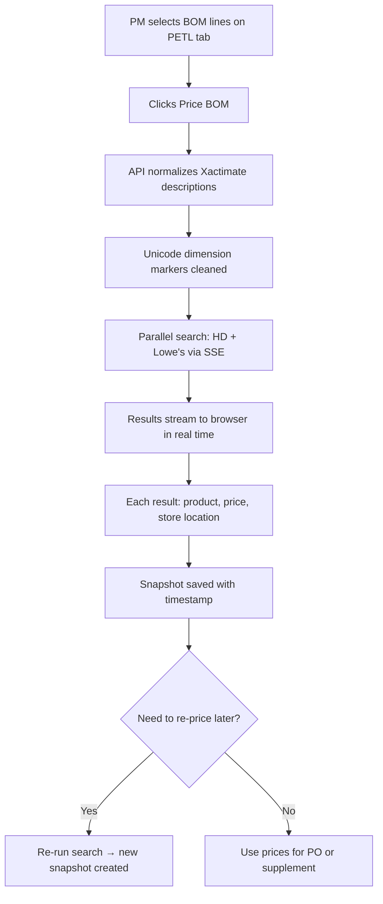

# EST-004 — BOM Pricing: HD & Lowe's Price Comparison

🔴 Advanced · 📋 PM

> **Chapter 2: Estimating & Xactimate Import** · [← Price List Management](./EST-003-price-list-management.md) · [Next: NexPLAN Selections →](./EST-005-nexplan-selections.md)

---

## Purpose

Turn any Xactimate estimate into a live-priced Bill of Materials by searching Home Depot and Lowe's simultaneously. Results stream to your browser in real time with store-level detail (name, address, phone) and timestamped price snapshots for insurance supplement evidence.

## Who Uses This

- **PMs** — price BOM lines against retail suppliers for purchasing decisions
- **Estimators** — compare retail pricing to cost book estimates for bid accuracy

## Step-by-Step Procedure

1. Open a project → **PETL** tab.
2. Select the BOM lines you want to price (checkbox selection).
3. Click **🔍 Price BOM** (or equivalent action button).
4. The system runs **simultaneous searches** against Home Depot and Lowe's.
5. Results stream to your browser via SSE (Server-Sent Events) — you see prices appearing in real time, one line at a time.
6. Each result shows:
   - **Product name & SKU** from the retailer
   - **Price** (current retail)
   - **Store name, address, and phone** — the nearest store with the item in stock
7. Results are saved as a **timestamped snapshot** — re-run weekly to track price movement.
8. Historical snapshots are never overwritten.

## Flowchart

## Use Cases

- **Pre-construction pricing** — import Xactimate estimate, price all BOM lines in 3 minutes vs. 3–5 hours manually.
- **Mid-project re-pricing** — materials spike. Re-run search, compare to original snapshot. The price difference report supports insurance supplement requests.
- **Supplier negotiation** — Lowe's is consistently 8% cheaper on lumber? Use the store contact info to negotiate bulk discounts.

## Tips & Best Practices

- **Xactimate descriptions contain Unicode characters** (feet: `'`, `′`; inches: `"`, `″`). NCC normalizes these automatically — you don't need to clean the CSV.
- **Snapshots are your evidence.** Timestamped price snapshots are admissible evidence for insurance supplement negotiations. Run a search before and after a price spike to document the difference.
- **Store-level results matter.** The nearest Home Depot might not have the item, but one 10 miles away does. Each result includes the specific store with availability.

## Troubleshooting

| Issue | Solution |
|-------|----------|
| Search returns no results for some items | The Xactimate description may be too specific. The normalization engine strips codes and abbreviations, but highly specialized items may not have retail equivalents |
| SSE stream stalls mid-search | This can happen on slow connections. Refresh the page — already-completed results are saved in the snapshot |
| Prices seem wrong for my area | Results are based on the nearest store to your company address. Verify your company address in Settings → Company |

## Powered By — CAM Reference

> **EST-INTG-0001 — Multi-Provider BOM Pricing Pipeline** (32/40 ⭐ Strong)
> *Why this matters:* No competitor offers live multi-supplier pricing with SSE streaming + store locations + snapshot history. Procore has procurement but no real-time search. Xactimate has pricing but from its own static database, not live retail. The pipeline saves 3–5 hours per project of manual lookup and captures $2.5K–$7.5K in supplier delta per project. NexOP contribution: ~2.99% of revenue — the #2 highest-impact CAM in the entire portfolio.

---

## Revision History

| Rev | Date | Changes |
|-----|------|---------|
| 1.0 | 2026-03-11 | Initial release — extracted from Module Master Class |
