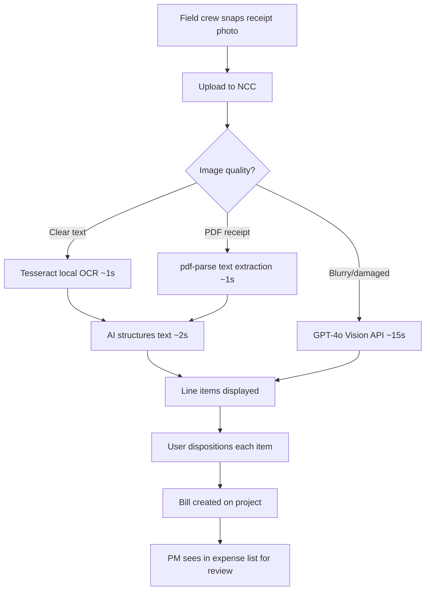

# RCPT-001 — Receipt Capture Workflow

🟢 Basic · 🏗️ FIELD · 📋 PM

> **Chapter 3: Expense Capture & Receipt Management** · [← NexDupE](./EST-007-nexdupe.md) · [Next: Transaction Import →](./RCPT-002-transaction-import.md)

---

## Purpose

Capture receipts in the field by photographing them with your phone. NCC's OCR engine extracts every line item — vendor, amounts, SKUs, quantities — and creates a bill on the project in seconds.

## Who Uses This

- **Field crews** — snap receipts at the store or job site
- **PMs** — review captured receipts and approve expense allocations

## Step-by-Step Procedure

1. Open a project → **New Daily Log**.
2. In the **Receipt / Expense** section, tap **📷 Add Receipt**.
3. Take a photo of the receipt (or select from camera roll).
4. NCC runs OCR:
   - Clear receipt → ~3 seconds (Tesseract local extraction + AI structuring)
   - Blurry/damaged → ~15 seconds (GPT-4o vision fallback)
   - PDF receipt → ~2 seconds (text extraction, no image processing)
5. Results appear immediately:
   - **Vendor name** (auto-detected)
   - **Date and total**
   - **Every line item** with quantity, unit price, and description
6. **Disposition each line item:**
   - **Keep on Job** — stays on the current project (default)
   - **Credit (Personal)** — marked as personal expense, credited back
   - **Move to Project** — reassigned to a different project
7. The bill is created on the project with the net total after dispositions.

## Flowchart

## Powered By — CAM Reference

> **FIN-AUTO-0001 — Inline Receipt OCR** (30/40 ⭐ Strong)
> *Why this matters:* No construction PM tool offers line-item-level receipt control with AI-powered OCR. Field crews capture dozens of receipts per week. NCC extracts every line item, lets you exclude personal purchases per-item, handles credit deductions, and computes the net total — all inline in the daily log form. Competitors like Procore offer receipt scanning but only at the receipt level, not the line-item level.
>
> **FIN-SPD-0001 — Hybrid Receipt OCR Pipeline** (31/40 ⭐ Strong)
> *Why this matters:* The 3-second processing time is not magic — it's architecture. Tesseract.js extracts text locally in ~1 second, then a fast AI model (Grok) structures it. The vision API is only used as a fallback for damaged receipts. This hybrid pipeline is 10× faster and 10× cheaper than cloud-only OCR. No competitor uses a local+AI hybrid approach.

---

## Revision History

| Rev | Date | Changes |
|-----|------|---------|
| 1.0 | 2026-03-11 | Initial release — extracted from Module Master Class |
