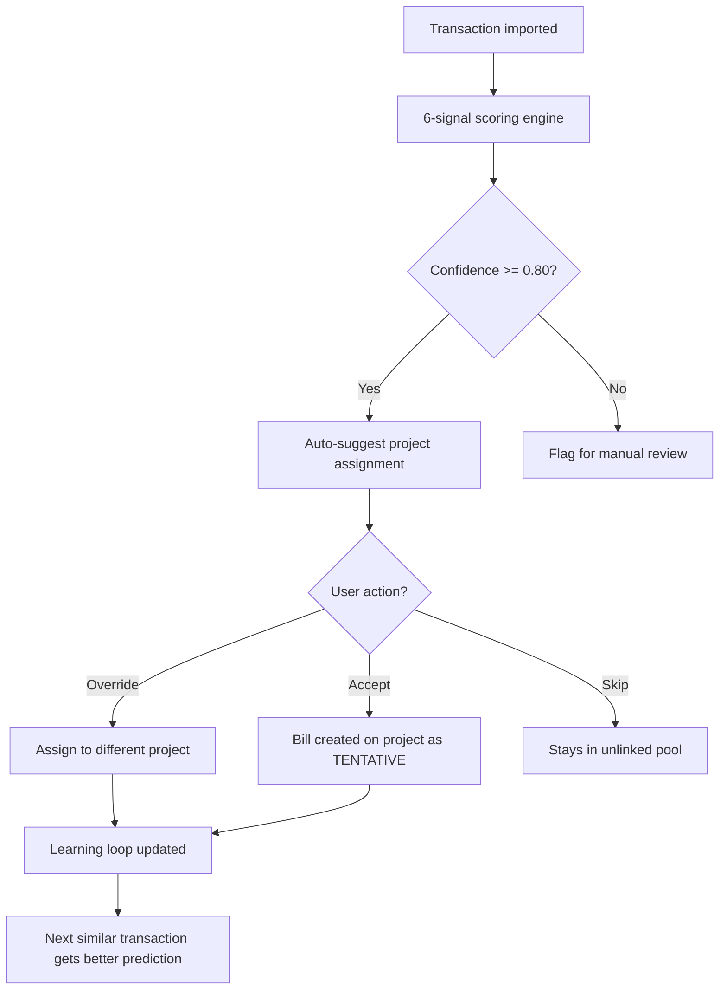

# RCPT-003 — Prescreening & Smart Assignment

🟡 Intermediate · 💰 ACCOUNTING · 📋 PM

> **Chapter 3: Expense Capture & Receipt Management** · [← Transaction Import](./RCPT-002-transaction-import.md) · [Next: Auto-Bill Creation →](./RCPT-004-auto-bill-creation.md)

---

## Purpose

When transactions are imported, NCC's prescreening engine predicts which project each charge belongs to — using a 6-signal intelligence engine that learns from your corrections over time.

## Who Uses This

- **Accounting** — review prescreen suggestions, accept or override assignments
- **PMs** — see transactions auto-assigned to their projects

## How Prescreening Works

For each imported transaction, NCC evaluates 6 signals:

1. **Vendor pattern** — "HOME DEPOT" historically goes to active construction projects
2. **Amount range** — $400–$600 charges from HD typically match material purchases
3. **Date proximity** — charges near daily log dates for a specific project score higher
4. **Historical assignment** — what project did similar charges go to last month?
5. **Active project status** — only suggests active projects, not completed ones
6. **PM feedback loop** — every accept, reject, and override improves future predictions

## Step-by-Step Procedure

1. Navigate to **Financial** (`/financial`).
2. The **Prescreen Queue** shows imported transactions with suggested assignments.
3. Each transaction shows:
   - Description (e.g., "HOME DEPOT #0604 $485.23")
   - Suggested project (with confidence score, e.g., 0.92)
   - Auto-classification (PROJECT_MATERIAL, ENTERTAINMENT, FUEL, etc.)
4. For each transaction:
   - **Accept** — confirms the suggestion (transaction assigned to that project)
   - **Override** — assign to a different project (this trains the learning loop)
   - **Skip** — leave unassigned for now
5. Accepted transactions create `TENTATIVE` bills on the project.

## Flowchart

## Powered By — CAM Reference

> **FIN-INTL-0002 — Smart Prescreen Learning Loop** (33/40 ⭐ Strong)
> *Why this matters:* Every imported transaction must be manually assigned to a project in every other system. It's a bookkeeper time sink that scales linearly with transaction volume. NCC's 6-signal intelligence engine predicts the assignment with a self-improving feedback loop — accepts, rejects, and overrides compound into higher accuracy. By month 3, routine purchases approach zero-touch assignment. No competitor has a learning loop for transaction-to-project matching. NexOP contribution: ~0.60% of revenue.

---

## Revision History

| Rev | Date | Changes |
|-----|------|---------|
| 1.0 | 2026-03-11 | Initial release — extracted from Module Master Class |
